Fair Usage Policy
================

Many Internet Service Providers make use of Fair Usage Policies (FUP) to regulate the data usage of customers. With a growing customer base comes more strain on your network and it is, therefore, necessary to restrict usage for consumers that tend to abuse their connection.

FUP is a method of restricting customer usage by means of decreasing or increasing customers' internet speeds, if and when certain data usage parameters/limits are reached.

The Splynx FUP feature includes:

* Define when to count the customer traffic - days and hours
* Decrease or increase speeds of a customer if he reaches the defined amount of data during one day, week or month
* Block a customer if he reaches an allowed amount of data usage per day, week or month
* Permanently block customer until he pays for additional data
* Change the speed of customer based on the day of the week and time of the day  

To define Fair usage policies, navigate to *Tariffs>Internet>* click on the arrow icon  <icon class="image-icon">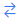</icon> on the plan you wish to add FUP rules to.

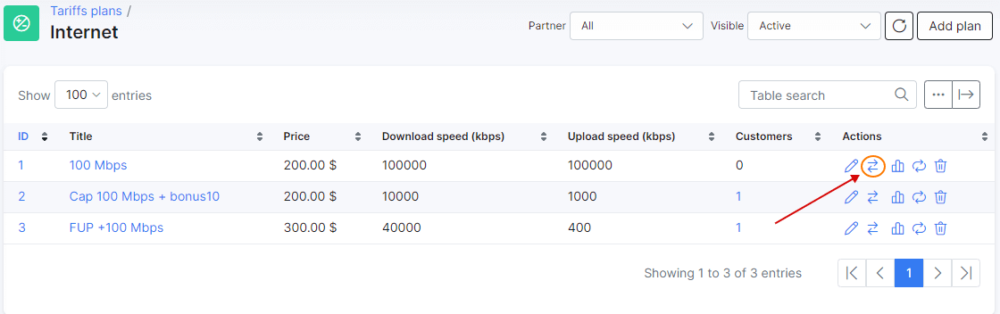

In Splynx, each internet plan has independent fair usage policy rules/settings. Examples of different FUP settings and usage are shown below.

**1. Define when to count the traffic in Plan for FUP.**

Firstly, we have to define the time period for the system to count customers' traffic, Splynx counts all traffic by default. Custom periods for counting traffic is illustrated in the example below, traffic is not counted on Sundays and specific night hours:

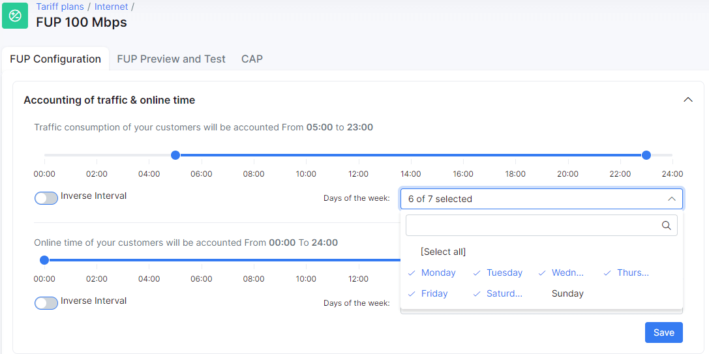

When the online time of customers is accounted for, there is an option to restrict the customer online time with the use of a FUP setting.

**2. Change speeds customers when allowed a specified data amount is reached**

Customers who have abusive tendencies with regards to internet usage can be controlled by means of limiting their internet speeds based on the amounts of data they use within a day.

For example, you have a 2 Mbps download / 1 Mbps upload plan and you wish to restrict the speeds customers who exceed downloads or uploads of 5 GB. You can configure FUP rules to decrease the speeds of customers who exceed this limit each they day exceed it. The following is an example of a FUP rule to decrease the speeds of customers by 50% of their original plan if 5 GB has been reached

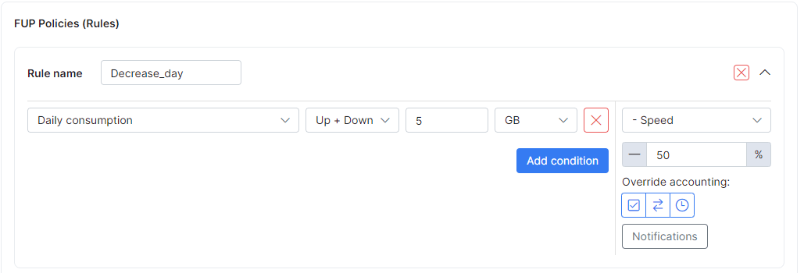

We can check what will happen when a customer downloads 2 GB per day in the _Preview window_ of FUP settings:

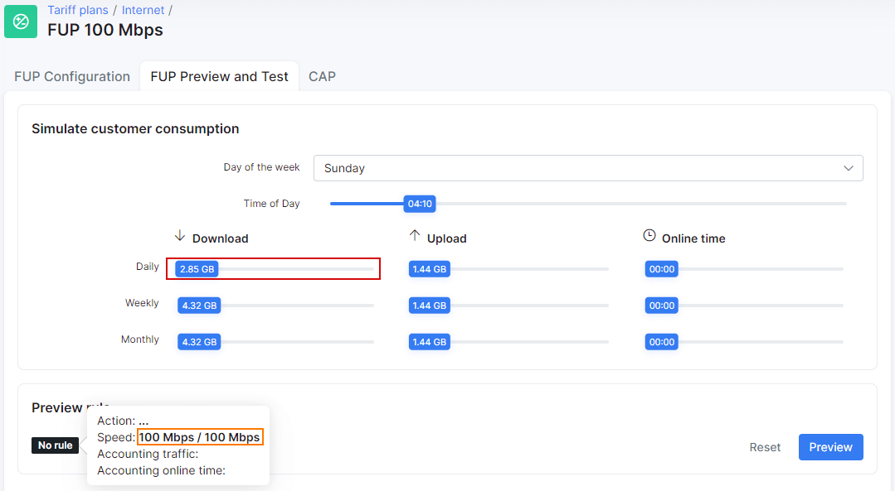

Nothing happens because the customer hasn't reached the 5 GB daily limit. We can see that no FUP rule was applied. However, if a customer does exceed the 5 GB limit, his speed will be decreased from 2/1 Mbps to 1/0,5 Mbps, illustrated below:

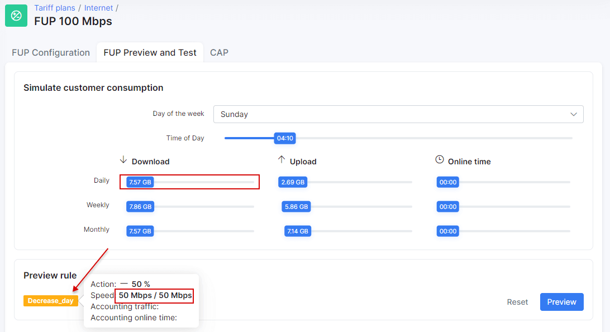

We can quickly get an overview of customers with active FUP rules in services or online lists of clients.

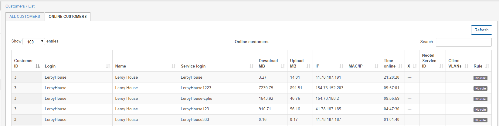

**3. Block customers who exceed data limits per day, week or month**

The same logic for restricting customer speeds is used for blocking customers, we just change the action the rule should apply. For example, let's apply a FUP rule to block customers who will exceed a limit of 10GB per month.

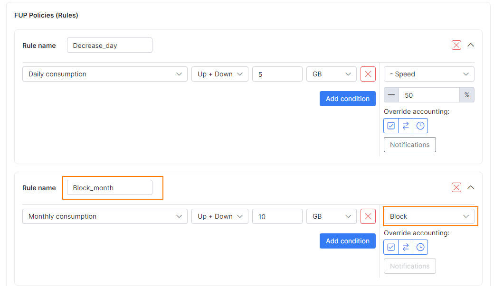

As depicted in the image, Splynx can combine several FUP rules under one plan. In the example, we combined the speed limitation based on daily usage with the blocking rule based on the total monthly usage.

**4. Permanently block customer until he pays for additional data**

This is a different type of blocking. FUP is used to optimize the customer network usage. When permanently blocking customers based on monthly data limits, until payments are made for additional data, we make use of *Capped services*. For more information on Capped service click [here](configuring_tariff_plans/capped_plans/capped_plans.md).

**5. Change the speed of customers based on the day of the week and time of the day**

Speeds of customers' internet services can be increased or decreased based on times of the day or specific days. These are rules applied to the situation of off-peak hours and/or days.

Below is an example of a FUP rule which allows customers to get higher speeds in night hours. Notice that yet again this is just another rule applied to the same plan in the previous examples of rules. Hence, all our settings for the daily and monthly limitations remain and a new rule is added to speed up internet from 2 Mbps to 4 Mbps in night hours:

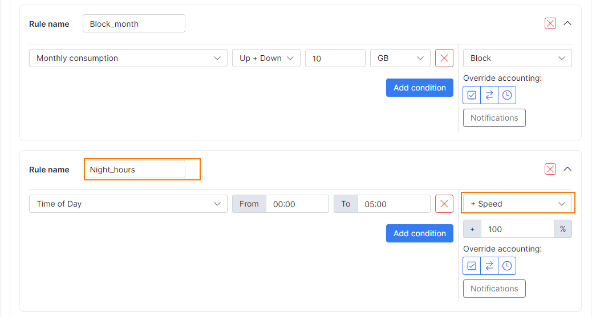

**6. Override Accounting**

Here we can define if we want to override default/configured accounting of traffic or online time rules.

These functions apply actions of FUP rules despite the configured accounting parameters for traffic or online time.

Below are examples of default accounting of tariff & online time rules:

* Traffic consumption of your customers will be accounted from 08:00 to 02:00
* Online time consumption of your customers will be accounted from 10:00 to 02:00

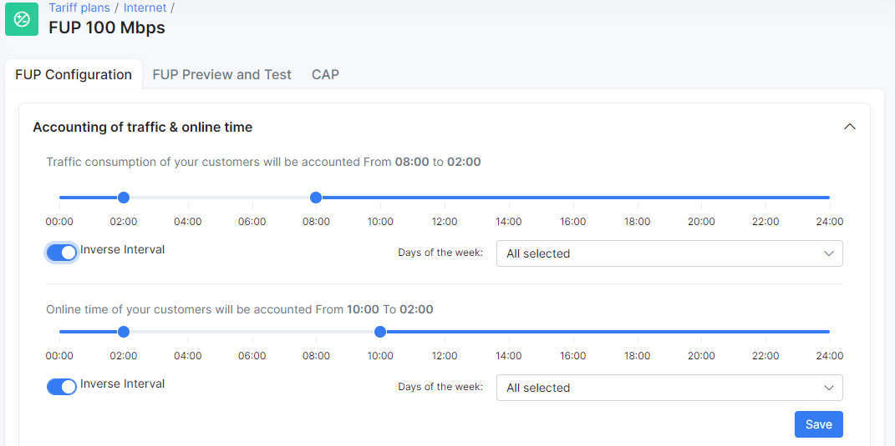

_Overriding accounting configuration per rule:_

* _<u>Override accounting:</u>_

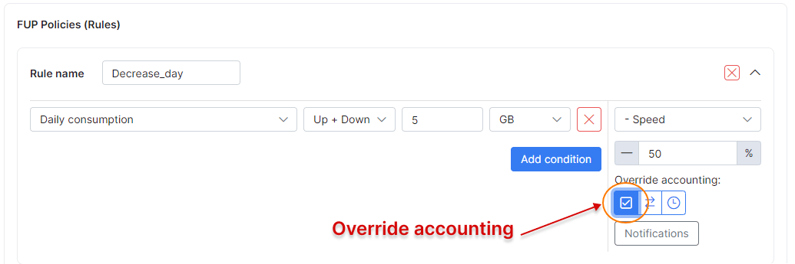

This button enables/disables the **override default/configured tariff values** function.

* _<u>Accounting of traffic</u>:_

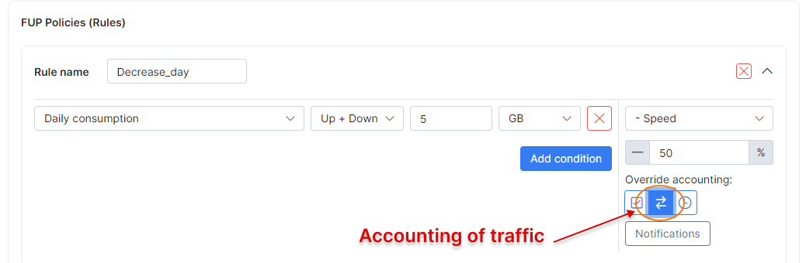

This button enables/disables overriding of configured **traffic accounting parameters**, given that **overriding** is enabled.

* _<u>Accounting of online time:</u>_

This button enables/disables overriding of configured **online consumption accounting parameters**, given that **overriding** is enabled.

_<u>Examples of accounting of traffic & online time rules are shown below</u>_:

* Traffic consumption of your customers will be accounted from 08:00 to 02:00
* Online time consumption of your customers will be accounted from 10:00 to 02:00

Here are some illustrations explaining the logic of the override function:

<u>Rule #1</u>: Override accounting is enabled and is applied to traffic, and online consumption accounting parameters:

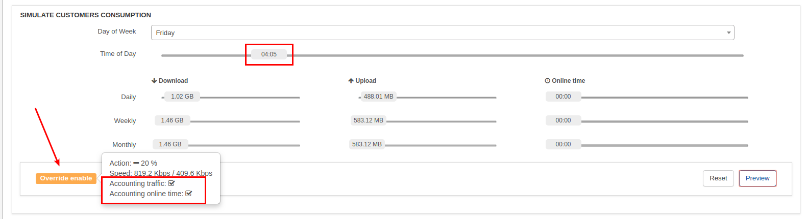

<u>Rule #2</u>: Override accounting is disabled:

<u>Rule #3</u>:  Override accounting is enabled and is applied to traffic, and online consumption accounting parameters:

