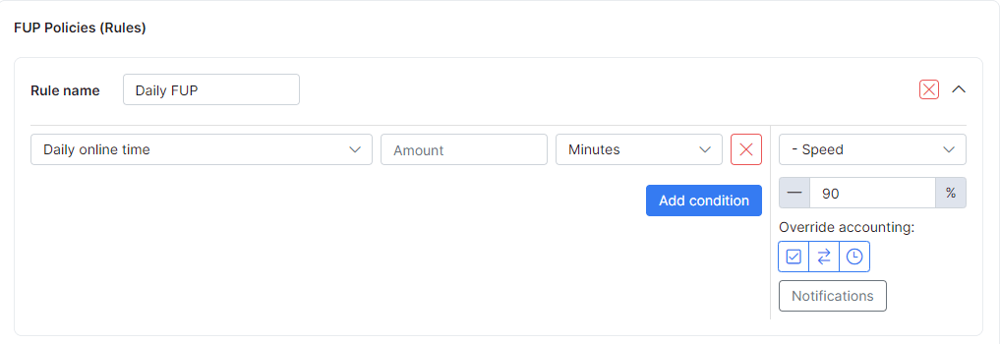

Fair Usage Policy
================

Many Internet Service Providers make use of Fair Usage Policy (FUP) to regulate the data usage by customers. As an increasing number of customers creates a heavier load on your network, it is necessary to restrict the usage for consumers that tend to abuse their connection.

FUP is a method of restricting customer usage by means of decreasing or increasing customers' internet speed when certain data usage parameters/limits are reached.

The Splynx FUP feature includes:

* Define when to account the customer traffic: days and hours
* Decrease or increase speed for a customer if the defined amount of data during one day, week or month is reached
* Block a customer when the allowed amount of data usage per day, week or month is reached
* Permanently block a customer until the additional data is paid for
* Change the speed for a customer based on the day of the week and time of the day  

To define fair usage policies, navigate to *Tariffs → Internet* and click on the arrow icon  <icon class="image-icon"></icon> next to the plan you wish to add FUP rules to.

In Splynx, each internet plan has independent FUP rules/settings. Examples of different FUP settings and usage are shown below.

**1. Define when to account the traffic in Plan for FUP.**

Firstly, we have to define the time period for the system to account customers' traffic. Splynx accounts all traffic by default. Custom periods for accounting traffic is illustrated in the example below. Traffic here is not accounted on Sundays and the specified night hours:

When the online time of customers is accounted for, there is an option to restrict the customer online time with the use of a FUP setting.

**2. Change speed for customers when the specified data amount is reached**

Customers who have abusive tendencies with regards to internet usage can be controlled by means of limiting their internet speed based on the amount of data they use per day.

For example, you have a 100 Mbps download / 100 Mbps upload plan and you wish to restrict speed for customers who exceed downloads or uploads of 5 GB. You can configure FUP rules to decrease the speed for customers who exceed this limit during the day. The following image is an example of a FUP rule for decreasing speed for customers by 50% of their original plan if 5 GB has been reached:

We can check what will happen when a customer downloads 2 GB per day in the _Preview window_ of FUP settings:

Nothing happens because the customer has not reached the 5 GB daily limit. We can see that no FUP rule was applied. However, if a customer does exceed the 5 GB limit, his speed will be decreased from 100/100 Mbps to 50/50 Mbps:

You can see customers' FUP rules in services (for one customer): 

or in online list (for all customers):

**3. Block customers who exceed data limits per day, week or month**

The same logic for restricting customer speed is used for blocking customers. We just change the action the rule should apply. For example, let's apply a FUP rule to block customers who will exceed a limit of 10 GB per month.

As shown above, Splynx can combine several FUP rules under one plan. In the example, we combined the speed limitation based on daily usage with the blocking rule based on the total monthly usage.

**4. Permanently block customer until he pays for additional data**

This is a different type of blocking. FUP is used to optimize the customer network usage. When permanently blocking customers based on monthly data limits, until payments are made for additional data, we make use of *Capped services (or CAP)*. For more information on CAP click [here](configuring_tariff_plans/capped_plans/capped_plans.md).

**5. Change speed for customers based on the day of the week and time of the day**

The speed for customers' internet services can be increased or decreased based on the time of the day or specific days. These rules are applied to off-peak hours and/or days.

Below is an example of a FUP rule which allows customers to get higher speed at night-time. This is just another rule applied to the same plan in the previous examples of rules. So all our settings for the daily and monthly limitations remain and a new rule is added to speed up internet from 100 Mbps to 200 Mbps during the night hours:

**6. Override Accounting**

You can define if you want to override default/configured accounting of traffic or online time rules.

These functions apply FUP rules despite of the configured accounting parameters for traffic or online time.

Below are examples of default accounting of tariff & online time rules:

* Traffic consumption of your customers will be accounted from 08:00 to 02:00
* Online time consumption of your customers will be accounted from 10:00 to 02:00

_Overriding accounting configuration per rule:_

* _<u>Override accounting</u>_

This button enables/disables the **override default/configured tariff values** function:

* _<u>Accounting of traffic</u>_

This button enables/disables overriding of configured **traffic accounting parameters**, given that **overriding** is enabled:

* _<u>Accounting of online time</u>_

This button enables/disables overriding of configured **online consumption accounting parameters**, given that **overriding** is enabled:

_Examples of traffic accounting and online time rules are shown below_:

* Traffic consumption of your customers will be accounted from 08:00 to 02:00
* Online time consumption of your customers will be accounted from 10:00 to 02:00

*********************************************************************************
<u>Rule #1</u>: Override accounting is enabled and is applied to traffic and online consumption accounting parameters:

<u>Rule #2</u>: Override accounting is disabled:

<u>Rule #3</u>:  Override accounting is enabled and is applied to traffic and online consumption accounting parameters:

