Fair User Policy
================

Many Internet providers use Fair User Policing (FUP). This is an approach when speed of customer is changed if he downloads or uploads more than a certain amount of data.

Splynx FUP mode allows:

* Define when count the traffic - days and hours
* Decrease or increase speed of customer if he reaches defined amount of data during one day, week or month
* Block customer if he reached allowed amount of data per day, week or month
* Permamently block customer until he pays for additional data
* Change the speed of customer based on day of the week and time of the day  

There is an arrow icon in Splynx Internet plan settings which is used to define Fair user policies - 

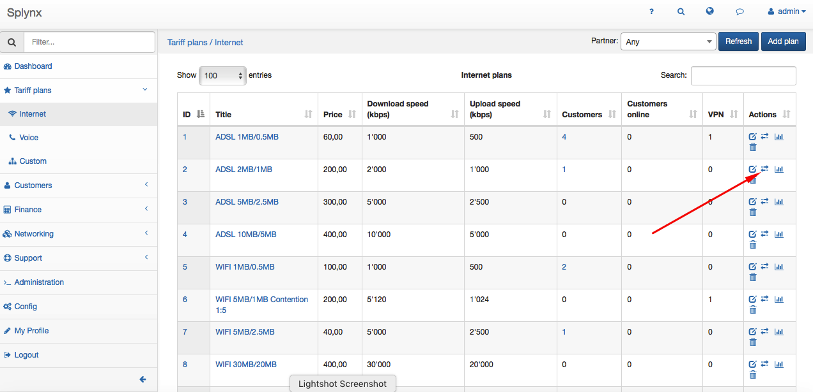

Each internet plan has its own independent fair user policy settings. Examples of different FUP settings and usage are shown below.

**1. Define when count the traffic in Plan for FUP.**

The first part you see are settings of when to count customers traffic. By default Splynx counts all customer's traffic and then applies FUP settings. But It's possible to not count customer's traffic in some period of time. In example below traffic is not counted on Sundays and in night hours:

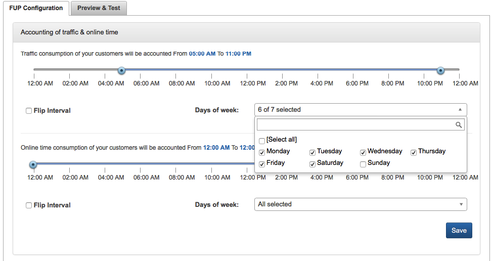

If online time of the customer is used in FUP settings, an option of counting of online time is also available.

**2. Change speed of the customer when allowed **data** amount is reached**

For example, there is a plan of 2 Mbps download/1 Mbps upload and we want to limit the speed of people who will download or upload over 5 GB per day. Every day when customer downloads 5 GB, his speed will be decreased to 50% of original speed. Next day he will get back to original speed. Below is example of FUP rule which will do the job:

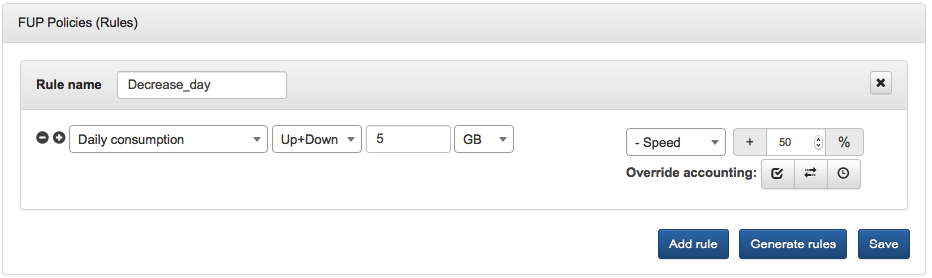

We can check what will happen when customer downloads 2 GB per day in the _Preview window_ of FUP settings:

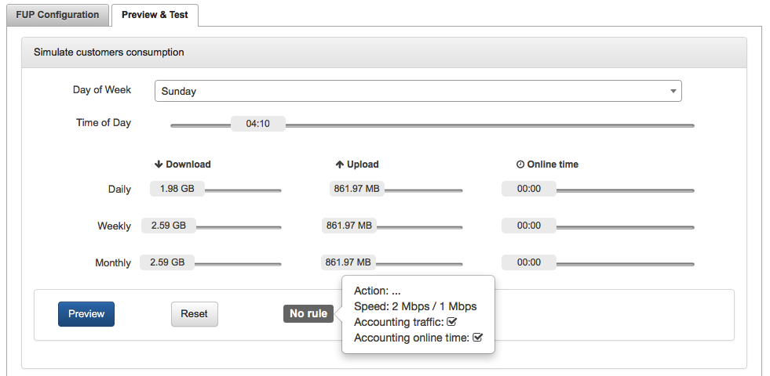

Nothing happens because customer hasn't reached 5 GB daily limit. We can see that no FUP rule was applied. In case if customer transfers over 5 GB limit, his speed will be decreased from 2/1 Mbps to 1/0,5 Mbps:

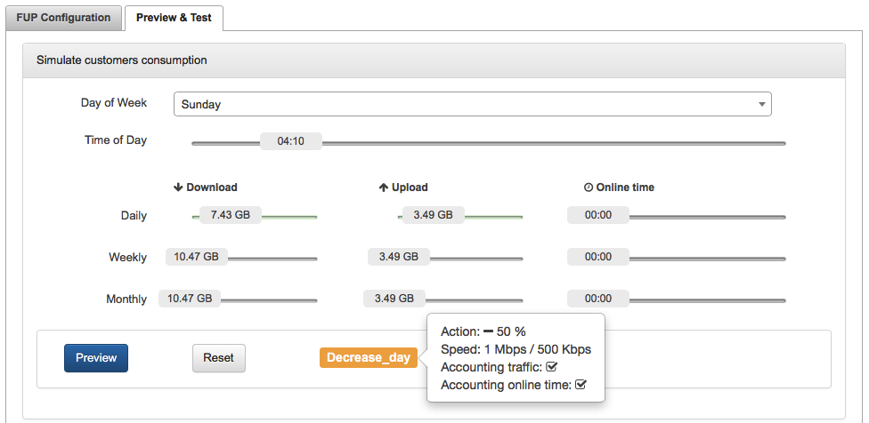

We can quickly get an overview of customers with active FUP rules in services or online list of clients.

**3. Block customer if he reached allowed amount of data per day, week or month**

The same logic is used for blocked customer, we just need to change the action. Let's apply FUP to block customer who will reach 10GB per month.

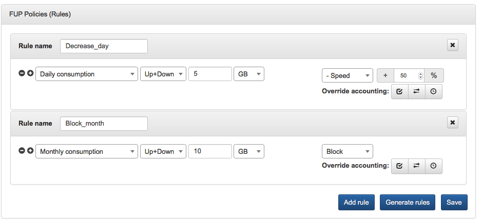

As it's obvious from a picture, Splynx can combine several FUP rules under one plan. Here we combine the speed limitation based on daily usage and blocking on monthly usage.

**4. Permamently block customer until he pays for additional data**

This is a different type of blocking. FUP is used to optimise the customers' network usage when permanent blocking is used to provide capped services.

**5. Change the speed of customer based on day of the week and time of the day**

We can allow customers to get higher speed in night hours. Below is an example of configuration, again it's just a new rule in the same plan, so all our settings for daily and monthly limitations remain, and one new rule is added to speed up internet from 2 Mbps to 4 Mbps in night hours:

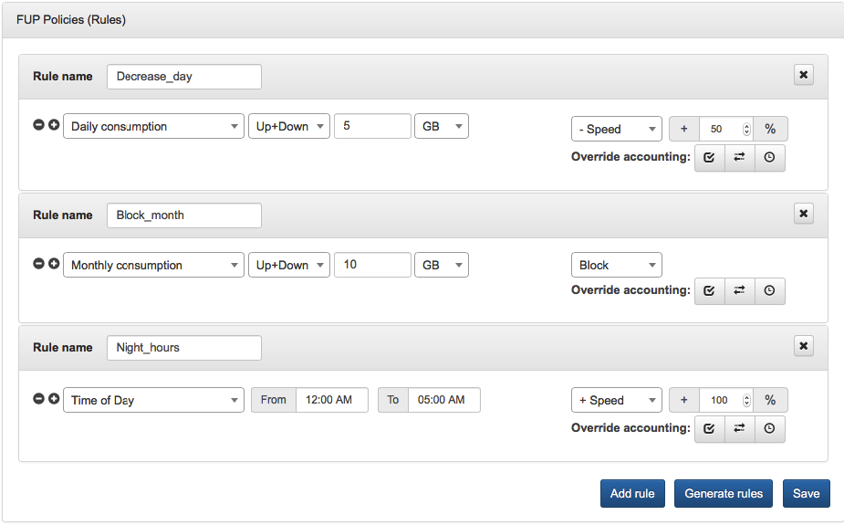

**6. Override Accounting**

In Override Accounting we can define if we want to override default accounting of traffic or online time rules.

Below are examples of default accounting of tariff & online time rules:

* Traffic consumption of your customers will be accounted from 08:00 to 02:00
* Online time consumption of your customers will be accounted from 10:00 to 02:00

_Overriding accounting configuration per rule:_

* _<u>Override accounting:</u>_

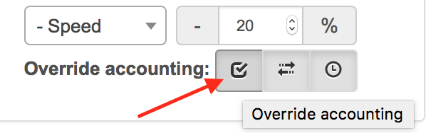

First checkbox defines if we want to **override default tariff values**.

* _<u>Accounting of traffic</u>:_

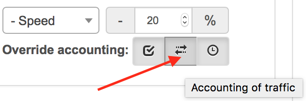

Here we can set to **account the traffic** when this rule is active (in case of Override accounting is enabled)

* _<u>Accounting of online time:</u>_

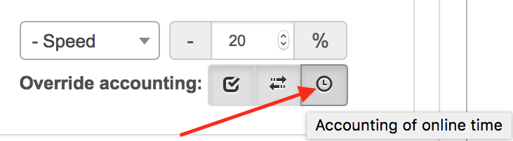

Here we can set to **account online time** when this rule is active (in case of Override accounting is enabled)

_<u>Examples of accounting of traffic & online time rules are shown below</u>_:

* Traffic consumption of your customers will be accounted from 08:00 to 02:00
* Online time consumption of your customers will be accounted from 10:00 to 02:00

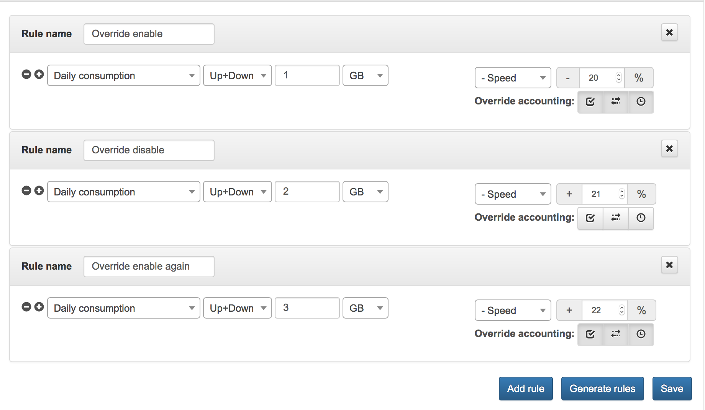

Here are some previews explaining logic of work:

<u>Rule #1</u>: Override accounting is enabled, accounting of traffic is enabled, accounting of online time is enabled

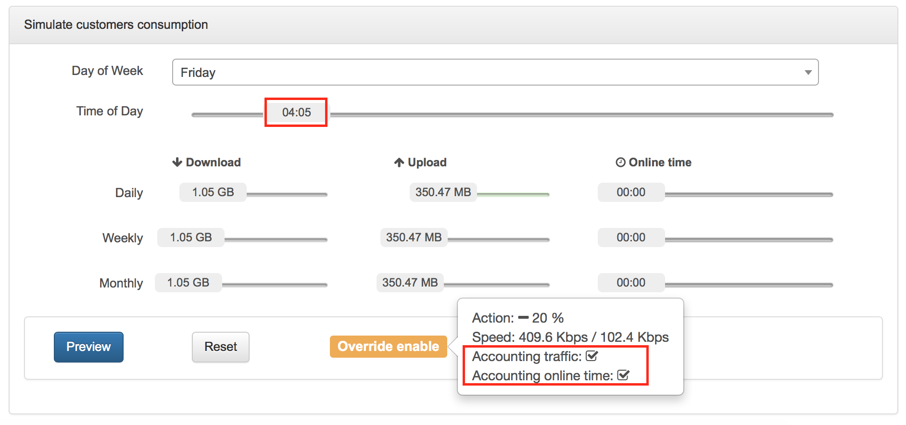

<u>Rule #2</u>: Override accounting is disabled

<u>Rule #3</u>: Override accounting is enabled, accounting of traffic is enabled, accounting of online time is enabled:

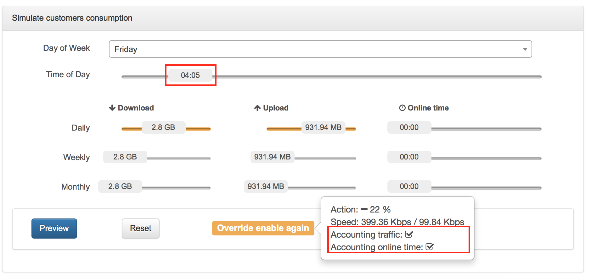
