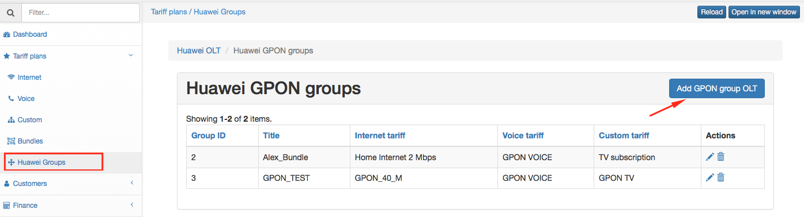
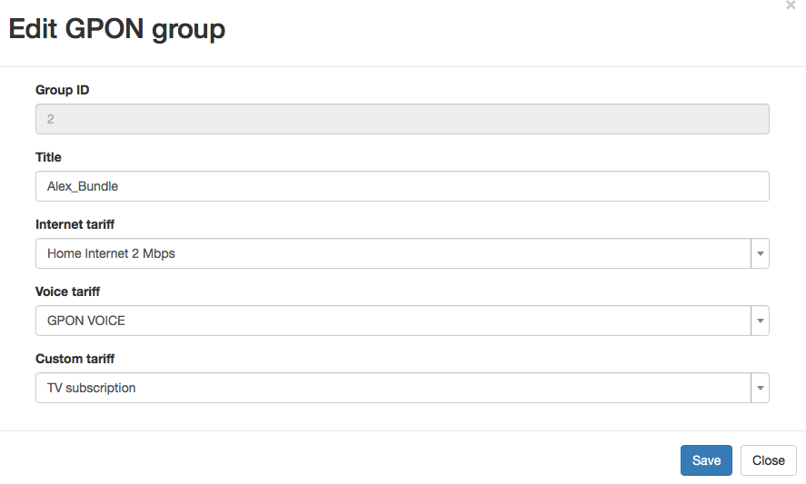
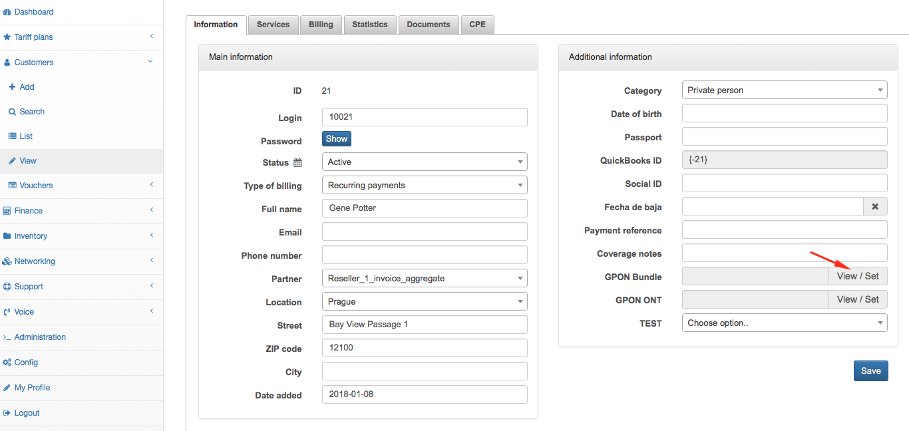

Huawei Groups
=============

In Huawei Groups is where we can create groups of plans that will limit the bandwith in the Huawei GPON.

It's located on Tariff Plans → Huawei Groups, by clicking on add you can configure new GPON group.

Select the plans and set the tittle for create it.

Note that now we have add this 2 new fields on the Voice and Custom tariffs plans, so it will allow you to limit the bandwidth for this specific services from Splynx, like VoIP and TV services.

Once the group is created, we can assign it to the customer in his information page.

And select the group for this customer.

Note that this part is just for the BW management, you should also add the services to the customer for the billing.