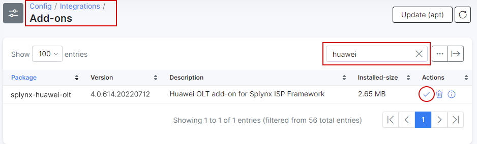
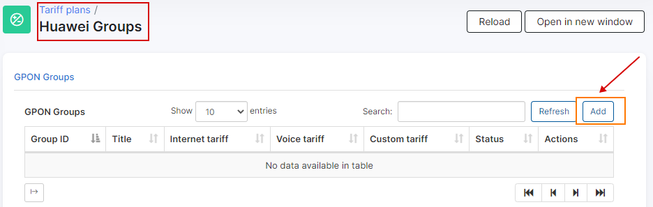
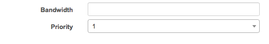
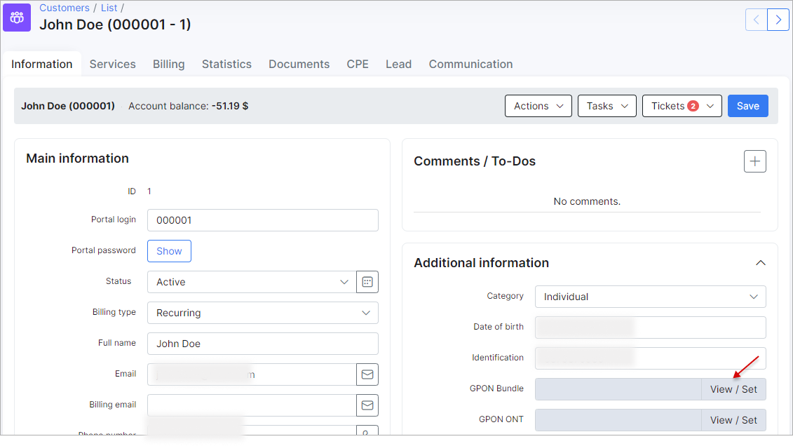
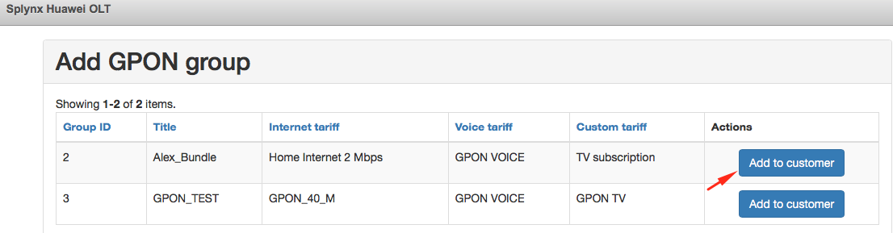

Huawei Groups
=============

Huawei Groups is where we can create groups of plans that will limit the bandwidth in the Huawei GPON.

It's located in _Tariff Plans → Huawei Groups_, when the Huawei Gpon addon is enabled. This can be done in _Config → Integrations → Addons_, search for Huawei and install the addon:

The section will then appear under _Tariff plans_ and you can create new groups by clicking on the "Add " button located at the top right of the page.

You will be redirected to the following window where you can select the plans and set the title for the new group.

Please note that we have added 2 additional fields on the Voice and Custom tariff plans, this will allow you to limit the bandwidth for these specific services from Splynx, like VoIP and TV services.

Once the group is created, we can assign it to the customer on the main information page.

Where we can select the group for this customer.

Please note the above-mentioned information only applies to bandwidth management. In order to include GPON services in customer billing, these services should be added as separate services under the customer's services tab.
