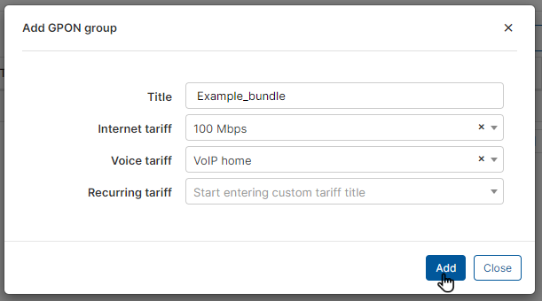

Huawei Groups
=============

Huawei Groups is where we can create groups of plans that will limit the bandwidth in the Huawei GPON.

It is located in _Tariff Plans → Huawei Groups_. But you need first to enable Huawei GPON add-on. For this, go to _Config → Integrations → Add-ons_; search for Huawei and install the add-on:

Then the section will appear under _Tariff plans_ and you can create new groups by clicking on ``Add`` button at the top right of the page.

You can select plans and set the title for the new group in the following window:

Please note that there are 2 additional fields for _Voice_ and _Recurring_ tariff plans. This allows you to limit the bandwidth for these specific services from Splynx, like VoIP and TV services.

Once the group is created, you can assign it to the customer on the main information page:

Then select a group for this customer:

Please note the above-mentioned information applies only to bandwidth management. In order to include GPON services in customer billing, these services should be added as separate services under the customer's services tab.
