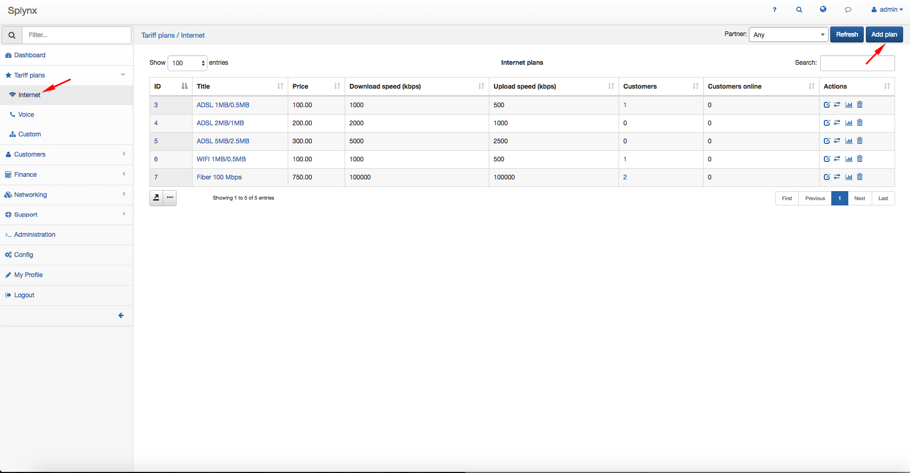
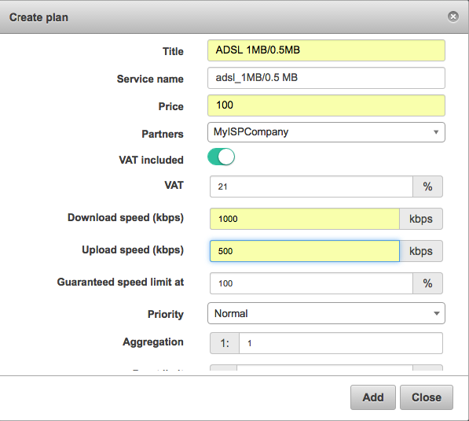
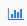
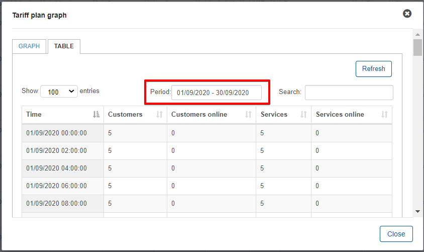
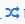
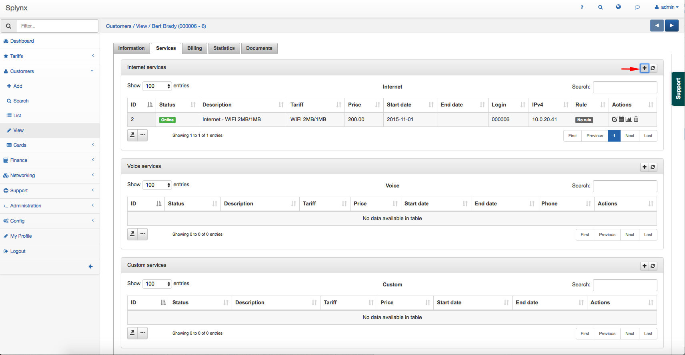
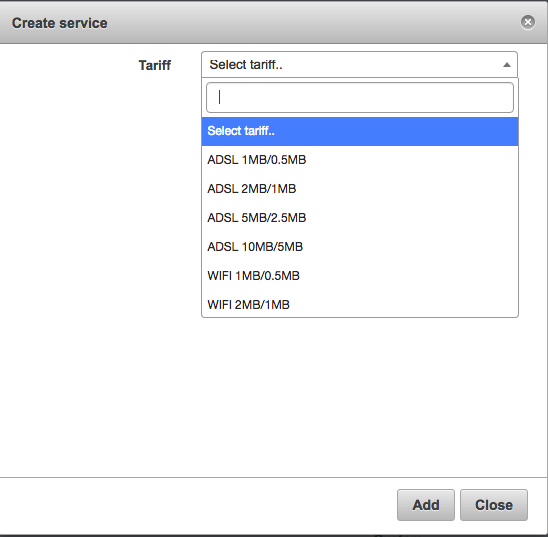
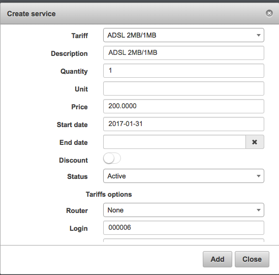
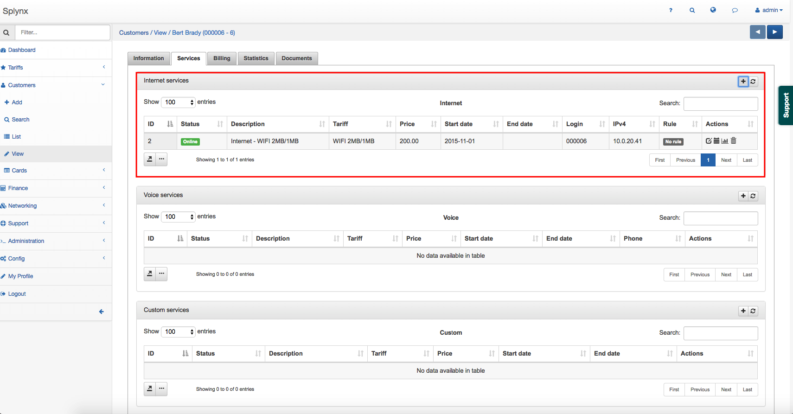

Internet plans
==============

This is where you create new and configure all your internet plans. To create new internet plans, navigate to  _Tariff Plans_, click on the _Internet_ section then click the _Add_ button at the top right of the page.

You will be redirected to the "Add Plan" page, where you will provide the necessary information/parameters for the plan you wish to create.

* **Title** - the name of the plan displayed in the list.
* **Service name** - the service description.
* **Price** - the monthly price for the service.
* **Partners** - partners the plan will be available to.
* **VAT** - the percentage of the VAT.
* **VAT Included** - select whether the plan's price includes VAT or not.
* **Download speed (Kbps)** - the download speed limit of the internet plan.
* **Upload speed (Kbps)** - the upload speed limit of the internet plan.  *Values of Download and Upload speeds are **MIR** (Maximum Information Rate) – best-case scenario, maximum data rate available for flow, if there is any free part of bandwidth*.
* **Guaranteed speed limit at** - the percentage we guarantee for the end-user. *This is the **CIR** (Committed Information Rate) – worst-case scenario, traffic will flow at this rate regardless of other traffic flows, at any given time, the bandwidth should not fall below this committed rate*.
* **Priority** - the priority of IP packets of the plan, options are: Low, Normal, High. IP packets of customers subscribed to a plan with a High priority will be forwarded first in a case of traffic congestion. Values are 1 (high), 4(normal) and 8(low).
* **Aggregation** - how many users will share the speed of the plan.
* **Burst limit** - the percentage of the maximum  burst speed allowed
* **Burst threshold** - the percentage at which burst speeds are enabled/disabled.
* **Burst Time** - the period of time used in the calculation of Burst values.
* **Tariff plans available in customer portal** - the list of other tariffs available for changing from the current tariff in the customer's portal.
* **Types of billing** - the types of billing the plan will be available to.
* **Prepaid (custom) period** - by default, it is set to monthly and customers will be charged for a period of a month, but it is possible to select "Days amount" which will cause another field to appear:" _Custom period (days)_" - this will allow you to set a custom period in days. (7 days (week), 10 days, etc up to 365 days).

* **Available in self-registration** -  enables/disables the availability of the tariff when customers sign up for services via the social/self-registration addon

Once internet plans has been created, it is possible to edit or to delete them with the icons found in the actions column of the internet plans table.  <icon class="image-icon"></icon> or <icon class="image-icon"></icon>

It is also possible to view a statistical graph of traffic for this plan with the use of the graph <icon class="image-icon"></icon> icon, in the *Actions* column, this button will present you with the following window:

The graph can be filtered to display statistical data by Hour, day, week, month or year:

Alternatively, this data can be presented in a table format and can be filtered by a specific period of time:

The Change plan <icon class="image-icon"></icon> icon can be used to change the plan in a mass action for all customers subscribed to this plan. Please follow the link below for more information: 
[Tariff Change](configuring_tariff_plans/tariff_change/tariff_change.md)

Like all tables in Splynx, you can modify the appearance of content, content to display and export the table into Excel, CSV or PDF formats, you can also choose to copy or print the table. This is done with the use of these <icon class="image-icon"></icon>  icons found at the bottom left of each table. The <icon class="image-icon"></icon> icon is used to export and the   <icon class="image-icon"></icon> icon is used to format the appearance and content of the table.

After creating an internet plan, you can now assign it as a service to a customer. To assign a service to a customer, navigate to _Customers → List_, select the specific customer, navigate to their _Services_ tab and simply click on the *Add service* button located at the top left of the page.

A window will appear to create the service, where you will select a plan from the drop-down list and specify the data in the fields provided for the service.

Once you have completed the service data form and added it, it will appear in the service table of the customer.

