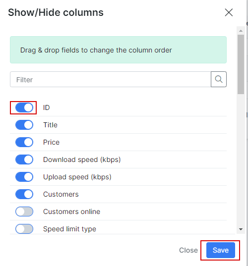

Internet plans
==============

 Here you create new and configure all your internet plans. You can specify search parameters like "Partner" or display plans with different statuses. To create new internet plans, navigate to  _Tariff Plans_, click on the _Internet_ section then click the _Add_ button at the top right of the page.

You will be redirected to the "Add Plan" page where you need to specify internet plan parameters:

Here is a description of all available options:

* **Title** - the name of the plan displayed in the list;

* **Enabled** - enable/disable this plan. If disabled - you won't be able to create a service with this plan. Previously created services will be active;

* **Service name** - the service description (under customer's internet services list);

* **Price** - the price of the service;

* **Partners** - select partners who will be able to use this plan;

* **VAT Included** - select whether the plan's price includes VAT or not;

* **VAT** - the percentage of the tax;

* **Download speed (Kbps)** - the download speed limit of the internet plan;

* **Upload speed (Kbps)** - the upload speed limit of the internet plan.  *Values of Download and Upload speeds are **MIR** (Maximum Information Rate) – best-case scenario, maximum data rate available for flow, if there is any free part of bandwidth*;

* **Guaranteed speed limit at** - the percentage we guarantee for the end-user. Depends on the setup but we recommend to always select *None*. *This is the **CIR** (Committed Information Rate) – worst-case scenario, traffic will flow at this rate regardless of other traffic flows, at any given time, the bandwidth should not fall below this committed rate*;

* **Priority** - the priority of IP packets of the plan, options are: Low, Normal, High. IP packets of customers subscribed to a plan with a High priority will be forwarded first in a case of traffic congestion. Values are 1 (high), 4(normal) and 8(low);

* **Aggregation** - how many users will share the speed of the plan;

* **Burst** - the percentage of the maximum  burst speed allowed;
 * **Burst threshold** - the percentage at which burst speeds are enabled/disabled;
 * **Burst Time** - the period of time used in the calculation of Burst values.

* **Tariff plans available in customer portal** - the list of other tariffs available for changing from the current tariff in the customer's portal. For more information, please read the following tutorial - [Change plan from customer portal](customer_portal/change_plan_from_customer_portal/change_plan_from_customer_portal.md);

* **Types of billing** - the types of billing the plan will be available to;

* **Prepaid (custom) period** - by default, it is set to monthly and customers will be charged for a period of a month, but it is possible to select "Days amount" which will cause another field to appear:" _Custom period (days)_" - this will allow you to set a custom period in days. (7 days (week), 10 days, etc up to 365 days).

* **Available in self-registration** -  enables/disables the availability of the tariff when customers sign up for services via the social/self-registration add-on.

Once internet plans has been created, it is possible to configure [CAP](configuring_tariff_plans/capped_plans/capped_plans.md) or [FUP](configuring_tariff_plans/fair_usage_policy/fair_usage_policy.md) rules, see plan usage graphs and change plan for all services:

It is also possible to view a statistical graph of traffic for this plan with the use of the graph icon, in the *Actions* column, this button will present you with the following window:

Alternatively, this data can be presented in a table format and can be filtered by a specific period of time:

The Change plan icon can be used to change the plan in a mass action for all customers subscribed to this plan. Please follow the link below for more information: 
[Tariff Change](configuring_tariff_plans/tariff_change/tariff_change.md)

It is possible to export a current view of plans list and select some additional for displaying:

To select some new fields for displaying just select them and save changes:

Now when a new plan created you can create some internet services for customers. Please use [this manual](../../customer_management/customer_services/customer_services.md) as a reference.

We also have a few reports based on plan statistic what can be found under [Administration/Reports](administration/reports/reports.md)
