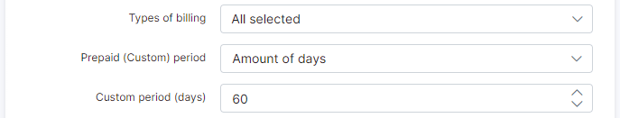

Internet plans
==============

 Here you can create new internet plans and configure them. You can specify search parameters like _Partner_ or display plans with different visibility statuses. To create a new internet plan, navigate to  _Tariff Plans_ → _Internet_, click ``Add plan`` button at the top right of the page.

You will be redirected to the _Add Plan_ page where you need to specify internet plan parameters:

Here is a description of all available options:

* **Title** - the name of the plan displayed in the list;

* **Enabled** - enable/disable this plan. If disabled - you won't be able to create a service with this plan. Previously created services will be active;

* **Service description** - the service description (under customer's internet services list);

* **Price** - the price of the service;

* **Partners** - select partners who will be able to use this plan;

* **VAT Included** - select whether the plan's price includes VAT or not;

* **VAT** - the percentage of the tax;

<icon class="image-icon"></icon>
To be able to set your VAT percentage amount, you need first add it in _Config → Finance → Taxes_. Then you can select it in _VAT_ field. For more information see [Taxes](configuration/finance/taxes/taxes.md).

* **Download speed (Kbps)** - the download speed limit of the internet plan;

* **Upload speed (Kbps)** - the upload speed limit of the internet plan.  *Values of Download and Upload speeds are **MIR** (Maximum Information Rate) – best-case scenario, maximum data rate available for flow, if there is any free part of bandwidth*;

* **Guaranteed speed** - the percentage we guarantee for the end-user. Depends on the setup but it is recommended to select always *None*. *This is the **CIR** (Committed Information Rate) – worst-case scenario, traffic will flow at this rate regardless of other traffic flows, at any given time; the bandwidth should not fall below this committed rate*;

* **Priority** - the priority of IP packets of the plan. Options are: Low, Normal, High. IP packets of customers subscribed to a plan with a High priority will be forwarded first in a case of traffic congestion. Values are 1 (high), 4 (normal) and 8 (low);

* **Aggregation** - how many users will share the speed of the plan;

* **Burst** - the maximum  burst speed allowed. Options are fixed/relative.

 * **Burst threshold** - the percentage at which burst speeds are enabled/disabled;

 * **Burst Time** - the period of time used in the calculation of _Burst_ values.

* **Tariff plans available in customer portal** - the list of other tariff plans available for changing from the current tariff in the customer's portal. For more information, please read the following tutorial: [Change plan from customer portal](customer_portal/change_plan_from_customer_portal/change_plan_from_customer_portal.md);

* **Types of billing** - the types of billing the plan will be available to;

* **Prepaid (custom) period** - by default, it is set to monthly and customers will be charged for a period of a month, but it is possible to select "Days amount" which will cause another field to appear:" _Custom period (days)_" - this will allow you to set a custom period in days. (7 days (week), 10 days, etc up to 365 days);

* **Exclude traffic classes from accounting** - choose traffic classes, if any, that should be excluded from accounting. Read [Traffic class](configuration/network/traffic_class/traffic_class.md) for more information.

*************************************************************************

Once the internet plan has been created, it is possible to configure [CAP](configuring_tariff_plans/capped_plans/capped_plans.md) or [FUP](configuring_tariff_plans/fair_usage_policy/fair_usage_policy.md) rules, see plan usage graphs and change plan for all services:

It is possible to view a statistical graph of traffic for this plan by clicking on the graph icon in the *Actions* column. Then the following window appears:

Alternatively, this data can be presented in a table format and can be filtered by a specific period of time:

The Change plan icon can be used to change the plan in a mass action for all customers subscribed to this plan. Please follow the link for more information:
[Tariff Change](configuring_tariff_plans/tariff_change/tariff_change.md)

It is possible to export a current view of plans list and select some additional columns to be displayed:

To select some new fields for displaying, enable them with a toggle and save the changes:

Now, when a new plan created, you can add some internet services for customers. Please use [this guide](../../customer_management/customer_services/customer_services.md) as a reference.

Reports based on plan statistic can be found under [Administration/Reports](administration/reports/reports.md).

*************************************************************************
Another option is updating the name and price of a plan. Sometimes a business needs to increase/decrease price for plans or change the description, and in Splynx you can do it by clicking on *Edit*  next to the tariff plan. The following window will open with the additional toggles under the description and price fields:

If you need to change *Service description* or/and *Price* but you do not want to overwrite the changes (if any) in description and price made in customer services subscribed to this tariff plan, enable *Update description in existing services* (meaning if they are the same). If the description and price are not the same, they will remain unchanged for such services.

In case you need to change *Service description* or/and *Price* even for all services subscribed to this tariff plan, enable *Force description/price update, if the service description/price is not the same*. Please be careful with this option because all the previous changes made in services subscribed to this tariff plan will be overwritten!
