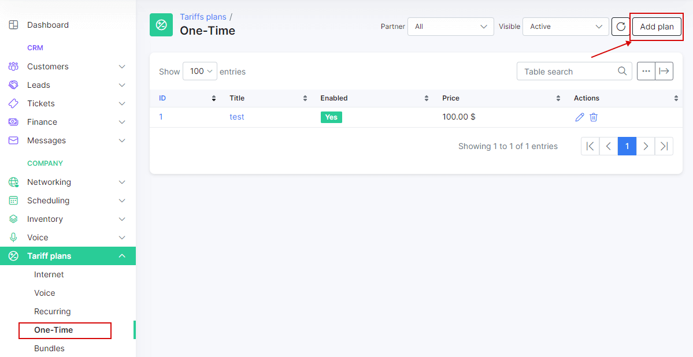
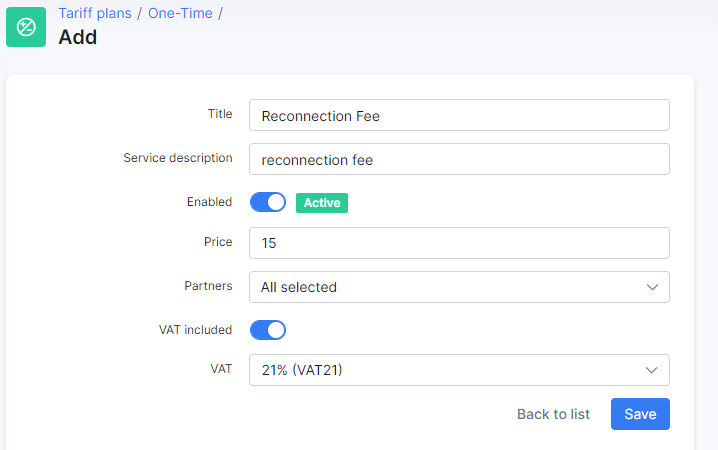
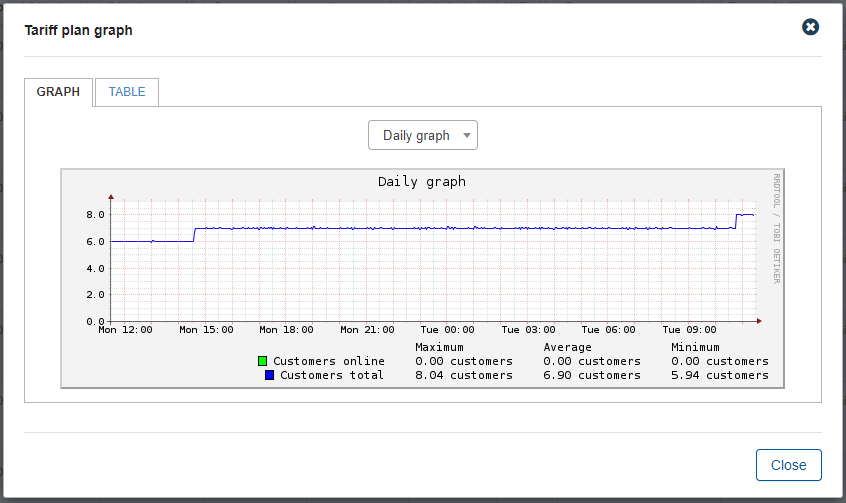
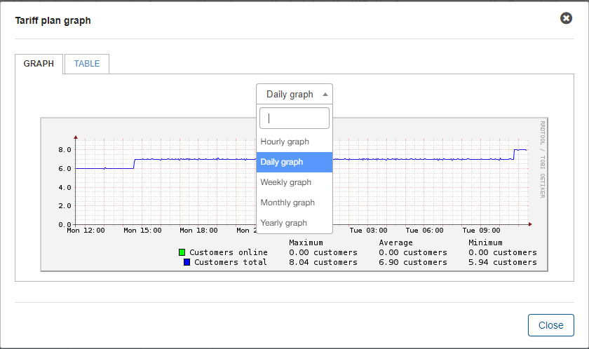
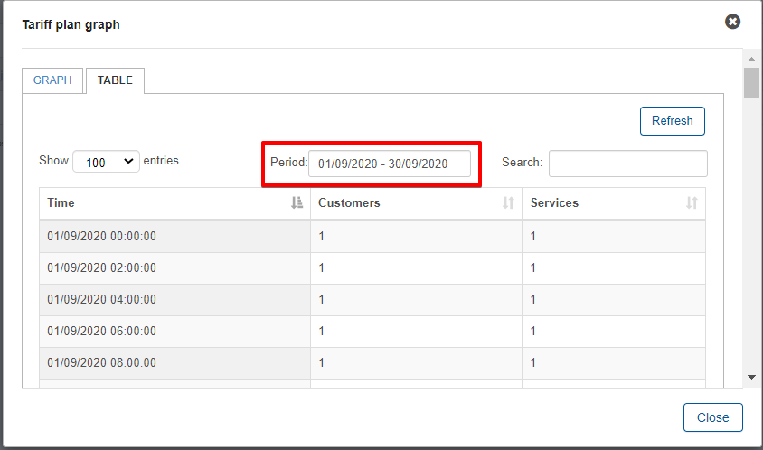
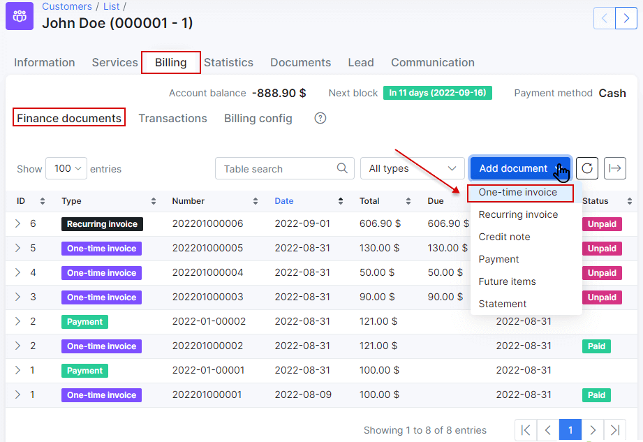
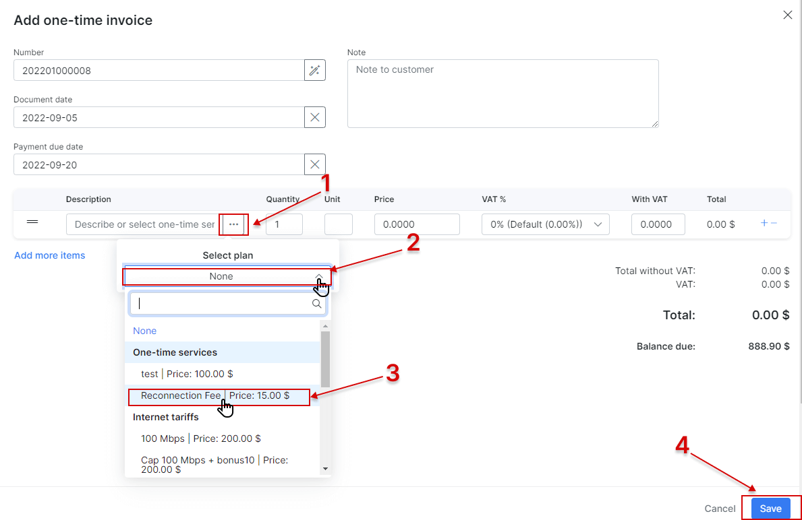
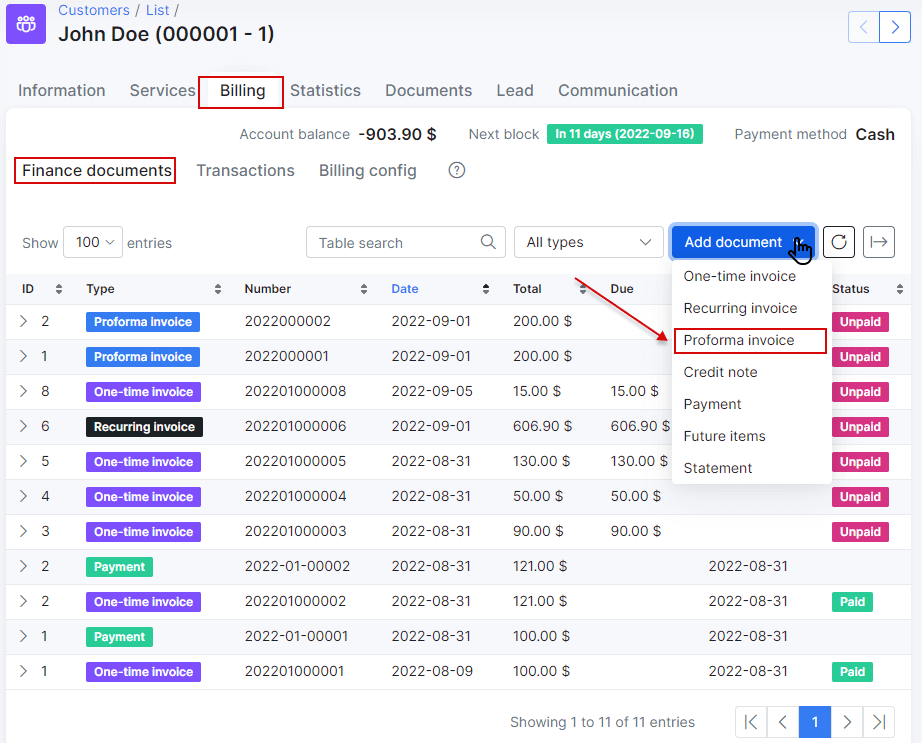
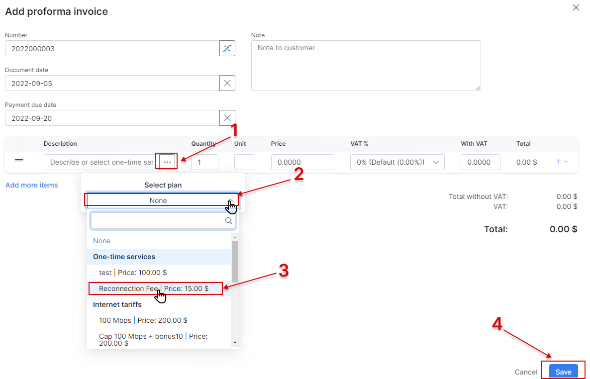

One-Time plans
==============
These are non-recurring charges used regularly which include services like, call out fees, the initial connection of customers, materials used in conduit, etc.

To create new One-Time plans, navigate to _Tariff plans → One-time_ and click on Add plan.

You will be redirected to an add plan page where you will fill in the following parameters to create a new one-time plan.

* **Title** - the name of the tariff in the One-Time Tariffs list/table.
* **Price** - the price for the service.
* **Partners** - the partners this plan will be available to.
* **VAT Included** - whether VAT is included in the price of the plan or not.
* **VAT** - the percentage of the VAT.

Once one-time plans have been created, it is possible to edit or to delete them with the icons found in the actions column of the voice plans table.  <icon class="image-icon"></icon> or <icon class="image-icon"></icon>

It is also possible to view a statistical graph of traffic for this plan with the use of the graph <icon class="image-icon"></icon> icon, in the *Actions* column, this button will present you with the following window:

The graph can be filtered to display statistical data by Hour, day, week, month or year:

Alternatively, this data can be presented in a table format and can be filtered by a specific period of time:

The Change plan <icon class="image-icon"></icon> icon can be used to change the plan in a mass action for all customers subscribed to this plan. Please follow the link below for more information: 
[Tariff Change](configuring_tariff_plans/tariff_change/tariff_change.md)

Like all tables in Splynx, you can modify the appearance of content, content to display and export the table into Excel, CSV or PDF formats, you can also choose to copy or print the table. This is done with the use of these <icon class="image-icon"></icon>  icons found at the bottom left of each table. The <icon class="image-icon"></icon> icon is used to export and the   <icon class="image-icon"></icon> icon is used to format the appearance and content of the table.

After the creation One-Time plans, it is applicable to:

**1. Add one-time invoice**

On the customer's "_Billing - Invoices_ tab" is an option to add One-time invoices:

In the One-time invoice creation here you are able to select One-time plans as items and all data pertaining to the selected plan will auto-filled as depicted in the image below:

**2. Add Proforma invoice**

Just as with "One-time invoices", the same logic can be used for proforma invoices, navigate to the customer's "_Billing - Proforma Invoices_ tab", click on the Add Proforma invoice button:

In the proforma invoice creation page, same as the "One-time invoices", you are able to select One-time plans as items on the invoice:

