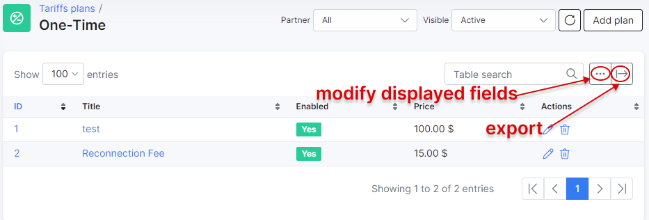
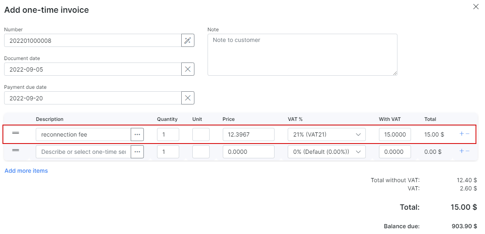
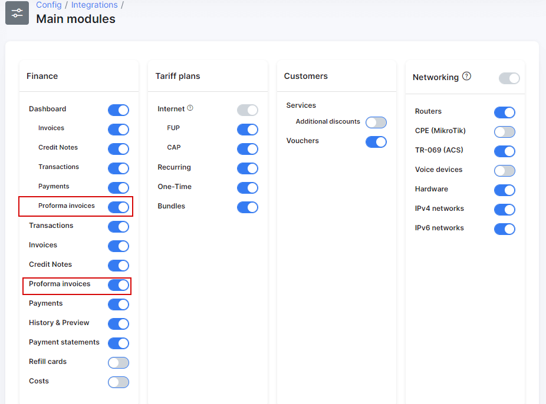

One-Time plans
==============

These are non-recurring charges used regularly which include services like, call out fees, the initial connection of customers, materials used in conduit, etc.

To create a new One-Time plan, navigate to _Tariff plans → One-time_ and click on ``Add plan``.

You will be redirected to an add plan page where you need to fill in the following parameters to create a new one-time plan.

* **Title** - the name of the tariff plan in the list of One-Time plans.
* **Service description** - a brief description of the One-time plan.
* **Enabled** - enables/disables the active status of the One-Time plan.
* **Price** - the price for the service.
* **Partners** - the partners this plan will be available to.
* **VAT Included** - whether VAT is included in the price of the plan or not.
* **VAT** - the percentage of the VAT.

<icon class="image-icon"></icon>
To be able to set your VAT percentage amount, you need first add it in _Config → Finance → Taxes_. Then you can select it in _VAT_ field. For more information see [Taxes](configuration/finance/taxes/taxes.md).

Once the one-time plan is created, it is possible to edit or delete it with the icons in _Actions_ column of the one-time plans list:  <icon class="image-icon"></icon> or <icon class="image-icon"></icon>

Like all tables in Splynx, you can modify the appearance of content to be displayed and export the table into Excel, CSV or PDF formats. You can also choose to copy or print the table:

***********************************************************************

After the One-Time plan is created, you can do the following:

**1. Add one-time invoice**

In the customer's _Billing → Finance documents_ tab there is an option to add One-time invoices:

When creating One-time invoice you can select One-time plans as items, and all the data pertaining to the selected plan will be auto-filled as depicted in the image below:

**2. Add Proforma invoice**

<icon class="image-icon"></icon>
Please make sure that you have proforma invoices enabled under _Finance_ in _Config → Integrations → Main modules_:

Just like with _One-time invoices_, the same logic can be used for proforma invoices. Navigate to the customer's _Billing → Finance documents_ tab and add a proforma invoice:

In the proforma invoice creation page, same as with _One-time invoices_, you are able to select One-time plans as items on the proforma invoice:

