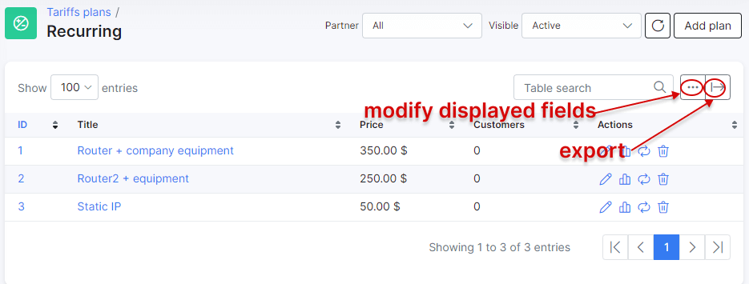
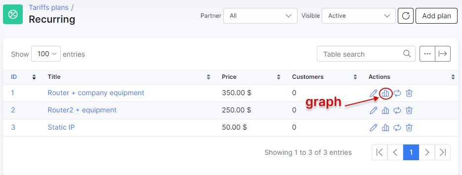

Recurring plans
============

Recurring (Custom) plans are specifically designed to bill and keep track of unique services you render within your company.

For example, certain ISPs provide public IP services for users, rental of equipment, hosting or IPTV services. These are the examples of recurring tariff plans.

To create a recurring plan navigate to _Tariff plans → Recurring_ and click on ``Add plan`` in the top right of the page.

You will be redirected to the add plan page where you need to enter the details of the plan in the provided fields.

* **Title** - the name of the tariff in the list/table of recurring tariffs;
* **Enabled** - enable/disable this plan (when disabled - you won't be able to create new services);
* **Service description** - a brief description of the plan;
* **Price** - the default price for the service;
* **Partners** - the partners this plan will be available to;
* **VAT Included** - whether VAT is included in the price of the plan or not;
* **VAT** - the percentage of the VAT;

<icon class="image-icon"></icon>
To be able to set your VAT percentage amount, you need first add it in _Config → Finance → Taxes_. Then you can select it in _VAT_ field. For more information see [Taxes](configuration/finance/taxes/taxes.md).

* **Tariff plans available in customer portal** - the list of tariffs available to change to from the current tariff in the customer portal. For more information, please read the following tutorial: [Change plan from customer portal](customer_portal/change_plan_from_customer_portal/change_plan_from_customer_portal.md);
* **Types of billing** - the type of billing the plan will be available to;
* **Prepaid (custom) period** - by default, it is set to monthly and customers will be charged for a period of a month, but it is possible to select _Amount of days_ which will cause another field to appear: _Custom period (days)_ - this will allow you to set a custom period in days. (7 days (week), 10 days, etc up to 365 days);

Once the recurring plan has been created, you can edit or delete it with the icons found in the actions column of the table.

Like all tables in Splynx, you can modify the appearance of content to be displayed and export the table into Excel, CSV or PDF formats. You can also choose to copy or print the table:

You can also view a graph of the amount of customers on this plan in the *Actions* column:

After clicking the graph button, the following window appears:

The graph can be presented by hour, day, week, month or year.
**************************************************************************

The Change plan icon <icon class="image-icon"></icon> can be used to change the plan in a mass action for all the customers subscribed to this plan. Please follow the link below for more information:
[Change plan](configuring_tariff_plans/tariff_change/tariff_change.md).

After creating a recurring plan, you can assign it as a service to a customer. To assign a service to a customer, navigate to _Customers → List_, select the specific customer, open their _Services_ tab and click on ``Add service`` button located at the top right of the page:

In a new window, select a plan from the drop-down list and specify the data in the fields provided for the service:

After being added, the service appears in the customer's service tab:

*************************************************************************
Another option is updating the name and price of a plan. Sometimes a business needs to increase/decrease price for plans or change the description, and in Splynx you can do it by clicking on *Edit*  next to the tariff plan. The following window will open with the additional toggles under the description and price fields:

If you need to change *Service description* or/and *Price* but you do not want to overwrite the changes (if any) in description and price made in customer services subscribed to this tariff plan, enable *Update description in existing services* (meaning if they are the same). If the description and price are not the same, they will remain unchanged for such services.

In case you need to change *Service description* or/and *Price* even for all services subscribed to this tariff plan, enable *Force description/price update, if the service description/price is not the same*. Please be careful with this option because all the previous changes made in services subscribed to this tariff plan will be overwritten!