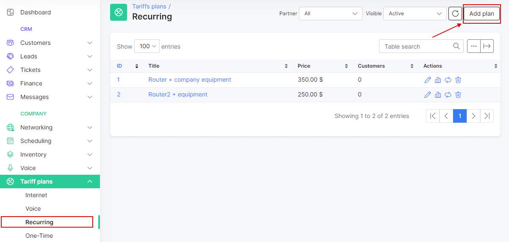
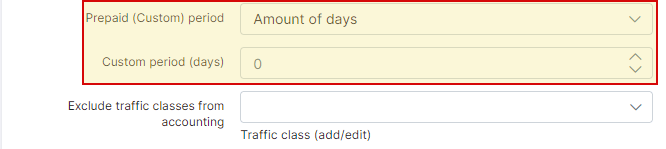
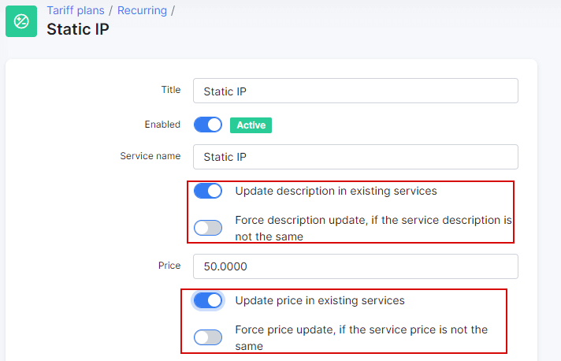

Recurring plans
============

Recurring (Custom) plans are specifically designed to bill and keep track of unique services you render within your company.

For example, certain ISP's provide public IP services to users; Rental of equipment; Hosting or IPTV services are examples of recurring tariff plans.

To create recurring plans navigate to _Tariff plans → Recurring_ and click on Add plan in the top right of the page.

You will be redirected to the add plan page and where you will enter the details of the plan in the provided fields.

* **Title** - the name of the tariff in the list/table of recurring tariffs;
* **Enabled** - enable/disable this plan (when disabled - you won't be able to create new services);
* **Service name** - the description of the plan;
* **Price** - the default price for the service;
* **Partners** - the partners this plan will be available to;
* **VAT Included** - whether VAT is included in the price of the plan or not;
* **VAT** - the percentage of the VAT;
* **Tariff plans available in customer portal** - the list of tariffs available to change to from the current tariff in the customer portal;
* **Types of billing** - the type of billing the plan will be available to;
* **Prepaid (custom) period** - by default, it is set to monthly and customers will be charged for a period of a month, but it is possible to select "Days amount" which will cause another field to appear:" _Custom period (days)_" - this will allow you to set a custom period in days. (7 days (week), 10 days, etc up to 365 days);

Once recurring plans have been created, you can edit or delete them with the icons found in the actions column of the table.

Like all tables in Splynx, you can modify the appearance of the list, content to display and export the table into Excel, CSV or PDF formats, you can also choose to copy or print the table. This is done with the use of icons found at the bottom left of each table.

You can also view a graph of the ammount of customers on this plan in the *Actions* column, this button will present you with the following window:

The graph can be filtered to display by hour, day, week, month or year:

The Change plan icon can be used to change the plan in a mass action for all customers subscribed to this plan. Please follow the link below for more information: 
[Tariff Change](configuring_tariff_plans/tariff_change/tariff_change.md)

After creating a recurring plan, you can now assign it as a service to a customer. To assign a service to a customer, navigate to _Customers → List_, select the specific customer, navigate to their _Services_ tab and simply click on the *Add service* button located at the top left of the page.

A window will appear to create the service, where you will select a plan from the drop-down list and specify the data in the fields provided for the service.

Once you have completed the service data form and added it, it will appear in the service tab of the customer.

Another option is the updating of the name and price of a plan. Sometimes a business needs to increase/decrease price for plans and in Splynx you can do it in few clicks using *Edit* button under tariff plan:

To change the *Service name* for new services you should update this field and **do not** enable the option *Update description in existing services*.

The same with price, if you need to update the price for all services just specify new price, enable option "Update price in existing services" and these changes will be applied to all services subscribed to this tariff plan.
