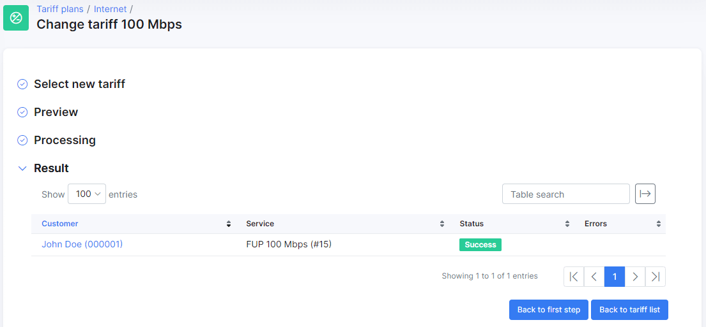

Change Plan
========

This feature can be used to change a tariff plan in the system, regardless of how many customers are subscribed to it. The feature is for mass changes as its functionality is to change the selected plan with another plan in the system for all the customers subscribed to the former.

The feature is available for all types of tariff plan's in the system, so that you could comfortably change a tariff plan. For this, just click on _Change plan_ button in the *Actions* column of each respective tariff plan row:

You will be presented with the following window:

Then you need to specify the following:

* **New plan start date** - select the date to apply the change of plan for all customers using this plan.

* **New plan** - select a new plan to change to from the list of available plans in the drop-down menu. If you need to create a new plan, create it before using this feature.

* **Ignore balance** - enabling this option will ignore the balance of the current plan for all the customers registered to this plan.

After specifying these parameters, _Description_ and _Price_ fields will appear, and ``Preview`` button will become available.

Click on ``Preview`` button to display a preview of the results found for all the customers using this plan. In this case, there is only one customer subscribed to this plan:

To confirm the action, click on ``Change tariff``. If you need to change something in _Select new tariff_,  click on ``Back to first step``.

After clicking on ``Change tariff``, the following window appears:

Click on ``Confirm`` to proceed with the action.

After processing the change, you will see in the _Result_ step a list of all the customers the change plan has been executed on. The successful result of the action will be confirmed with the green _Success_ status:

