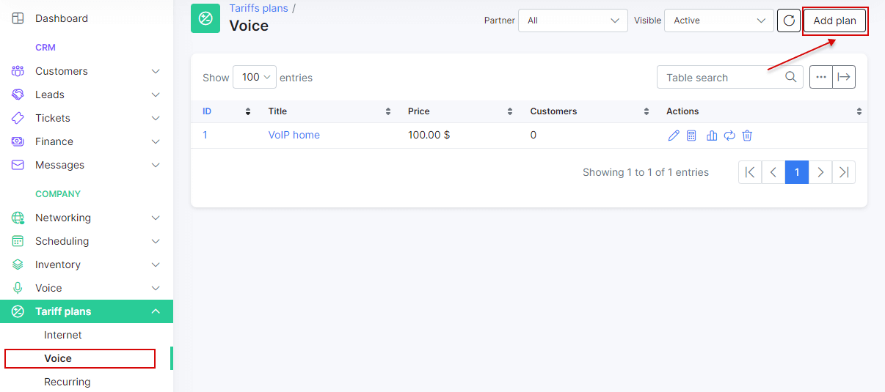
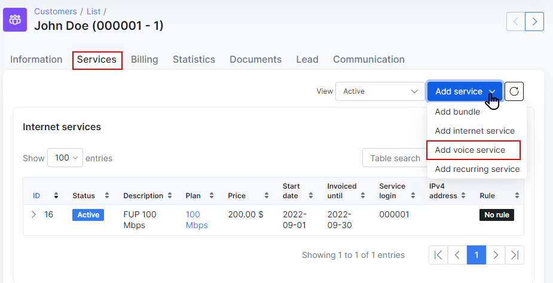

Voice plans
===========

This is the home of your voice services you will provide to your customers.

**Why use Voice plans in Splynx?**

We can provide two main reasons using Splynx for voice plans:

1. Charging customers monthly fees for voice services such as VOIP, Toll numbers, Number rentals or Mobile plans.
2. Processing of VOIP CDR's. Splynx can automatically or manually process the CDR's from Voice platforms, attach calls from CDRs to corresponding customers, create transactions for voice service usage and make one common invoice for Voice and Internet services.

To configure a voice plan, navigate to _Tariff plans → Voice_ and click on the _Add plan_ button found in the top right of the page.

You will be redirected to an add plan page where you will fill in the following parameters to create a new voice plan.

* **Title** - the name of the tariff in the list/table of voice tariffs.
* **Service name** - the description of the plan.
* **Price** - the price for the service.
* **Type** - the options are VOIP, Fix or Mobile.
* **Partners** - the partners this plan will be available to.
* **VAT Included** - whether VAT is included in the price of the plan or not.
* **VAT** - the percentage of the VAT.
* **Tariff plans to change** (available in customer portal) - the list of other tariffs available for changing from the current tariff in the customer's portal.
* **Types of billing** - the types of billing the plan will be available to.
* **Prepaid (custom) period** - by default, it is set to monthly and customers will be charged for a month, but it is possible to select "Days amount" which will cause another field to appear:" _Custom period (days)_" - this will allow you to set a custom period in days. (7 days (week), 10 days, etc up to 365 days).

* Available in self-registration -  enables/disables the availability of the tariff when customers sign up for services via the social/self-registration addon.

Once voice plans has been created, it is possible to edit or to delete them with the icons found in the actions column of the voice plans table.  <icon class="image-icon"></icon> or <icon class="image-icon"></icon>

It is also possible to view a statistical graph of traffic for this plan with the use of the graph <icon class="image-icon"></icon> icon, in the *Actions* column, this button will present you with the following window:

The graph can be filtered to display statistical data by Hour, day, week, month or year:

Alternatively, this data can be presented in a table format and can be filtered by a specific period of time:

The Change plan <icon class="image-icon"></icon> icon can be used to change the plan in a mass action for all customers subscribed to this plan. Please follow the link below for more information: 
[Tariff Change](configuring_tariff_plans/tariff_change/tariff_change.md)

Like all tables in Splynx, you can modify the appearance of content, content to display and export the table into Excel, CSV or PDF formats, you can also choose to copy or print the table. This is done with the use of these <icon class="image-icon"></icon>  icons found at the bottom left of each table. The <icon class="image-icon"></icon> icon is used to export and the   <icon class="image-icon"></icon> icon is used to format the appearance and content of the table.

After creating a voice plan, you can now assign it as a service to a customer. To assign a service to a customer, navigate to _Customers → List_, select the specific customer, navigate to their _Services_ tab and simply click on the *Add service* button located at the top left of the page.

A window will appear to create the service, where you will select a plan from the drop-down list and specify the data in the fields provided for the service.

 

Once you have completed the service data form and added it, it will appear in the service table of the customer.

In the service table in the Tariffs module, under the actions column, you will find the following icon: <icon class="image-icon"></icon>.

This icon refers to the rates and prices of voice services according to preconfigured/loaded rates tables for CDR's

For more information about voice CDR processing, please click [here](voice/voice.md).
