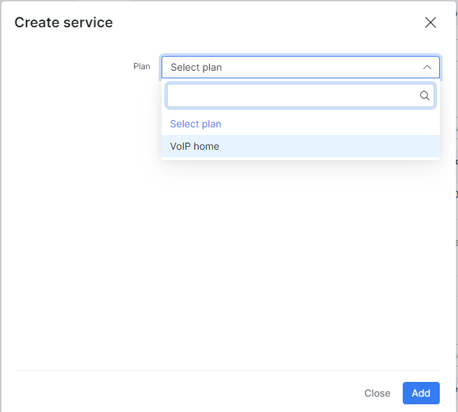
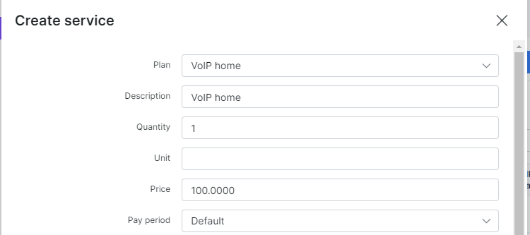

Voice plans
===========

**Why use Voice plans in Splynx?**

There are two main reasons for voice plans :

1. Charging clients monthly fee for voice services such as VOIP, Toll number, Number rental or Mobile plan.
2. Processing of VOIP CDR. Splynx is able to process the CDR from Voice platforms, attach calls from CDRs to proper customer, create transaction for voice usage and make one common invoice for Voice services and Internet.

To configure the Voice plan, click on _Tariff plans → Voice_ and click on _Add plan_.

A Create plan window will pop up and it will be possible to create a plan.

* Title - the name that describe the tariff in the Voice Tariffs table
* Service name - the service used
* Price - the price for the service
* Type - the options are: VOIP, Fix or Mobile
* Partners - the partner 's name
* VAT Included - select it on or off
* VAT - you can decide the percentage of the VAT

It is possible to edit or to delete the tariff with the icons <icon class="image-icon"></icon> or <icon class="image-icon"></icon> in the column Actions.

There are two symbols <icon class="image-icon"></icon> on the bottom left of the table. The first one on the left <icon class="image-icon"></icon> is used to copy, print the table and to export it in different formats: Excel, CSV, PDF. The second <icon class="image-icon"></icon> is used to modify the view of the table.

After the creation of Voice plan, it is possible to associate the service to a customer. Click on _Customer → List_, select the customer, click on the tab _Services_ and on the +.

A window will pop up to create the service.

 

It is possible to see the new service in the Services table.

To get more information about Voice CDR processing, please, follow dedicated tutorial page.
