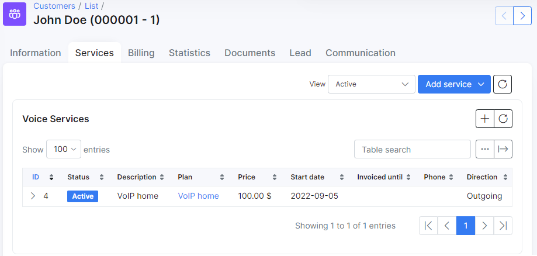

Voice plans
===========

This is the home of your voice services you will provide to your customers.

**Why use Voice plans in Splynx?**

We can provide two main reasons using Splynx for voice plans:

1. Charging customers monthly fees for voice services such as VOIP, Toll numbers, Number rentals or Mobile plans.
2. Processing of VOIP CDR's. Splynx can automatically or manually process the CDR's from Voice platforms, attach calls from CDRs to corresponding customers, create transactions for voice service usage and make one common invoice for Voice and Internet services.

To configure a voice plan, navigate to _Tariff plans → Voice_ and click on ``Add plan`` button at the top right of the page:

You will be redirected to the add plan page where you can create a new voice plan by filling in the following parameters:

* **Title** - the name of the tariff in the list of voice tariffs.
* **Enabled** - enable/disable this plan (when disabled - you won't be able to create new services).
* **Service description** - the description of the plan.
* **Price** - the price for the service.
* **Type** - the options are VoIP, Fix or Mobile.
* **Partners** - the partners this plan will be available to.
* **VAT Included** - whether VAT is included in the price of the plan or not.
* **VAT** - the percentage of the VAT.

<icon class="image-icon"></icon>
To be able to set your VAT percentage amount, you need first add it in _Config → Finance → Taxes_. Then you can select it in _VAT_ field. For more information see [Taxes](configuration/finance/taxes/taxes.md).

* **Tariff plans available in customer portal** - the list of other tariffs available for changing from the current tariff in the customer's portal. For more information, please read the following tutorial - [Change plan from customer portal](customer_portal/change_plan_from_customer_portal/change_plan_from_customer_portal.md).
* **Types of billing** - the types of billing the plan will be available to.
* **Prepaid (custom) period** - by default, it is set to monthly and customers will be charged for a month, but it is possible to select _Amount of days_ which will cause another field to appear: _Custom period (days)_ - this will allow you to set a custom period in days  (7 days (week), 10 days, etc up to 365 days).

************************************************************************
Once the voice plan has been created, it is possible to edit or delete it with the icons found in the actions column of the voice plans list: <icon class="image-icon"></icon> or <icon class="image-icon"></icon>.

It is also possible to view a statistical graph of traffic for this plan with the use of the graph <icon class="image-icon"></icon> icon in the *Actions* column. This button will present you with the following window:

The graph can be filtered to display statistical data by hour, day, week, month or year:

Alternatively, this data can be presented in a table format and filtered by a specific period of time:

**************************************************************************
The Change plan <icon class="image-icon"></icon> icon can be used to change the plan in a mass action for all customers subscribed to this plan. Please follow the link below for more information: [Change plan](configuring_tariff_plans/tariff_change/tariff_change.md).

Like all tables in Splynx, you can modify the appearance of content to be displayed and export the table into Excel, CSV or PDF formats. You can also choose to copy or print the table:

*********************************************************************
After creating a voice plan, you can assign it now as a service to a customer. For this, navigate to _Customers → List_, select the specific customer, open their _Services_ tab and click on ``Add service`` button at the top right of the page:

A window will appear to create the service, where you need to select a plan from the drop-down list and specify the data in the fields provided for the service:

 

Once you have completed the service data form and added it, it will appear in the service table of the customer:

******************************************************************
In the list of voice plans, under the actions column, there is the following icon: <icon class="image-icon"></icon>.

This icon refers to the rates and prices of voice services according to preconfigured/loaded rates tables for CDR's.

For more information about voice CDR processing, please click [here](voice/voice.md).

*************************************************************************
Another option is updating the name and price of a plan. Sometimes a business needs to increase/decrease price for plans or change the description, and in Splynx you can do it by clicking on *Edit*  next to the tariff plan. The following window will open with the additional toggles under the description and price fields:

If you need to change *Service description* or/and *Price* but you do not want to overwrite the changes (if any) in description and price made in customer services subscribed to this tariff plan, enable *Update description in existing services* (meaning if they are the same). If the description and price are not the same, they will remain unchanged for such services.

In case you need to change *Service description* or/and *Price* even for all services subscribed to this tariff plan, enable *Force description/price update, if the service description/price is not the same*. Please be careful with this option because all the previous changes made in services subscribed to this tariff plan will be overwritten!
