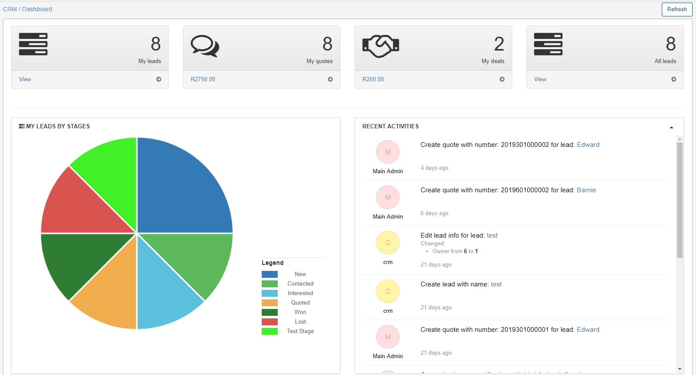

CRM Dashboard
===
The CRM dashboard provides an overview of all sales activities regarding prospective customers.

The dashboard represents progressive and interactive data statistics for each contributing headers. You can see total amounts of deals and quotes with an estimated total revenue, as well as, the number of leads for the current administrator and all leads within the system.

Each section is represented here in an appropriate format. My leads, My quotes, My deals and all deals are represented by the mean of the informational box of totals and consist of links that direct you to the respective sub-module.

Other summarized information regarding activities on the system and progression in stages of leads are represented by means of the following:

A pie chart for the **My leads by stages** section - which displays the various stages of the current administrator's leads in the system. A legend for the different stages and the color thereof on the chart is provided as descriptions for each stage.

A table for the  **Recent Activities** section - representing live information of all actions applied to the leads in the system.

A table for the **Leads Info** section - tabulates a breakdown of the quotes vs deals and the number thereof as well as the total revenue it may generate.

A table for the **Upcoming follow-ups** - displays reminder notifications configured for each lead in their information page.

