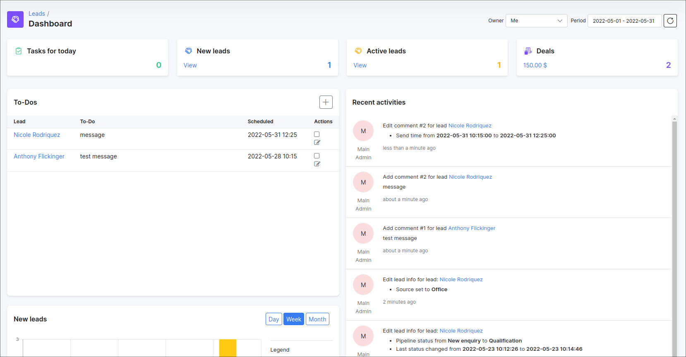
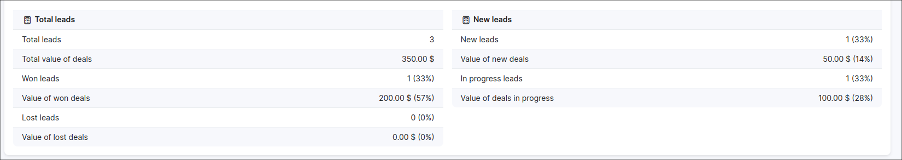

Leads Dashboard
===
The Leads dashboard provides an overview of all sales activities regarding prospective customers.

The dashboard represents progressive and interactive data statistics for each contributing headers. You can see total amounts of deals and its total value, as well as, the number of leads for the current administrator, related tasks for today, etc.

Each section is represented here in an appropriate format. **Tasks for today**, **New leads**, **Active leads** and **Deals** are represented by the mean of the informational box of totals and consist of links that direct you to the respective sub-module.

Other summarized information regarding activities on the system and progression in stages of leads are represented by means of the following:

* **To-Dos** - consolidated list of all tasks in relation to a specific lead. Also, tasks are presented in each leader's profile in the **Comments/To-Dos** section;

* **Recent activities** - representing live information of all actions applied to the leads in the system;

* **New leads** - representation of new and converted leads per day/week/month;

* **Sources** - pie chart shows the source from which the lead came, as well as statistics of converted leads;

* **Sales funnel** - chart displays the various pipelines (stages) of the current administrator's leads in the system.;

* **Total leads** - tabulates a breakdown of the leads vs deals and the number thereof as well as the total revenue it may generate.;

* **New leads** - able shows statistics only on newly created leads and deals;

