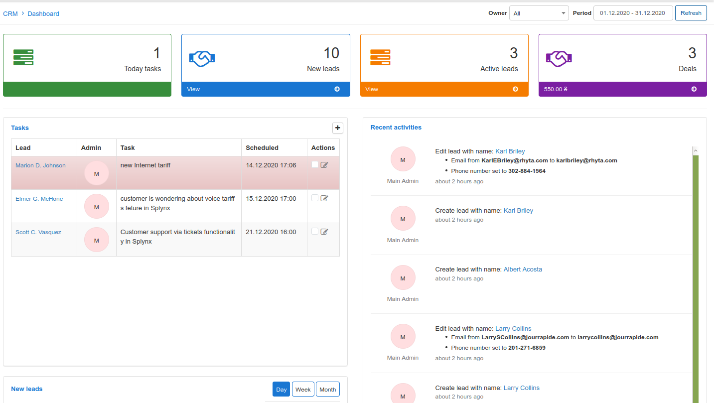

CRM Dashboard
===
The CRM dashboard provides an overview of all sales activities regarding prospective customers.

The dashboard represents progressive and interactive data statistics for each contributing headers. You can see total amounts of deals and quotes with an estimated total revenue, as well as, the number of leads for any administrator, related tasks and all leads within the system.

Each section is represented here in an appropriate format. Today tasks, new leads, active leads and all deals are represented by the mean of the informational box of totals and consist of links that direct you to the respective sub-module.

Other summarized information regarding activities on the system and progression in stages of leads are represented by means of the following:

A table **Tasks** displays the tasks related to the leads, the task assigned for today is highlighted in the list section.

A graph for **New leads** section displays the correlation between the number of added and converted leads during day, week or month.

[CRM Dashboard New leads](CRM_dashboard_new_leads.png)

A pie chart for **Sources** displays the original source of information from which the client learned about us. A legend for the different types and the color thereof on the chart is provided as descriptions for each type.

[CRM Dashboard Sources](CRM_dashboard_sources.png)

A table for **Recent Activities** section - representing live information of all actions applied to the leads in the system.

A graph for **Sales funnel**  displays the various stages of the current administrator's leads in the system and below it tabulates a breakdown of the quotes vs deals and the number thereof as well as the total revenue it may generate.

[CRM Dashboard Sales funnel](CRM_dashboard_sales_funnel.png)

A graph for **Leads per owner** shows the correlation between the number of various stages of the leads in the system according to all or current administrator account. A legend for the different stages and the color thereof on the chart is provided as descriptions for each stage.

[CRM Dashboard Leads per owner](CRM_dashboard_leads_per_owner.png)
