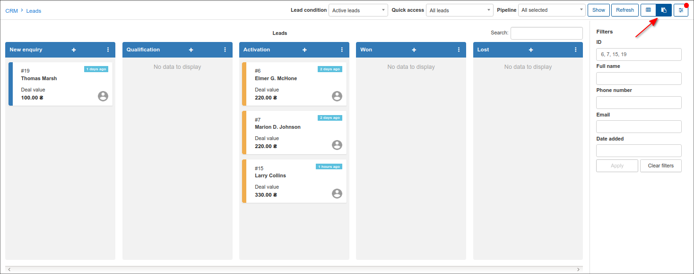

Deals
====
Deals are commitments/agreements created with leads on business done with/for them. The deals amount directly depends on the number of Quotes and its value with leads, one time services are ignored.

In order to show the deals statistic in accordance with the leads list with quotes and pipeline status, click on Deals info box in CRM → Dashboard.

Creating the successful *Quotes* leads to a greater number and amount of deals in *Totals* table .

We can also use the filter options to filter between the different status' the deals belong to, switch the list of leads with quotes to workflow view according to their pipeline status or use advanced search.

