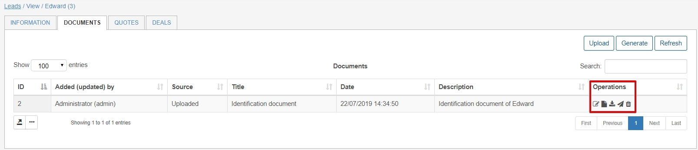

Documents
=====
The documents section of leads can be accessed on the select lead's page. Here we can upload all documents pertaining to the lead eg. documentation, contracts, NDA's and agreements.

We have two options to add/create documents into Splynx.

1. Uploading documents - simply click on upload - Add the title with optional description, whether the document should be visible to the customer within their portal and finally upload the document via the File upload button 

2. Generate documents - We can generate documents via **loading** predefined templates in the system or generating a new document which can be **saved as a new** template. We can also **preview** the document before finally generating it. (Template configuration is covered [here](configuration/system/templates/templates.md))

Once we have uploaded/generated a document, its is possible to either **Edit**, **View**, **Download**, **Send** or **Delete** a document.

