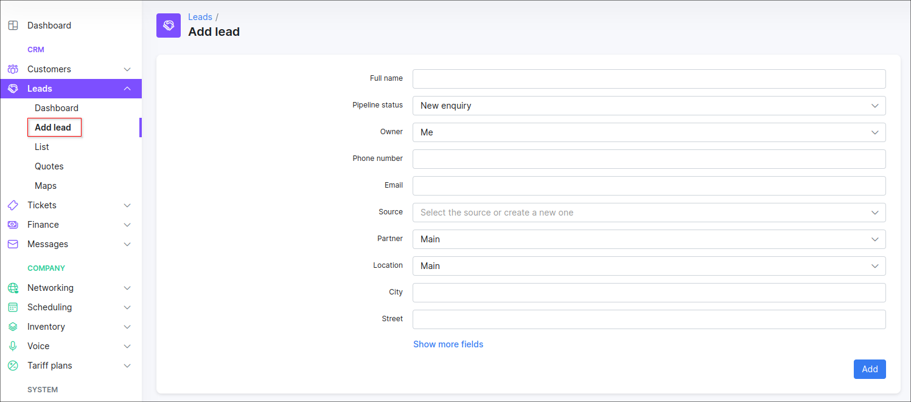
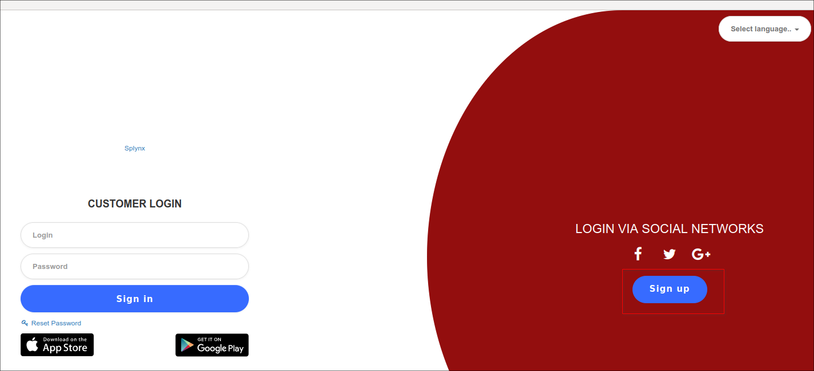
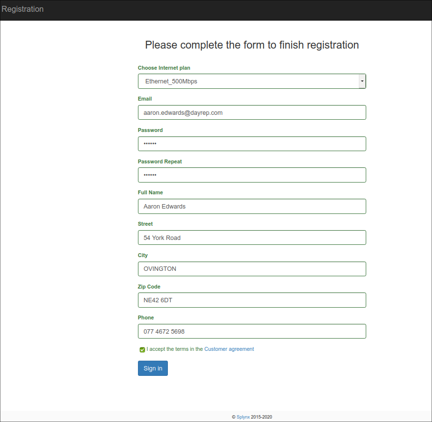
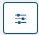
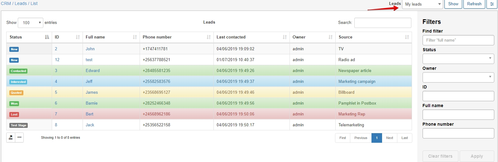
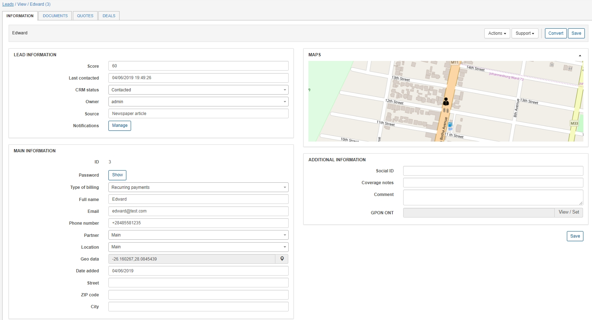
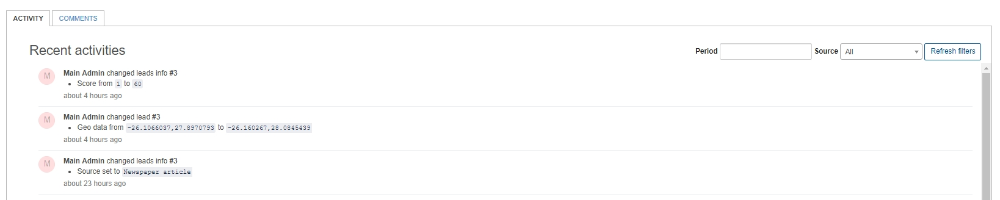
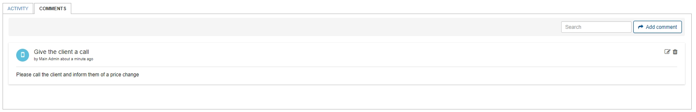
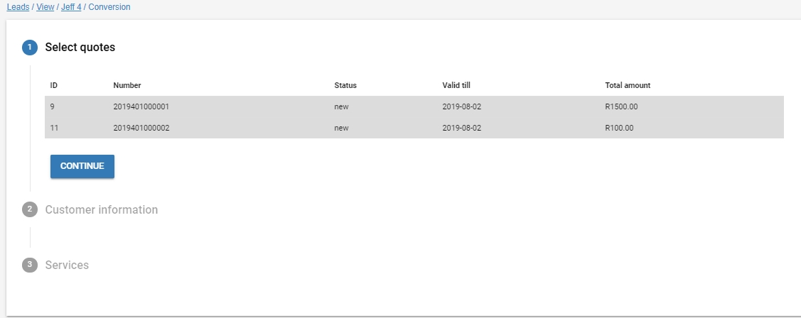
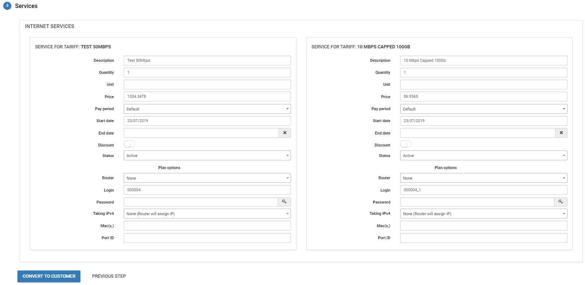

Leads
=======
A lead is a person or business who may eventually become a client. Leads are the central part of the CRM that binds all other functions together.

Our first step is to **Add a new lead** - here we will specify all the details pertaining to the prospective customer (Owner, CRM Status and Source). The information added here, will also be used when converting from a lead to a customer.

**Full name** - Names and surname of the lead 
**Login** - Username used to sign into the customer portal 
**Email** - Email address(es) of the lead, multiple addresses supported and separated by comma "," 
**Phone number** - contact number(s) of the lead, multiple numbers supported and seperated by comma "," 
**Partner** - the partner the lead will belong to in the list of partners 
**Location** - the location the lead will belong to in the list of locations 
**Owner** - the administrator that will be responsible for the lead 
**CRM status** - the status of the lead (stage in the process) 
**Source** - where/what/how the lead obtained/received/gained interest or information about the company 

 Persons interested in signing up for a subscription can also be referred to the customer portal where, they can sign up by means of a registration form with relevant details required to contact them.

 

 

The leads list is where we'll find a complete list of all "My leads" (default view) - these are the leads which the current administrator is responsible for.

 However, you can to change the list of leads to display, by selecting a category from the drop down list to view specific leads thereof. We also have the option to filter leads according to several fields in the filter tab 

Next, we can view a lead by clicking on their full name/ID - this will open the lead page, where all the details relevant to the lead can be defined or edited.

In the leads information page, all details will be entered as per a normal customer except information regarding to a service.

CRM specific details:
- Score - A scoring function that can be used to score leads based on popularity.
- Last contacted - time and date feature to record when the lead was last contacted.
- CRM status - Status/level in the process the of lead (Status's can be customized within Config / CRM / Lead Stages)
- Owner - the administrator who is responsible for the lead.
- Source - Where the lead originates from or discovered the product/company.
- Notifications - Notifications sent to the administrators regarding the lead, also shows as upcoming follow-ups on the dashboard.

 All changes made to the selected lead can be viewed in the recent activities tab at the bottom of the page. Where comments can be added with customizable icons/color schemes.

In the **Actions** drop-down list found in the information page of the selected lead, we can access the following functions:
- Creating a message, which will be sent to the customer (can be processed with preconfigured template)
- Delete the lead
- Convert the lead - Convert the lead into a customer (See conversion process below)
- Create task - Creates a task related to the lead (directs to [scheduling a task](scheduling/scheduling.md))
- List of tasks - List all tasks related to lead

## Converting a lead to a customer

Our main objective for the CRM is to achieve converting prospective customers into subscribers of our services.

We can choose to convert leads to customers by accessing the actions tab and clicking **Convert** .

This will initiate the conversion process, consisting of three steps.

1. **Select the quote/s** - quotes that will be used to create the customer's services. (The services quoted and agreed upon).

2. **Customer information** - choose which type of conversion we want to use, `create active customer and invoice` or `create inactive customer and proforma invoice`. We can choose to complete the conversion within this step by clicking *convert now*, skipping the services step, or continue to add services existing on the customers quote.

3. **Services** - The final step, allowing us to edit the services of the quote we selected in step 1.
Once all details have been entered, we can complete the process by clicking on *convert to customer*.

The leads module is also linked to the support system whereby you can log new tickets on behalf of the customer or view open or closed tickets linked to them. You can do this by navigating to the Support drop-down as shown below:

