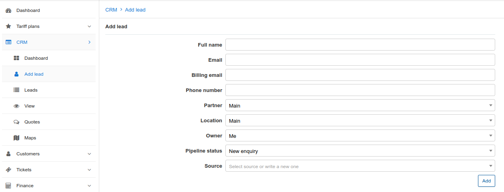
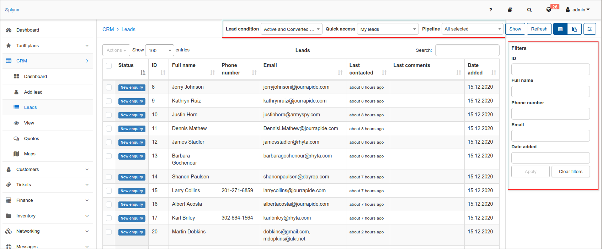
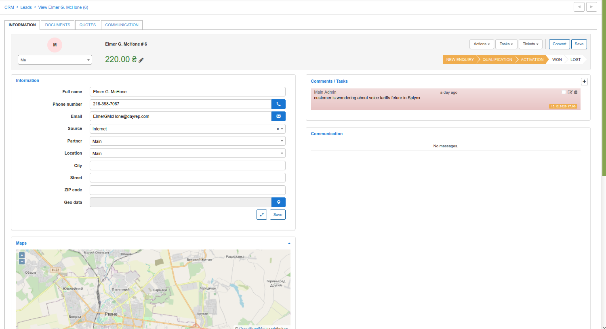
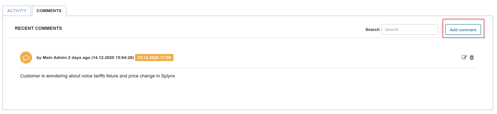
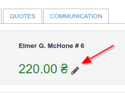
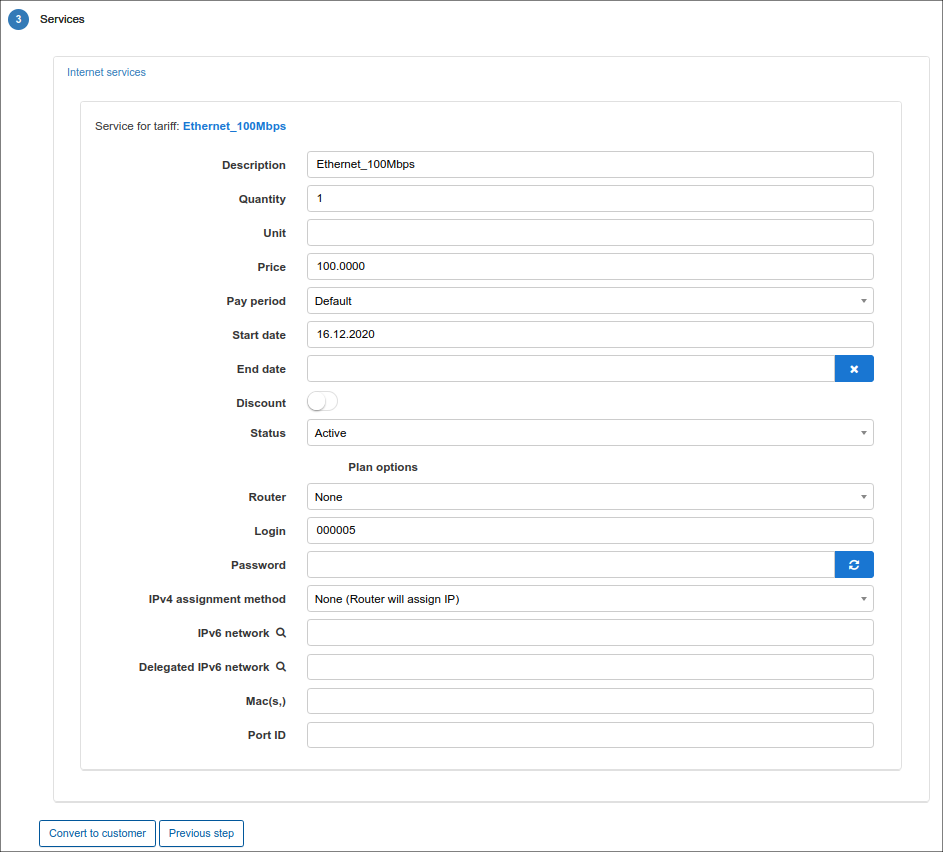

Leads
=======
A lead is a person or business who may eventually become a client. Leads are the central part of the CRM that binds all other functions together.

Our first step is to **Add a new lead** - here we will specify all the details pertaining to the prospective customer (Owner, Pipeline status and Source). The information added here, will also be used when converting from a lead to a customer.

**Full name** - Names and surname of the lead 
**Email** - Email address(es) of the lead, multiple addresses supported and separated by comma "," 
**Billing email** - Email address(es) of the lead, only for billing correspondence, if no address is specified then the main email will be used, multiple addresses supported and separated by comma "," 
**Phone number** - contact number(s) of the lead, multiple numbers supported and separated by comma "," 
**Partner** - the partner the lead will belong to in the list of partners 
**Location** - the location the lead will belong to in the list of locations 
**Owner** - the administrator that will be responsible for the lead 
**Pipeline status** - the status of the lead (stage in the process). The available statuses for lead: New enquiry, Qualification, Activation, Won, Lost. 
**Source** - where/what/how the lead obtained/received/gained interest or information about the company 

 Persons interested in signing up for a subscription can also be referred to the [customer portal](/configuration/main_configuration/portal/portal.md) where, they can sign up by means of a registration form with relevant details required to contact them.

 

 

 

The complete list of the leads is available in CRM ⟶ Leads.

However, you can to change the list of leads to display, by selecting the necessary category (Lead condition, Quick access, Pipeline) from the drop down lists to view specific leads thereof. We also have the option to filter leads according to ID / Full name / Phone number / Email / Date added fields in the filter tab 

Also, we can switch current table view of leads into workflow

Next, we can view a lead by clicking on their full name/ID - this will open the lead page, where all the details relevant to the lead can be defined or edited.

In the leads information page, all details will be entered as per a normal customer except information regarding to a service.

CRM specific details:

- *Source* - Where the lead originates from or discovered the product/company.
- *Score* - A scoring function that can be used to score leads based on popularity.
- *Type of billing* - option allows to choose between reccuring and prepaid (custom) billing.
- *Date added* - the date when the lead was added into system.
- *Comments / Tasks* - the panel with scheduled tasks for current lead.
- *Communication* - the panel with the history of communication with lead.
- *Maps* - the visual map based on the coordinates in Geo data field.
- *Recent activities* - the timeline shows us live information about all changes of lead profile in system.

In the recent activities tab at the bottom of the page we can add and schedule the customizable comments as well.

On the top sidebar of information page of the selected lead, the following functions are available:

**Lead owner change**
The drop-down menu where we can change the lead owner

**Deal value/comment change**
The option to change deal value/comment

**Actions**
- *Creating a message*, which will be sent to the customer (can be processed with preconfigured template)
- *Delete the lead*

**Tasks**
- *Create task* - Creates a task related to the lead (directs to [scheduling a task](scheduling/scheduling.md))
- *List of tasks* - List all tasks related to lead

**Tickets**
- *Create* - creates ticket linked to the lead (directs to [tickets](/tickets/tickets.md))
- *All tickets* / *Opened* - redirects to *Tickets → List new & open* related to current lead
- *Closed* - redirects to *Tickets → List of closed* related to current lead

- *Convert* button - convert the lead into a customer (See conversion process below).
- *Save* button - save the changes on lead information page.

**Pipeline status bar**
Status/level in the process the of lead (Status types can be customized in Config → CRM → Leads pipeline)

## Converting a lead to a customer

Our main objective for the CRM is to achieve converting prospective customers into subscribers of our services.

We can choose to convert leads to customers by accessing the information tab and clicking on **Convert** button.

This will initiate the conversion process, consisting of three steps.

1. **Select the quote/s** - quotes that will be used to create the customer's services. (The services quoted and agreed upon).

2. **Customer information** - choose which type of conversion we want to use, `create active customer`, `create active customer and invoice` or `create new customer and proforma invoice`. We can choose to complete the conversion within this step by clicking *convert now*, skipping the services step, or continue to add services existing on the customers quote.

3. **Services** - The final step, allowing us to edit the services of the quote we selected in step 1.
Once all details have been entered, we can complete the process by clicking on *convert to customer*.

