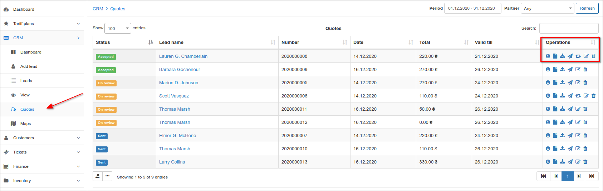

Quotes
=======
A quote is a document provided to a lead to inform them of the cost of a service/s before they decide to purchase it.

To view a list of all quotes, simply click on the **Quotes** menu in the sidebar under the Leads module. Here we can see details for each quote and the operations column with multiple actions to execute to each quote - *view*, *view PDF*, *download PDF*, *send*, *edit* or *delete*.

Quotes per lead can be accessed by navigating to the Quotes tab on the leads page. Here we can see a list of all quotes generated for the selected lead, displaying a summary of the total value of the quotes and a filter section at the bottom of the page, used to display quotes of a specified status.

To add a quote we should click on the **Add quote** button in the top right-hand corner of the quotes tab under a selected lead's page.

When adding a quote we are presented with the pop-up window below:

Here we can edit the following fields:
- **Status** - `New`, `Sent`, `On review`, `Accepted` or `Denied`;
- **Document date** - creation of the quote;
- **Number** - number for referencing quotes (pattern/format can be changed under `Config → Leads → Finance`);
- **Valid until** - period of the quote's validity calculate from the day of creation to the valid till date. Default is set to 10 days (can be changed under `Config → Leads → Finance`);
- **Set deal value** - value is calculated only for internet, voice, recurring, bundle tariff plans and depends on the total of quote;
- **Note** - note directed to the lead;
- **Memo** - personal note for the administrator.

Clicking on the icon  we can select a service to add to the quote. It is possible to add multiple services by pressing the `+` icon. Services can conveniently be re-ordered on the quote by dragging and dropping the services to the selected position of priority. You can also select the appropriate VAT percentage from the drop-down list in the VAT field.

Once we have created a quote, we can navigate to the **Actions** column on the table of quotes. Where multiple actions can be performed - *View*, *View PDF*, *Download PDF*, *Send*, *Edit* or *Delete*.

When sending quotes to leads, you can use templates to format the content the way you want the quote to appear.

Information on editing or creating **Quote template** can found [here](configuration/system/templates/templates.md).
