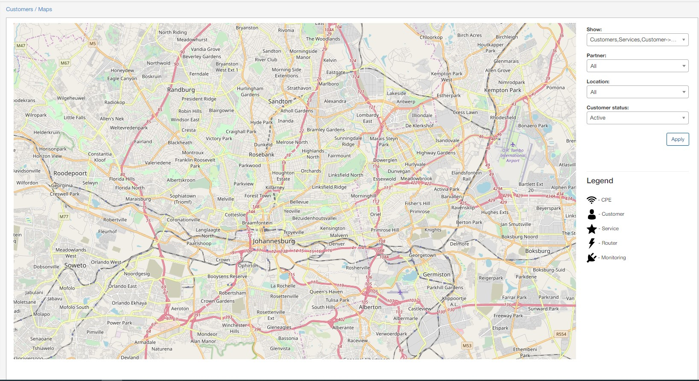

Maps
======

This is a map of all your customers which have location data recorded in the customer information page. This is data you can use to your advantage in various different ways from a geo data perspective.

The Map has a convenient filter for you to display specific data when viewing as well as a convenient legend for reference.

**Show** - select data to display on the map 
**Partner** - select data to display from customers belonging to a specific partner in your list of partners 
**Location** - select data to display from customers belonging to a specific location in your list of locations 
**Customer status** - select data to display of customers with a specific status 

