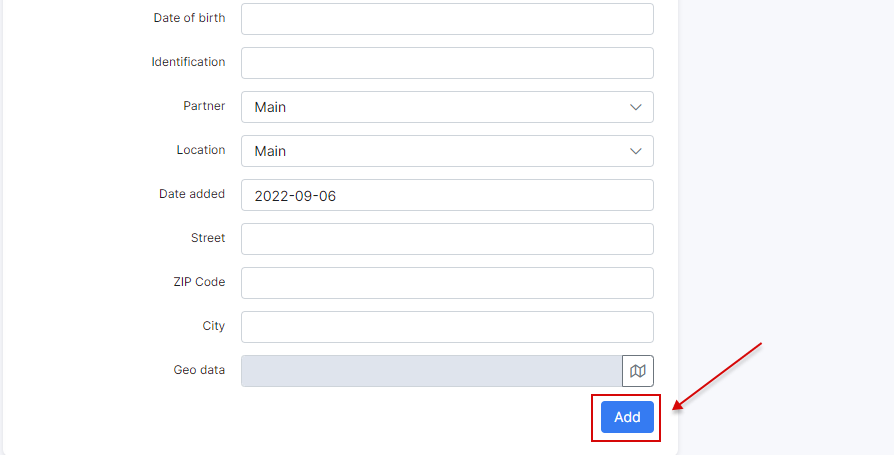
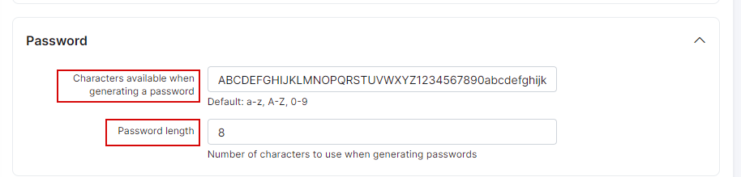

Adding a new customer
===================

To add a new customer, click on _Customers → Add_. A window will appear to fill in the client details in the provided fields:

* `Portal login` and `Portal password` - login and password can either be automatically generated or you may choose to create them manually. The <icon class="image-icon"></icon> button is used to generate automatically a new login and <icon class="image-icon"></icon> - for a password.
* `Billing type` - method with which you will bill the customer (prepaid or recurring).
* `Category` - if customer is a private person or a company.
* `Full name` - name and surname of the customer.
* `Email` - email address of the customer (several ones are separated by comma ",").
* `Billing email` - email address of the customer only for the billing correspondence (several ones are separated by comma ",").
This field has the next logic:
**1)** *if the billing email field is empty - all emails are sending to email(-s) from main "Email" field;*
**2)** *if there is the email in the "Billing email" field - all billing notifications will be sent to this billing email and all other emails will be sent to email from main "Email" field. As a result, Splynx does not duplicate the billing notifications to email(-s) from the main "Email" field;*
**3)** *in case only the billing email was added ("Email" field is empty), customer receives only the billing related letters, all other letters will not be sent by Splynx.*
* `Phone Number` - phone number of the customer (several ones are separated by comma ",").
* `Date of birth` - birthday of the customer.
* `Identification` - the passport number of the customer.
* `Partner` - partner the customer belongs to.
* `Location` - location the customer belongs to.
* `Date added` - the date when the customer has been added.
* `Street` - the customer's street name.
* `ZIP code` - ZIP code of the customer's area.
* `City` - the city of customer's residence.
* `Geo Data` - physical coordinates of the customer.
 
 
 

**Customer status**

The status of your customers plays a significant role in the system with regards to services and accounting. The status of a customer influences whether the system will account for the customer's services in a billing perspective and whether the customers service are active, suspended (blocked) or stopped.

Here are descriptions of the different customer statuses for you to understand how this influences the system:

* **New (Not yet connected)** - This is the status given to newly added customers by default.
* **Active** - This status allows the customer access their services, and the system accounts for their services based on their _Billing settings_.
* **Blocked** - This status suspends customers' services due to non-payment/failed to make payment on time, while system still accounts for customer's services in a billing perspective.  
* **Inactive** (Doesn't use services) - This status stops customers services and the system from accounting. It is the status given to customers' automatically when they've reached the _deactivation (grace) period_. This status is given to customers who do not use your services for a long period. In case the customer's account has _Inactive_ status it can be deleted.

Automatically generated login and password are created based on the randomized characters. These characters and the format can be modified to your preferences.

To define these characters and its format , click on _Config → Main→ Customers_.

It is possible to personalize a customer's parameters with _Additional field_ function in _Config → System → Additional fields_. These are custom fields you require for any given informational data within the system for your customers.

To create the additional field in the form of adding of the new customer or on the information tab of the existed customer, click on ``Add`` and specify the necessary parameters:

