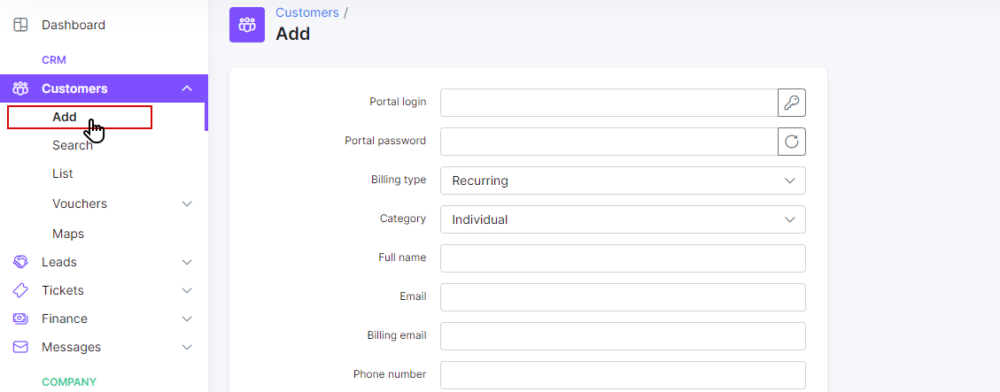

Adding a new customer
===================

To add a new customer, click on the _Customers Menu → + Add_. A window will appear for you to fill in the client details in the provided fields:

* `Login and Password` - Login's and Passwords can either be automatically generated or you may choose to manually create them . The <icon class="image-icon"></icon> button is used to automatically generate a new login and<icon class="image-icon"></icon> for passwords.
* `Type of billing` - method in which you will bill the customer (prepaid or recurring)
* `Full name` - full name and surname of the customer
* `Email` - email address of the customer (Multiple supported separated by comma ",")
* `Phone Number` - phone number of the customer (Multiple supported separated by comma ",")
* `Category` - if customer is a private person or a company.
* `Date of birth` - birthday of the customer
* `Passport` - passport number of the customer
* `Partner` - partner the customer belongs to
* `Location` - location the customer belongs to
* `Date added` - the date when the customer has been added
* `Street` - Street of the customer address
* `ZIP code` - ZIP code of the customer address
* `City` - city of the customer address
* `Geo Data` - physical coordinates of the customer

Automatically generated logins and passwords are created based on randomized characters. These characters and the pattern can be modified to your preference.

To define these characters and pattern , click on _Config → Main→ Customers_.

It is possible to personalize a customer's parameters with the _Additional field_ function in _Config → System → Additional fields_. These are custom fields you require for any given informational data within the system for your customers.

When you create an additional field for a customer, select _Add_ to get the parameter in the "add customer window" as well as the customer's profile by default.

