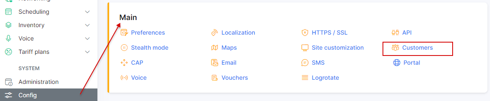

Adding new customer
===================

To add a customer, click on the _Customers Menu → + Add_. The window will pop up where you will fill in the next fields:

* `Login and Password` - it is possible to generate a new login and password or add it manually. The button <icon class="image-icon"></icon> is used for generation of new login and password.
* `Type of billing` - if customer is fully prepaid or we will charge him monthly (recurring charge).
* `Full name` - full name of the customer
* `Email` - email of the customer
* `Phone Number` - phone number of the customer
* `Category` - if customer is a private person or a company
* `Birthday` - birthday of the customer
* `Passport` - passport of the customer
* `Partner` - partner of the customer
* `Location` - location of the customer
* `Date add` - the date when the customer has been added
* `Street` - Street of the customer
* `ZIP code` - ZIP code of the customer
* `City` - city of the customer
* `Contract ID` - contract ID of the customer
* `Custom Status` - the options are: customer, deactivated, new
* `VAT ID` - the vat ID

Login and password are created based on pattern.

To define the pattern, click on _Config → Main→ Customers_. This is a way to define symbols for generation of login and password.

It is possible to personalise customer's parameters with the function _Additional field_ in _Config → System → Additional fields_.

When you create the additional field for a customer, select Add to get the parameter in the customer's profile by default.

