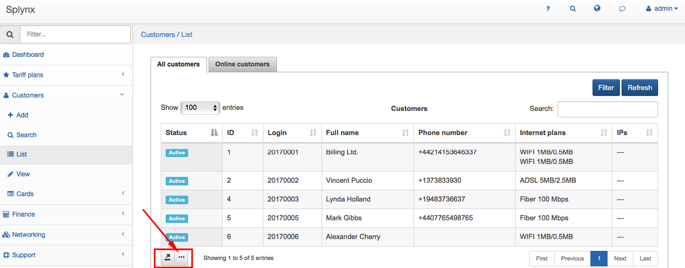
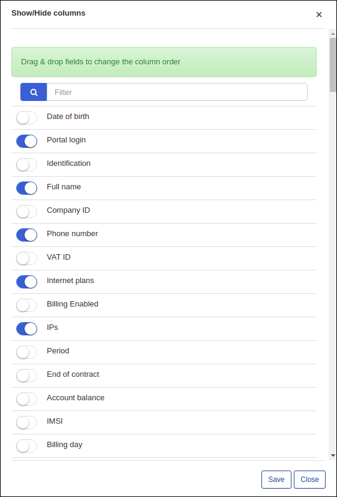
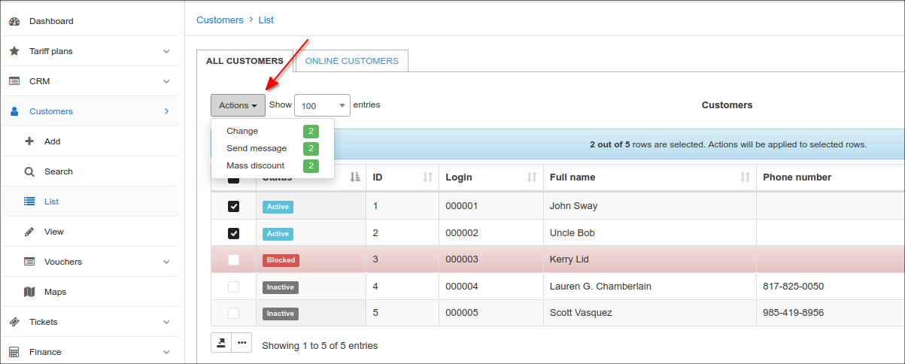
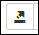

Modifying the table
==========

All tables within Splynx are customizable to view content you prefer and in the order you prefer to see it.

Click on the <icon class="image-icon"></icon> icon below the table then simply drag and drop fields in an order preferable for you or turn the field on/off.

You can select customers via checkboxes and make mass changes to them (change status, location, partner, type etc.) or send messages to selected customers.

In addition, by clicking on the export icon <icon class="image-icon"></icon> it's possible to print, copy or export a table in Excel, CSV or PDF formats.

These actions apply to all table in all modules of Splynx.
