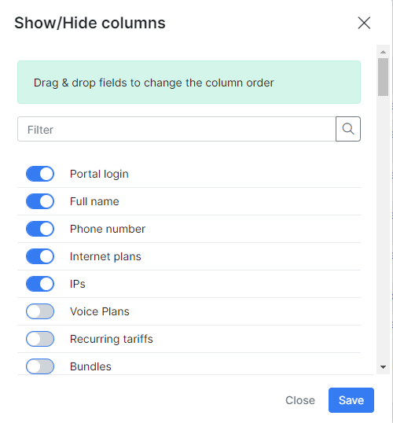
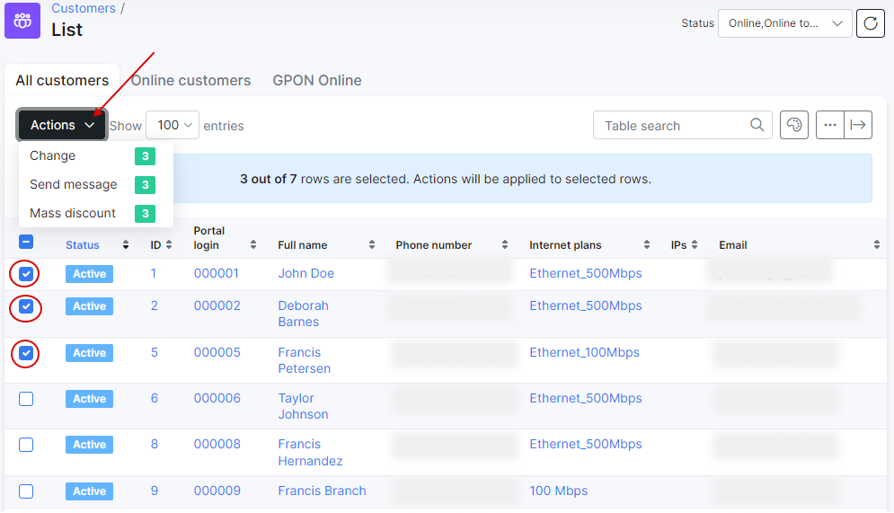
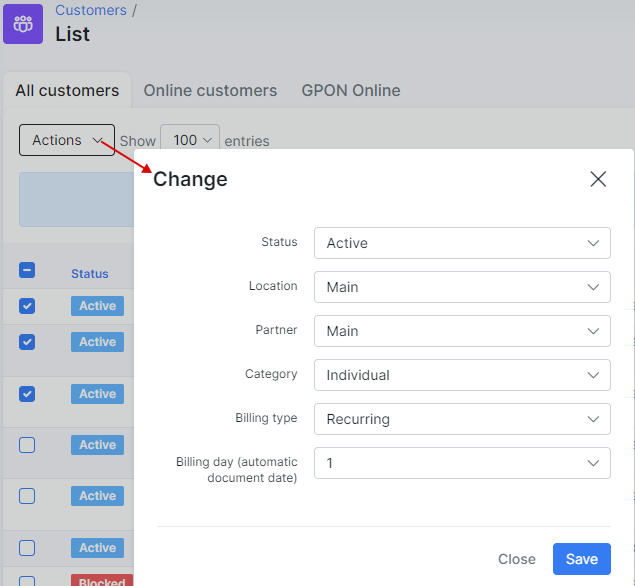
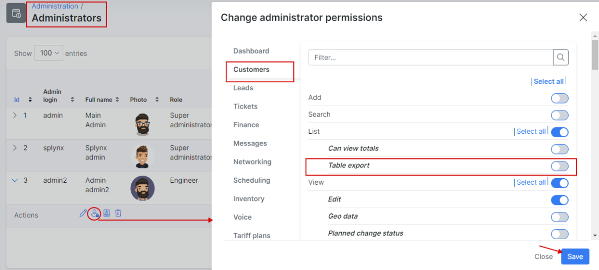

Modifying the table
==========

All tables within Splynx are customizable to view content you prefer and in the order you prefer to see it.

Click on the <icon class="image-icon"></icon> icon below the table, then simply drag and drop the fields in a preferable order for you or turn the field on/off.

You can select customers via checkboxes and make mass changes to them (change status, location, partner, category, billing type etc.), send messages or apply the discount to the selected customers.

In addition, by clicking on the export icon <icon class="image-icon"></icon> it is possible to print, copy or export a table to Excel, CSV or PDF files.

These actions can be applied to all tables in all modules of Splynx.

<icon class="image-icon"></icon> **NOTE:**

The function button to print, copy or export a table to files in different formats (Excel, CSV, PDF) is enabled only for admin accounts with such roles: `super-administrator`, `administrator`, `manager` and `financial-manager` by default, for other accounts with `customer-creator`, `engineer`, `technician` roles in Splynx, this feature is disabled.

The visibility of <icon class="image-icon"></icon> button is provided by `Table export` permission:

If the `Table export` permission is enabled, the button <icon class="image-icon"></icon> to export data will be shown in **ALL CUSTOMERS** and **ONLINE CUSTOMERS** tabs.

More information about the settings of Splynx accounts, permissions and roles you can find in these guides: [Admins and permissions](administration/main/admins_and_permissions/admins_and_permissions.md) , [Roles](administration/main/roles/roles.md) .
