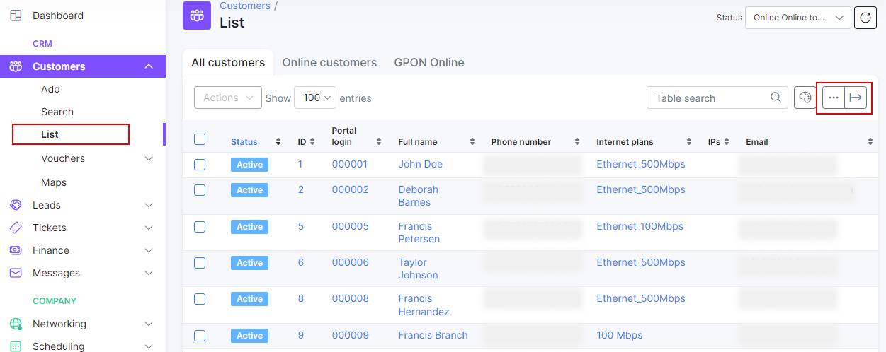

Modifying the table
==========

It is possible to customize every table within Splynx and change the columns' order/visibility.
Click on <icon class="image-icon"></icon> below the table and drag and drop fields in an order preferable for you or turn the field on/off.

You can select customers via checkboxes and make mass changes to them (change status, location, partner, type etc.) or send messages to selected customers.

In addition, by clicking on the export icon <icon class="image-icon"></icon> it's possible to print, copy or export a table in Excel, CSV or PDF formats.
