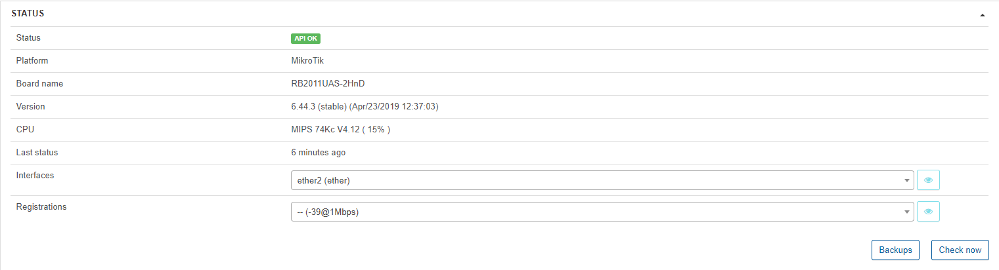

CPE management
==========

Splynx is able to manage CPE (Customer Premises Equipment), and apply some QoS (Quality of Service) rules. At the moment this feature is limited to MikroTik equipment.

To add a CPE choose the Customer where the CPE is located and set the IP and Login/Password of API user (remember to add this user on the device). Select the service the CPE is assigned to and enable QoS if you'd like to set some rules.

If all data is entered correctly, you will be able to see the status of the device.

Once the CPE is connected, we can set some QoS rules to prioritize and guarantee some outgoing services. For example, we can set a rule to prioritize VOIP traffic and guarantee a minimum speed. DST address is the external location where the internal traffic is sent/received to/from.

Priority 8 is the lowest priority, 1 is the highest.

CPE management allows control over the WLAN settings. If the CPE has a built-in WLAN the system will automatically add the AP. The WLAN is editable and we can make changes eg. SSID, password, interface, protocol, mode, security, encryption and disable it.

The other way is to add it manually and set all information.

It's possible to view the CPE status, it displays information about API status, board name, version CPU, last status, and also you can check interfaces by clicking on <icon class="image-icon"></icon>.

It's possible to see information about rates, data transmitted/received, errors and status.

We can create backups of the CPE if the FTP service on the router is enabled - this is especially useful for restoring a backup in case of device failure.

We can download the backups and also view the differences between different versions of backups.

Finally, you can enable DHCP server from CPE and set interface, network, pool etc.

