CPE management
==========

Splynx has the ability to manage CPE's (Customer Premise Equipment). At the moment this feature is limited to MikroTik equipment.

To add a CPE to a customer profile, navigate to the respective customer that the CPE belongs to and click on the CPE tab. If a CPE has not been configured for the customer, you will be presented with the window to add one. Simply fill in the required details and click *Add*

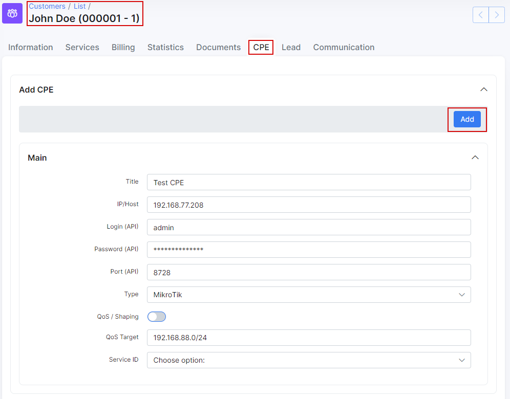

**Title** - name of the CPE 
**IP/Host** - IP address which Splynx can reach the CPE on 
**Login (API)** - username of the API user on the Mikrotik router 
**Password** - password of the API user on the Mikrotik router 
**Port(API)** - API port used to access the router 
**Type** - type of device (manufacturer) 
**Qos/Shaping** - enable or disable Qos rules 
**Qos Target** - Target IP the QOS will be applied to 
**Service** - Select the service which local queues will be based on & QOS rules will applied to 

If all data is entered correctly the status of the device will show <icon class="image-icon"></icon> , if there is a problem with the credentials you will see <icon class="image-icon"></icon>

Once the CPE is successfully added to the system, it will display the CPE status, providing  information about API status, board name, version CPU and last updated status.

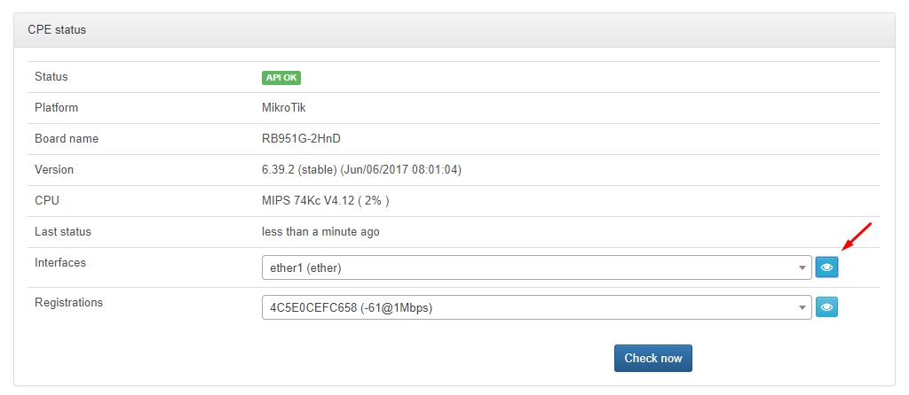

In addition, you can also check interfaces of the CPE by clicking on <icon class="image-icon"></icon>, this will display information about rates, data transmitted/received, errors and status of the interface.

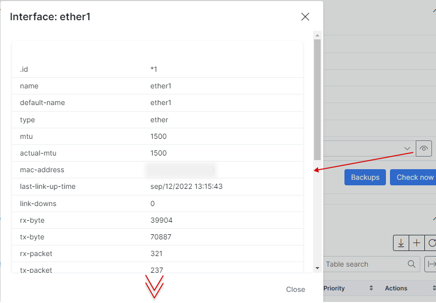

Once the CPE is connected, we are able to set QoS rules to prioritize and guarantee outgoing services. For example, we can set a rule to prioritize VOIP traffic and guarantee a minimum speed. DST address is the external location where the internal traffic is sent/received to/from.

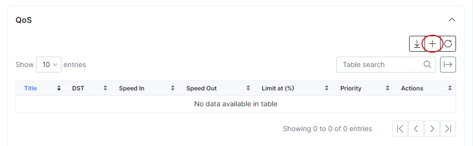

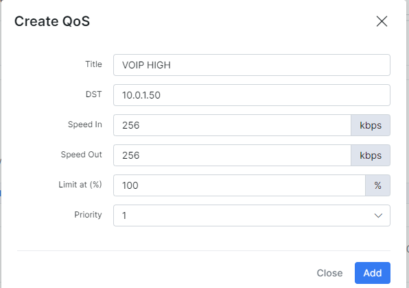

Priority 8 is the lowest priority, 1 is the highest.

CPE management allows control over the WLAN settings. If the CPE has a built-in WLAN the system will automatically add the AP. The WLAN configuration is editable and we are able to make changes from Splynx to settings like the SSID, password, interface, protocol, mode, security, encryption and disable the WLAN.

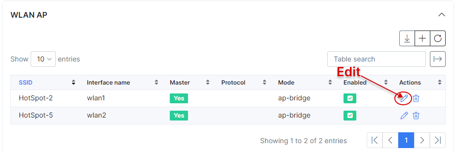

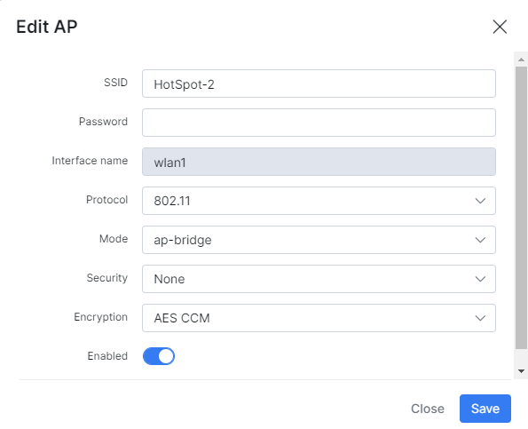

The other way is to add it manually and set all information.

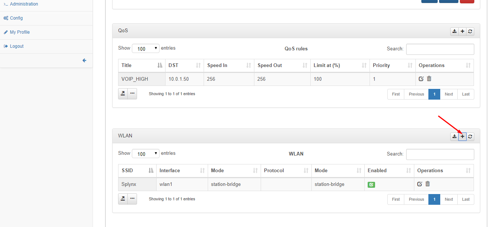

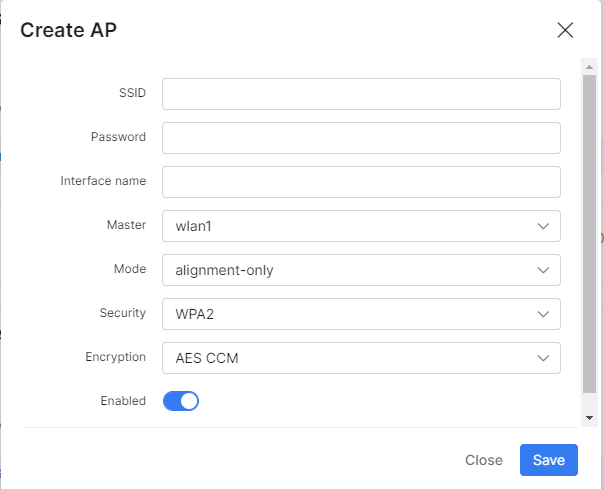

We can create backups of the CPE if the FTP service on the router is enabled - this is especially useful for restoring a backup in case of device failure.

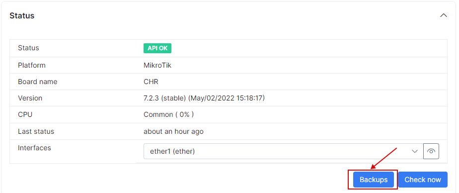

We can download the backups and also view the differences between different versions of backups.

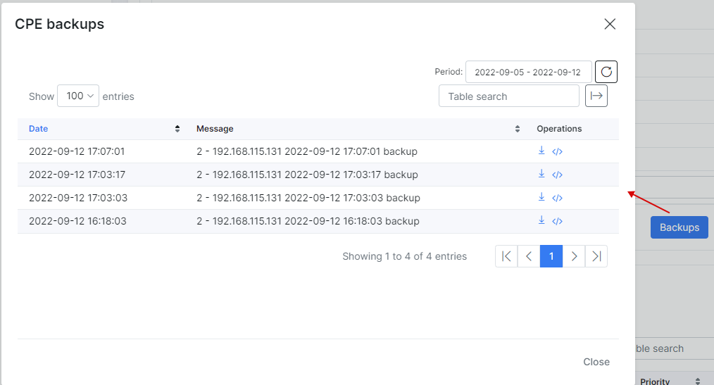

Finally, you can enable and configure a DHCP server on the CPE and set interface, network, pool etc.

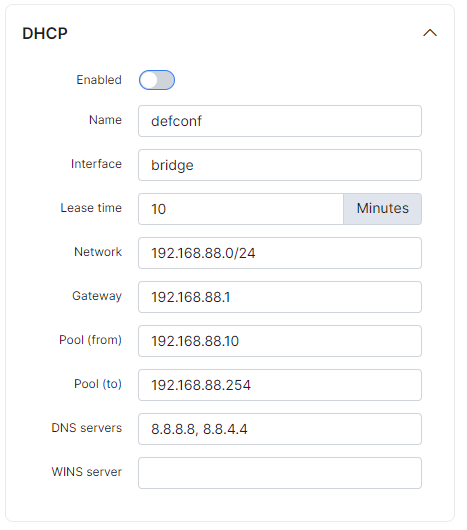
