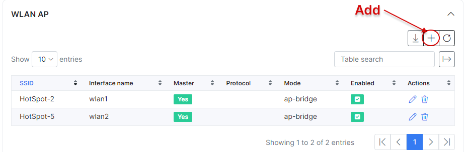
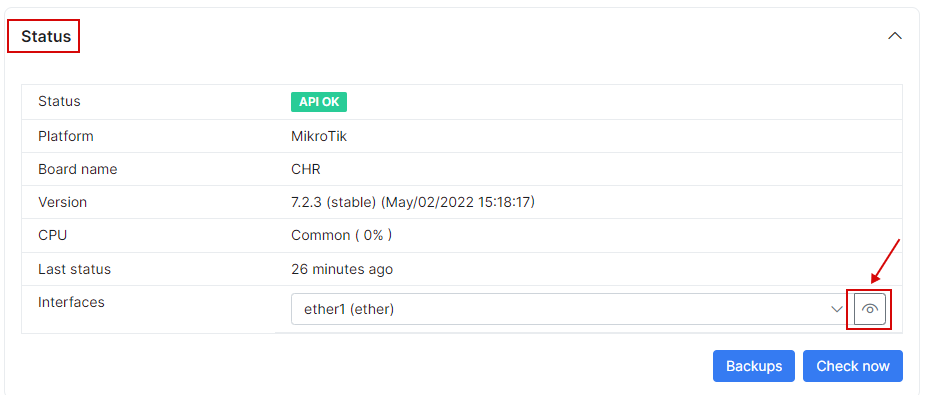

CPE management
==========

Splynx is able to manage Customer Premises Equipment, and apply some QoS rules. At the moment it works only on MikroTik.

To add CPE choose the Customer who owns this equipment and set IP and Login/Password of API. Select service customer is using with that CPE and enable QoS if you'd like to set some rules.

If all data is correct, you will see the signal of CPE.

Once CPE is connected, we can set some QoS rules to prioritize and guarantee some services. For example, we set a rule to prioritize VOIP traffic and guarantee a minimum speed.

CPE management allows to control some WLAN settings. In this case the WLAN settings appear in the box. WLAN is editable and we can make changes from Splynx, for example, change SSID, password, interface, protocol, mode, security, encryption and disable it.

The other way is to add it manually and set all information.

Another feature is managing of CPE status, it shows information about API status, board name, version CPU, last status, and also you can check interfaces by clicking on  <icon class="image-icon"></icon>.

It's posible to see information about rates, data trasmited/recieved, erros and status.

Finally, you can enable DHCP server from CPE and set interface, network, pool and other features.

