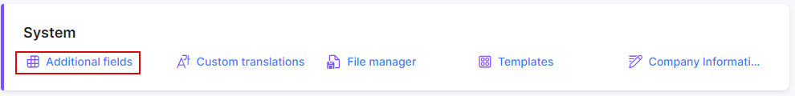
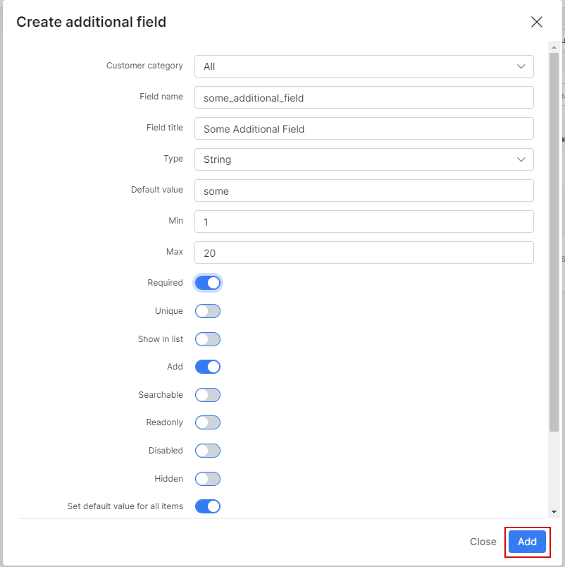
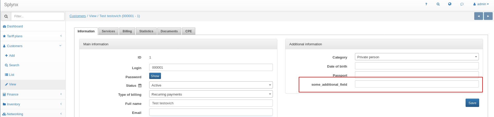

Custom additional fields
==========

To add an additional field, open _Config → System → Additional fields_:

Select the module where you'd like to add an additional field and click on `Add`.

A window will pop up where you can create an additional field.

In this example, it shows a `some_additional_field` additional field for the Customers module.

* **Customer category** - type of customers (Individual, Business or All).
* **Field name** - specify a name for the field for the system to recognize it in the database.
* **Field title** - specify the common name of the field on the system interface.
* **Type** - specify the type/format of data to be used as values for this field.
* **Default value** - specify a default value to be used as a prefix for the data entered in this field.
* **Min/Max** - minimum/maximum number of symbols in this field.
* **Required** - make the field mandatory in order to save.
* **Unique** -  unique value for this field.
* **Show in list** - shows in the list of the selected module as a column.
* **Add** - add to the entry of every module.
* **Searchable** - field will show up in searches.
* **Readonly** - field will have a read-only value.
* **Disabled** - field will be disabled.
* **Hidden** - field will be hidden.
* **Set default value for all items** - set as a default value for every field.

When the new field is created, it is possible to see the new field in the Additional Field table and in the Customer Information view:

