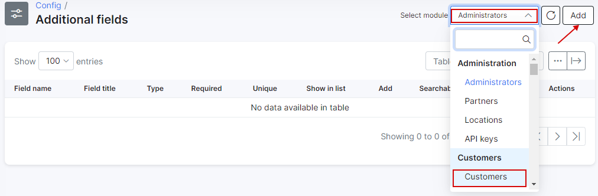
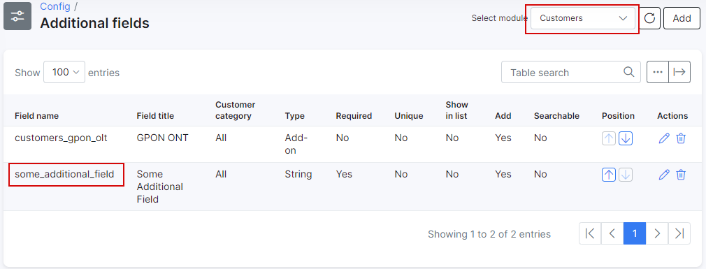
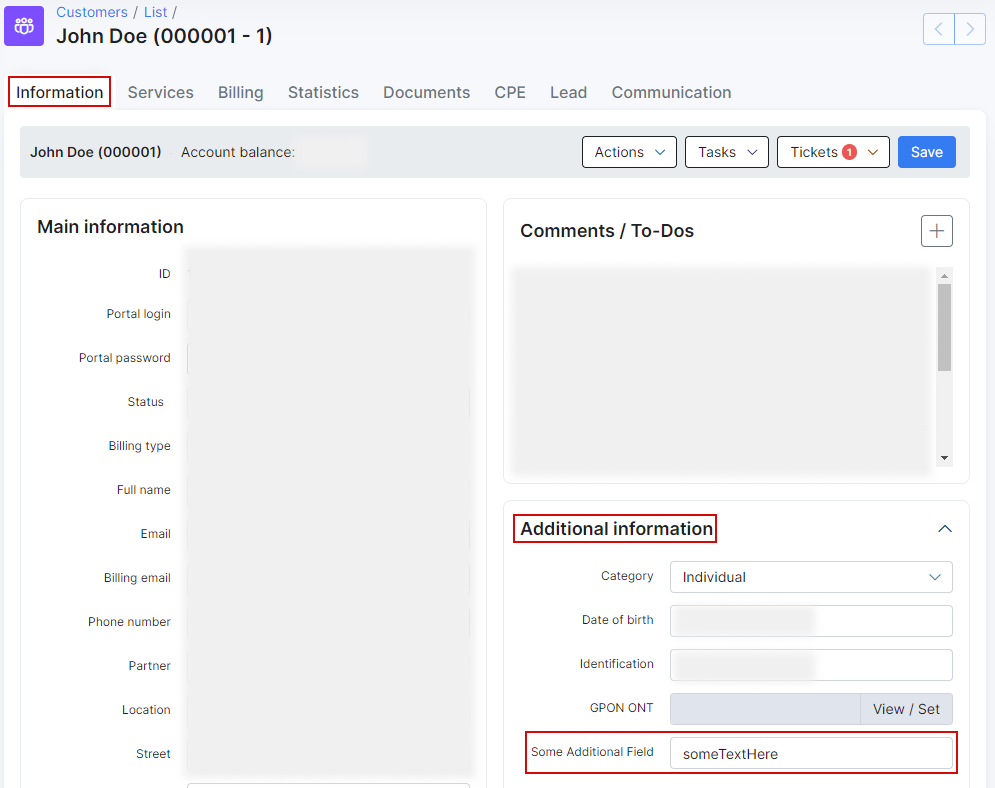

Custom additional fields
==========

To add additional field, click on the Config menu, and click on Additional field.

Select the module where you'd like to add an additional field and click on *Add button*.

A window will pop up and it will be possible to create an additional field.  
In this example, it shows a `some_additional_field` additional field for the Customers module.

* **Required** - impossible to save without filling in this field.
* **Unique** -  unique value for this field.
* **Show in list** - shows in the list of the selected module as a column.
* **Add** - add to the entry of every module.
* **Searchable** - field become searchable.
* **Readonly** - field become only for reading.
* **Disabled** - disable this field.
* **Hidden** - field will be hidden.
* **Set default value for all items** - set as a default value for every field.

When the new field is created, it is possible to see the new field in the Additional Field table and in the Customer Information view:

