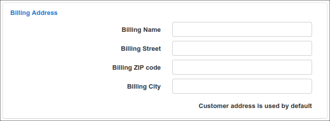
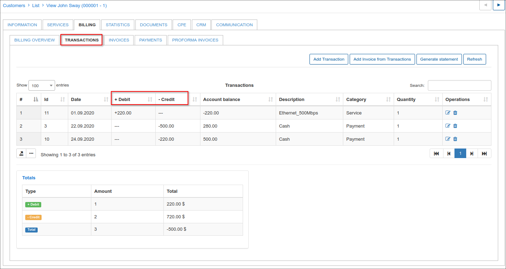
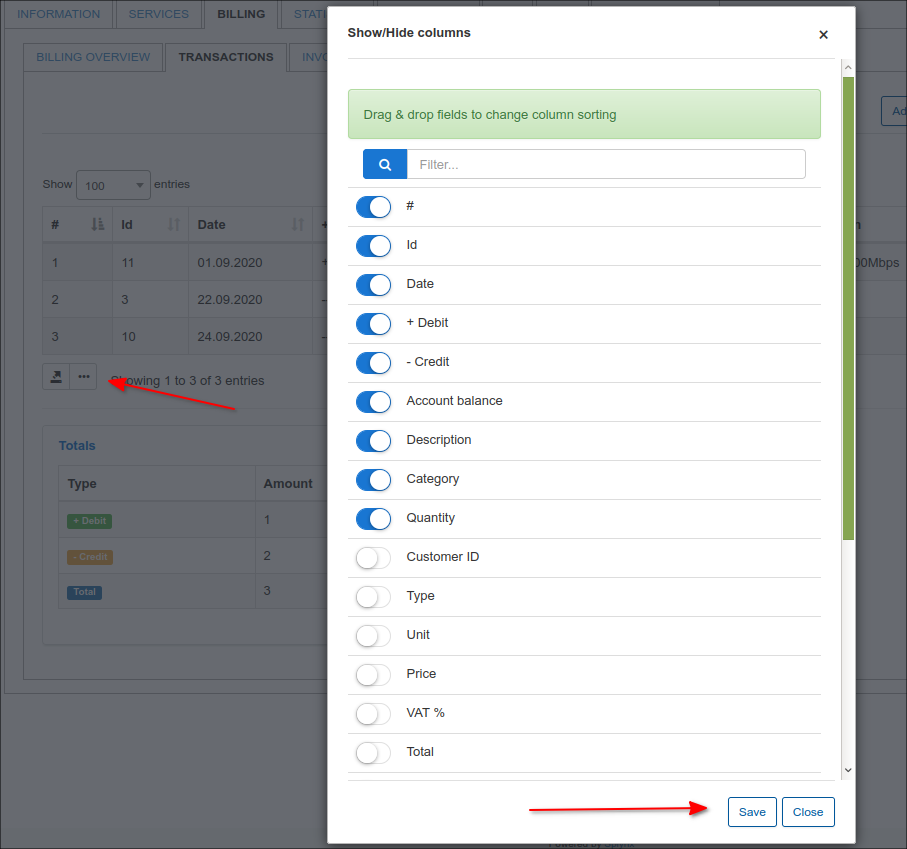
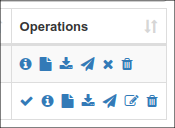

Customer billing
==========
This is your centralized finance department for each customer. Here you can customize your customer's billing to suit agreements and unique terms made with the respective customer, with regards to how they will be billed and interactions thereof.

The Customer Billing tab is divided into 5 sub-tabs:

* **Billing Overview** - The main information configuration page of your customer billing.
* **Transactions** - All transactions pertaining to the customer can be found here
* **Invoices** - All invoices generated for the customer can be found here
* **Payments** - All payments made by or on behalf of the customer.
* **Proforma Invoices** - A list of all proforma invoices is kept for future reference

## Billing Overview

Billing Overview displays 5 main sections:

* Billing Settings
* Proforma Invoice Settings
* Payment Accounts
* Billing Address
* Reminders Settings

**Billing settings**

The configuration of the **selected** customer billing is done here.
(The global settings for all customers are in `Config → Finance → Settings`).

## Billing Settings:.
* **Billing Enabled** - enables or disables billing for customer (whether the system should take customer into account or not)
* **Period** - period the customer will be billed for
* **Payment Method** - means in which client will make payments; credit card, cash, etc.
* **Billing day** - when the customer will be charged and invoices will be generated
* **Billing due** - when the customer needs to make payments before being blocked
* **Grace Period** - when the customer's services will be marked as inactive, client no longer uses services and the system no longer accounts for it
* **Minimal balance** - minimal balance required in the customer account to avoid being blocked
* **Create invoices** (after Charge & Invoice) - creates an invoice automatically after using the charge & invoice button <icon class="image-icon"></icon>.

## Payment Accounts

 Accounts of the customer which can use to make payments on the system.

 

 You can edit the available accounts to add customers accounts details with the "**+**" icon.

 

## Billing address

Billing addresses can be configured here if it is different to the address on the Main Information tab of the customer. By default, it is left empty and the address is taken from the Main Information table of the customer.

Specific billing addresses can be set here if the customer user a different address for billing from that in the *Main Information* page. If left blank, customers address is used by default

## Actions section

 The actions section provide a quick access toolbox when dealing with customer billing.

**Charge & Invoice**

<icon class="image-icon"></icon>

Customers can be charged **manually** with the `Charge & Invoice` button. 
Simply click the button, a charge & invoice window will appear where you can select the date and period of charging, then click on `Preview` to view services description and click on `Charge & Invoice` to manually charge the customer.

The system will automatically charge the customer and creates a new transaction which can be viewed  in the Transactions tab.

Please note that if you are charging a customer **manually**, the new invoice will only be created if the Invoicing option is enabled in `Customer's Billing → Billing Overview → Billing settings`.

When charging customers, if necessary, discounts for customers services can be added. Discounts are applied in the customers services. Navigate to customers services tab and select the desired service to apply the discount to, click on Edit icon <icon class="image-icon"></icon>. The edit service window will appear where you can apply the discount according to the parameters highlighted and you may add a note for reference in discount message. After a discount has been configured, it will appear in the <icon class="image-icon"></icon> window and the final price will automatically be calculated.

**Payment Calendar**

<icon class="image-icon"></icon>

 You can generate a payment calendar for the customer with the use of templates.

By default payment calendar generating is disabled. To enable it you need to activate it in `Config -> Finance -> Settings`.

**Cancel last charge**

<icon class="image-icon"></icon>

This button can be used to cancel the previous bill of a customer. This feature ensures that charges are cleared appropriately in the system by deleting the invoice and transaction pertaining to the charge.

**Save**

<icon class="image-icon"></icon>

Save any change made in the customer billing tab.

In **Proforma Invoice settings** it is possible to enable Auto proforma invoice creation for the current or next month as well as being able to choose a prepay period (up to 12 months).

In **Reminders settings** you can enable automatic sending of reminders to customers to remind them to pay for their services. It is also possible to enable a payment option for the last reminder and set an amount on the reminder payment with a comment on it.

## Transactions

Transactions are divided into 2 sections, namely, **Debit transactions** and **Credit transactions**

**Debit transactions** - transaction added to customers account with amounts to be paid. (decreases customers account balance) 
**Credit transactions** - transaction added to customers account after making payments. (increases customers account balance) 

All transactions can be edited or deleted.

The option to print, copy or save customer's transactions list, in either CSV, Excel or PDF formats can be found at the bottom of the table.

We can also customize the transactions table by enabling/disabling fields or drag&drop fields in a preferred method of displaying.

For more information on transactions, please navigate to the transactions manual - [Transactions](finance/transactions/transactions.md).

## Invoices

All invoices generated for the selected customer are shown in the invoices table. It displays the invoice number, date of issuing, payment date and status of payment.
Just as with transactions the option to print out, copy or save customer's invoices in CSV, Excel or PDF formats and sort columns by drag & drop fields.

The invoices list comes well equipped with tools found in the operations column. With these tools invoices can be paid and marked as unpaid, edited(if not paid), viewed as PDF's, sent to the customer or deleted. Payments of paid invoices can be deleted here as well.

Functions of each button in operations can be found by simply hovering over the icons.

Detailed descriptions and an explanation of invoicing can be found here -  [Invoices](finance/invoices/invoices.md)

## Payments

The Payments table contains all payments related to the selected customer, providing a table that displays the date of payments, payment types, amounts, invoice numbers and comments on the payments. Just as with transactions and invoices the option to print, copy or save customer's payments in CSV, Excel or PDF formats and sort columns by drag & drop fields.

More information about Payments can be found here -  [Payments](finance/payments/payments.md)

## Proforma invoices

The table of all Proforma invoices related to the customer can be viewed here, displaying invoice numbers, date of invoices, total amounts, payment dates and statuses (if it's paid, unpaid or overdue).
The option to print out, copy or save customer's pro forma invoices in CSV, Excel or PDF formats and sort columns by drag & drop fields.

Detailed information about Proforma invoices and the creation thereof  can be found here - [Proforma invoices](finance/proforma_invoices/proforma_invoices.md)

**Totals** for the transactions, invoices, proforma invoices and payments tabs can be found at the bottom of each section. Providing totals for relevant fields of the table within the tab.

Transactions tab total table:

