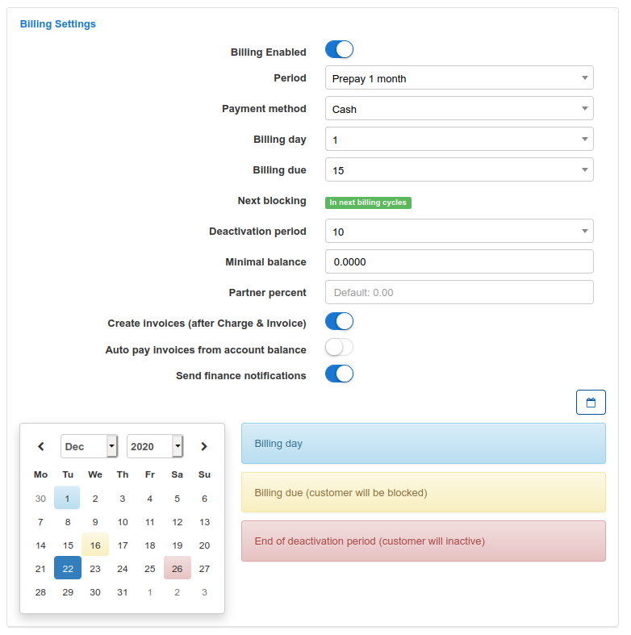
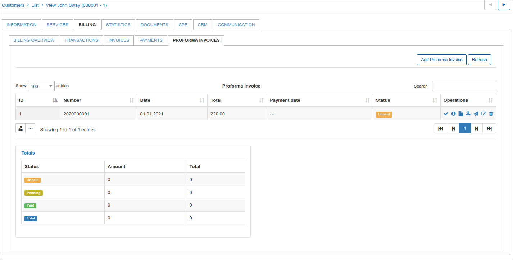

Customer billing
==========

The Customer Billing is divided into:
* Billing Overview
* Transactions
* Invoices
* Payments
* Proforma Invoices

## Billing Overview

Billing Overview displays 5 main sections:
* Billing Settings
* Proforma Invoice Settings
* Payment Accounts
* Billing Address
* Reminders Settings

It is possible to see the **Billing settings** for the selected customer (The global settings for all customers are in `Config → Finance → Settings`).

Billing Settings:.
* **Billing Enabled** - enable billing for customer
* **Period** - it can be prepaid or postpaid
* **Payment Method** - it is possible to select how the customer will pay
* **Billing day** - when the customer will be charged
* **Billing due** - when the customer will be blocked
* **Grace Period** - when the customer's services will be disabled
* **Minimal balance** - minimal balance for the customer
* **Make Invoices** (after Charge & Invoice) - create an invoice automatically after the charging action.

In **Payment Accounts** you can see the type of customer's payment account.

In **Billing address** you can see the billing address if it is different to the address on the Main Information tab of the customer. By default it's empty and the address is taken from the Main Information table of the customer.

It is possible **to charge the customer manually** with the action `Charge & Invoice`.
Select the date and period of charging, click on `Preview` to see services description and click on `Charge & Invoice`.

The system will automatically charge the customer, and it will be shown as a new transaction in the Transactions tab.

Please note that if you are charging a customer **manually**, the new invoice will be created only if Invoicing option is enabled in `Customer's Billing → Billing Overview → Billing settings`.

It is possible **to set a discount for the customer** before you charge them. You can choose this option in the customer's services: select the service where you want to apply the discount, and click on Edit icon <icon class="image-icon"></icon>. The window will appear where  it will be possible to enable Discount and set up Discount percentage, Discount start and end date, and Discount message. After discount is set up it will appear in <icon class="image-icon"></icon> window and the final price will automatically be calculated.

In *Actions section* you can generate a *Payment calendar* for the customer by using templates.

By default payment calendar generating is disabled. To enable it you need to activate it in `Config -> Finance -> Settings`.

In **Proforma Invoice settings** it's possible to enable Auto proforma invoice creation for the current or next month as well as choosing a prepay period (up to 12 months).

In **Reminders settings** you can enable sending automatic reminders to the customer to remind them to pay. It's also possible to enable a payment option for the last reminder and set an amount of reminder payment with comment on it.

## Transactions

Transactions are divided into **Debit transactions**, when we create an invoice to be paid by a customer, and **Credit transactions**, when payment from customer has been received.

There is an option to print out, copy or save customer's transactions  in CSV, Excel or PDF format.

We can also choose columns, which will be displayed in the transaction's table by sorting show/hide columns.

To learn more about transactions, please navigate to the transactions manual - [Transactions](finance/transactions/transactions.md).

## Invoices

All invoices generated are shown in this table. It contains the invoice number, date of issuing, payment date and status of payment. The same as with transactions there is an option to print out, copy or save customer's invoices in CSV, Excel or PDF formats and sort columns by drag & drop fields.

Detailed explanation of Invoicing can be found here -  [Invoices](finance/invoices/invoices.md)

## Payments

The Payments table contains all payments, related to the customer with the date of payment, payment type, amount, invoice number and comment on the payment. The same as with transactions and invoices there is an option to print out, copy or save customer's payments in CSV, Excel or PDF formats and sort columns by drag & drop fields.

More information about Payments can be found here -  [Payments](finance/payments/payments.md)

## Proforma invoices

All Proforma invoices related to the customer will be shown in this table consisting of the invoice number, date of invoice, total amount, payment date and status (if it's paid, unpaid or overdue).
There is the same option to print out, copy or save customer's pro forma invoices in CSV, Excel or PDF formats and sort columns by drag & drop fields.

Detailed information about Proforma invoices and the creation thereof  can be found here - [Proforma invoices](finance/proforma_invoices/proforma_invoices.md)
