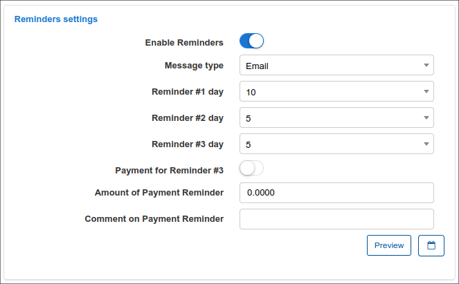

Customer billing
==========

**Contents:**

-  [1. Finance documents](customer_management/customer_billing/customer_billing.md#finance_documents)
	- [Invoices: One-time, Recurring and Proforma](customer_management/customer_billing/customer_billing.md#invoices)
		- [Invoice statuses](customer_management/customer_billing/customer_billing.md#invoices_statuses)
		- [Invoice operations](customer_management/customer_billing/customer_billing.md#invoices_operations)
		- [One-time Invoice](customer_management/customer_billing/customer_billing.md#invoices_one_time)
		- [Load Future Item to One-time Invoice](customer_management/customer_billing/customer_billing.md#load_future_one_time)
		- [Loading Future Item to Recurring Invoice](customer_management/customer_billing/customer_billing.md#load_future_recurring_time)
		- [Delete Invoice and Payment](customer_management/customer_billing/customer_billing.md#del_inv_payment)
		- [View Invoice](customer_management/customer_billing/customer_billing.md#view_invoice)
		- [Edit invoice](customer_management/customer_billing/customer_billing.md#edit_invoice)
		- [Send Invoice](customer_management/customer_billing/customer_billing.md#send_invoice)
		- [Invoice Due Amount and Partial Payment](customer_management/customer_billing/customer_billing.md#invoice_due)
	- [Credit Note](customer_management/customer_billing/customer_billing.md#credit_note)
	- [Payment](customer_management/customer_billing/customer_billing.md#payment)
	- [Future Items](customer_management/customer_billing/customer_billing.md#future_items)
	- [Statement](customer_management/customer_billing/customer_billing.md#statement)

-  [2. Transactions](customer_management/customer_billing/customer_billing.md#transactions)

-  [3. Billing config](customer_management/customer_billing/customer_billing.md#billing_config)
	- [Billing settings](customer_management/customer_billing/customer_billing.md#billing_settings)
	- [Payment accounts](customer_management/customer_billing/customer_billing.md#payment_accounts)
	- [Billing address](customer_management/customer_billing/customer_billing.md#billing_address)
	- [Billing actions](customer_management/customer_billing/customer_billing.md#billing_actions)
	- [Payment calendar](customer_management/customer_billing/customer_billing.md#payment_calendar)
	- [Add Recurring Invoice](customer_management/customer_billing/customer_billing.md#add_recurring_invoice)
	- [Cancel last Recurring Invoice](customer_management/customer_billing/customer_billing.md#cancel_recurring_invoice)
	- [Save (changes)](customer_management/customer_billing/customer_billing.md#save_changes)
	- [Proforma Invoice Settings](customer_management/customer_billing/customer_billing.md#proforma_invoice_settings)
	- [Reminders Settings](customer_management/customer_billing/customer_billing.md#reminders_settings)

This is your centralized finance department for each customer. Here you can customize your customer's billing to suit agreements and unique terms made with the respective customer, with regards to how they will be billed and interactions thereof.

The customer **Billing** tab is divided into 3 sub-tabs:

* **Finance documents** - here you can create any type of financial documents for the customer and you can also check the list of all existing ones;
* **Transactions** - all operations related to the customer can be found here;
* **Billing config** - the billing configuration page for the specific customer in Splynx.

 
## Finance documents

In this section can be found all financial documents related to the particular customer in Splynx or can be added the new ones:

- **One-time invoice**;
- **Recurring invoice**;
- **Proforma invoice**;
- **Credit note**;
- **Payment**;
- **Future items**;
- **Statement**

<icon class="image-icon"></icon> **NOTE:**

- **Statements** will not be displayed in the table under the **Finance documents** tab. But when a statement is added (generated), the options to send it to the customer's email, save to the customer's [documents](customer_management/customer_documents/customer_documents.md) or download it as a PDF file will be available;

- On the **Finance documents** tab we can trace all connections between financial documents of the customer, e.g. if we select to display **All invoice** - we can see the related payments and credit notes. The same representation of connections is present in the *One-time/Recurring/Proforma, Credit note, Payment, Future items* sections. Note, **if the administrator does not have permissions to view the corresponding financial document, just text will be displayed instead of a link**. Don't forget to enable the display of the necessary column in the table. What's more, when you view financial documents, you can also see their connections to other documents.

 
### Invoices: One-time, Recurring and Proforma

**Invoice** is a financial document which indicates the supply of goods or services between a vendor and a customer.

**One-time invoice** is designed for a customer who pays a one-time cost to obtain the product or service. If they need it again, when they choose, they’ll pay again.

**Recurring invoice** is when the items or services are supplied to a customer on a regular basis and the automatic charge is applied. If there’s no change in services your customers regularly need, the usage of the recurring invoicing is more preferable.

<icon class="image-icon"></icon> See documentation [about the invoices charging](finance/invoices/invoices.md)  for more information.

**Proforma invoice** is a non-official estimated invoice in advance that is given to a customer before products or services are supplied. It looks almost identical to the one-time/recurring invoice, however it does not have such a great importance because it's provisional. In other words it's a 'good faith' agreement between the vendor and the customer, used to avoid unexpected charges down the line.

<icon class="image-icon"></icon> Related Read: [Proforma invoices](finance/proforma_invoices/proforma_invoices.md) documentation.

 
### Invoice statuses

Let's consider the **invoice statuses** in details:

| Status  | Description |
| ------------ | ------------ |
| <icon class="image-icon"></icon> | the invoice has been created, but the customer has not made any payments towards the balance. The customer is expected to pay the invoice's amount due.|
| <icon class="image-icon"></icon> | the invoice has not been paid and is not yet past the due date but payment is sent for processing. Once the invoice payment is processed successfully, the invoice will be updated to either the `Paid` or `Unpaid` status. If the due period has been exceeded and the due amount hasn't been paid, a status will be changed to `Pending Overdue` or `Overdue`.|
| <icon class="image-icon"></icon> | the invoice was paid in full from customer's balance, the status is applied only if customer has enough funds.|
|<icon class="image-icon"></icon> | the payment was received, but it does not cover the full invoice amount (invoice total due amount). The statistics of `Partially paid` invoices will be included in the `Paid` category of the **Total invoiced** table. |
| <icon class="image-icon"></icon> | no payment was received for this invoice and the `Payment due` date has already passed. |
| <icon class="image-icon"></icon> | the invoice was marked as deleted. If we apply the `Mark as deleted` option for unpaid invoice, the invoice will be marked as deleted and its auto (`+Debit`) transaction (-s) will be removed. The manual transaction (-s), that was added to the invoice, will remain (even when `Delete completely` option was used) in any case. It's required to remove it manually. |

 
### Invoice operations

Also, there are a **number of operations** that can be executed with the icons in the **Actions** column:

| Action  | Description  |
| ------------ | ------------ |
|<icon class="image-icon"></icon>  |  View an invoice |
|<icon class="image-icon"></icon>   | View an invoice as a PDF file  |
|<icon class="image-icon"></icon>   | Download an invoice as a PDF file  |
|<icon class="image-icon"></icon>   | Send an invoice via Email/SMS or as a message to Customer portal |
|<icon class="image-icon"></icon>   | Edit a payment  |
|<icon class="image-icon"></icon>   | Create [credit note](finance/credit_notes/credit_notes.md) for the current invoice  |
|<icon class="image-icon"></icon>   | Delete an invoice with/without transaction |
|<icon class="image-icon"></icon>   |Pay an invoice|

---

 
### One-time Invoice

Usually, you can **create a one-time invoice** if you want to charge customer for [One-Time Plan](configuring_tariff_plans/one_time_plans/one_time_plans.md):

1. Click on the <icon class="image-icon"></icon> button and in the drop-down list and choose `One-time invoice`.

2. In the new window, click on the <icon class="image-icon"></icon> (breadcrumbs) icon and in the drop-down list choose the existing *One-Time Plan*, it will be automatically added to the invoice form with all details (e.g. price, VAT, description etc.).

In order to add the additional item (-s) to the invoice, press `+` sign or use the option `Add more items`, after that specify its date, price, quantity, description etc.

During the step of invoice creating you can modify the next option:

- **Number** - a number will be generated automatically. You can generate a new number using the button next to the field (an icon of magic wand). The invoice format number can be set in [Finance settings](configuration/finance/finance_settings/finance_settings.md);
- **Document date** - a transaction creation date;
- **Period** (only for a *Recurring* invoice ) - a period for which the invoice will be charged;
- **Payment due date** - the date by which the invoice must be paid. Please note, if you set the *Payment due date* value greater than the value in the *Payment due* field in the customer's *Billing config*, the customer will still be blocked the day after *Payment due*, but the *Recurring* invoice won't be with `Overdue` status.
The option `Same as document date` means that the value is equal to zero. To be precise, when you create an invoice and the `Same as document date` value is chosen in the `Payment due (days after document date)` select list, the `Payment due date` value of the invoice coincides with the date of invoice  creation.
- **Note** - some additional notes for the customer;
- **Select plan** - if the tariff plans have been created, you can select the necessary one in the selection menu. For a *Recurring* invoice, the plan will be loaded automatically, it's based on the service (-s) the customer uses;
- **Description** - a plan description, loaded automatically if you select a plan from the selection menu;
- **Quantity** - a property that is measured, e.g. `3`;
- **Unit** - a standard quantity against which a quantity is measured, e.g. `hour`; which is unit of the above quantity (in most cases, cannot be applied for a recurring invoice with service plan. But can be used for *One-time* invoices, where payment is made per hour);
- **Price** - a price of the plan, the value will be loaded automatically if the plan is chosen from the selection menu;
- **VAT %** - *Value Added Tax* is a flat tax levied on an item. Learn more about [Taxes](configuration/finance/taxes/taxes.md);

<icon class="image-icon"></icon> **NOTE:**

- The items with negative price value can be added to the invoice, but the invoice total price cannot be with the negative amount, it can only be equal to `0` or  greater than `0`.

3. Press the **Save** button to create the invoice.

 
### Load Future Item to One-time Invoice

The option **Load items from uncharged transactions** into the **One-time** invoice can be used to **add the future item** (an uncharged transaction with the option `Include transaction in next recurring invoice`).

 
#### Loading Future Item to Recurring Invoice

**STEP 1**

Create a future item (it's an uncharged transaction with the option `Include transaction in next recurring invoice`):

**STEP 2**

Add some service in customer profile, e.g. Internet service

**STEP 3**

<icon class="image-icon"></icon> **NOTE:**

In Splynx v4.0 the **Charge & Invoice** button was deprecated. To charge a customer, navigate to the **Finance documents** tab, press **Add document** and in drop-down list choose the **Recurring invoice** item.

**STEP 4**

Double check if the future item has been added to a newly created recurring invoice

**STEP 5**

Delete the invoice completely using the <icon class="image-icon"></icon> (Delete) icon under `Billing → Finance documents` tab or press the **Cancel last recurring invoice** button under `Billing → Billing config` tab. The current invoice includes the auto transaction (service charge  - step 3) and future item (it was added manually on step 1).

The next warning message will be displayed:

If we apply the **Cancel last recurring invoice** action and the invoice includes not only the transaction of service charge, the warning message will be the next:

**STEP 6**

Check if the future item is present in `Billing → Transactions` or in `Billing → Finance documents` locations. Mind, that the future item can only be removed manually.

---

<icon class="image-icon"></icon>  Also, take into consideration the following:

- during the converting a [quote](crm/quotes/quotes.md) to the invoice in customer's profile (`Lead → Quotes` tabs) or the converting some lead account to customer one, the **auto transaction will be created**. If we remove the created invoice, the auto transaction will be removed;

- if we create the invoice manually e.g. using the **Add document → One-time invoice** button and after that remove such invoice, its transaction will be removed automatically as well;

These statements and example above also apply to `Delete` option in drop-down menu with mass **Actions** in `Finance → Invoices`.

---

 
### Delete Invoice and Payment

- If the invoice is paid in one payment (payment amount is equal to the total invoice amount) or invoice is paid by more than one payment, such **invoice cannot be deleted until all related payments are deleted**

- To **check the payments which are related to the paid invoice**, choose `All invoices` under customer's finance documents tab, find the necessary invoice in the table and in the **Payment** column, next to the invoice item, click on three dots to **Show all** payments.

If the **Payment** column is not displayed in the table, click the **Show/hide columns** icon and enable the **Payment** toggle.

- To **delete a payment (-s) associated with an invoice**, click on the ID of displayed payment, the filter will be applied -  the payment that is associated with a specific invoice ID will be displayed in new window with all details, click on the **Actions** button to open additional menu, choose there the **Delete** option.

- An **invoice can be (partially) paid not only by a payment, but also by a** [**credit note**](finance/credit_notes/credit_notes.md). The uncharged future item can be loaded/added to one time/recurring invoice as well.

While **deleting the `Unpaid` invoice in the customer's profile** under `Billing → Finance documents` tab, it's possible to use `Mark as delete` option instead of delete invoice completely.

In this case, the invoice is marked as `Deleted`, its auto transaction (-s) will be removed. The future item related to the invoice will remain in any case. But such future item can be deleted manually.

In addition, an **invoice or credit note synced with an accounting add-on, e.g. Xero, cannot be deleted, instead create a corresponding credit note for the invoice**.

  

<icon class="image-icon"></icon> **IMPORTANT:** It is not recommended to completely delete any invoice from the customer's profile. The best idea is to create a [Credit note](finance/credit_notes/credit_notes.md) to keep a complete context of the billing flow to the customer.

<icon class="image-icon"></icon> **NOTE:**

- The invoice (-s) with `Deleted` status cannot be reverted back to `Unpaid` status, only the **Delete completely** option can be applied.

---

 
### View Invoice

To **view an invoice** as PDF with the <icon class="image-icon"></icon> (view PDF) icon, it is necessary to configure an **invoice template** first in `Config → System → Templates` and also to specify the use of the selected/modified template in `Config → System → Company information`.

On the **Company information** page, we define the [Partner](administration/main/partners/partners.md) and its PDF [Template](configuration/system/templates/templates.md) (`Invoice A4 Classic` item is selected as an example by default).
Once the PDF template is chosen, it will be possible to view the invoice in PDF format.

Please note that all [templates](configuration/system/templates/templates.md) can be customized, navigate to `Config → Templates`, choose the type of templates to display/work with and simple edit or add a new template you wish to use:

---

The [**Finance format**](configuration/main_configuration/localization/localization.md) displayed on the invoice are customizable. Click on `Config → Main → Localization`,  to define the currency and other finance format settings.

---

In `Config → Finance → Settings` can be found the global **Invoices settings** for all customers in Splynx system. In this menu, you can also define the **Invoice number format**, by default is used `{year}{partner_id|2}{next|6}` format.

You might also be interested in [Finance settings](configuration/finance/finance_settings/finance_settings.md) description.

---

 
### Edit Invoice

To **edit any unpaid invoice** click on the <icon class="image-icon"></icon> icon under the customer's `Billing → Finance documents` tab.

When editing a recurring invoice, its possible to change its **Period**. Pay attention, if the period is edited, the **total sum of the item/-s won't be changed** but in the next charge (new created recurring invoice) the pre-specified period won't be counted. <!-- SPL-9263 -->

- If the invoice is in the `Not paid` status, we can edit any fields, items, dates of the invoice.

- If the invoice is in the `Partially paid` status, only the following fields can be edited: **Note**, **Memo**, **Document date**, **Payment due date**, **Number** and existing additional fields.

- If the invoice is in the `Paid` status, we can edit only **Note**, **Memo** and existing additional fields.

---

 
### Send Invoice

It is also possible **to send invoice (-s) via email** with the <icon class="image-icon"></icon> icon (if the SMTP server is [configured](configuration/main_configuration/email_config/email_config.md)) in `Billing → Invoices`.
You can write a message body manually or choose a template to populate it.

Also if a new body text is manually typed, you can save it as a new template.

---

 
### Invoice Due Amount and Partial Payment

**Due Amount** - invoice details how much your customer owes you when payment is due for some provided service. The total due amount depends on the total cost per service, fees (taxes),  etc.

**Partial Payment** refers to the payment of an invoice that is less than the total amount due. In this case, the invoice will have the `Partially paid` status.

**Example #1**

A customer was invoiced a total of 120$ and a 50$ payment was received. As a result, the invoice has the `Partially paid` status and its total due amount is 70$.

If the next payment is more than the invoice due amount, the money will be added to customer's account balance. The invoice won't become overpaid, because the payment is added to the account balance, not directly to the invoice.

**Example #2**

If a customer has a transaction (type: `+ Debit`) and has an invoice with `Unpaid` status, and a new payment is received, the transaction will be paid off first, then the invoice.

Let's say, the transaction (type: `+ Debit`) is created equal to 100$. Also, the customer has the `Unpaid` invoice for 50$. The customer makes the payment for 100$. The result is the following:

The invoice is still with `Unpaid`status and there are no related payments to it.

If the customer makes the new payment for 50$, the invoice will be paid and payment relation will be added.

<icon class="image-icon"></icon> **NOTE:**

- the `Partially paid` status does not apply to the `Overdue` invoice;

-  if a customer has several `Unpaid` invoices and payment is received, the **invoices will be paid in the order of their creation**.

---

 
### Credit Note

The **Credit Notes** help to simplify the invoicing processes, it is useful for adjusting errors in created invoices. It allows you to lawfully amend an invoice, without having to delete or alter it.
In other words, the *Credit Note* - it's the `-Credit` transaction added to customers account after making payments (increases customers account balance).

**Example:**

You sent to customer the invoice which contains an error and the invoice has been paid, as a result you need to re-bill the customer for the billing period. Since you can’t change an invoice’s total amount, you need to apply credit note to correct the balance.
The experience with creating a new invoice with the negative price in order to refund a money to customer is now a thing of the past.
The *Credit notes* provide accurate and complete records keeping of the transactions that occur after an invoice has been created.

<icon class="image-icon"></icon>  Suggested read: [Credit Notes](finance/credit_notes/credit_notes.md) management guide.

---

 
### Payment

**Payment** is a record that indicates an amount of money that has been paid. The Splynx can authorize the [payment methods](configuration/finance/payment_methods/payment_methods.md) to be made using bank transfer, credit card, cash etc.
To show all payments that customer has made, select `Payment` type and the list of items will be shown:

Usually a payment is related to specific invoice however it can be added manually as standalone in Splynx.

<icon class="image-icon"></icon> For more information, see the [Payments](finance/payments/payments.md) documentation

---

 
### Future Items

**Future item**  - a transaction with the `Include transaction in next recurring invoice` option enabled, it can be either `+Debit` or `-Credit` transaction, depends on what price value (negative/positive) is set there.

**Example:**

A future item with 100$ price will be shown as `+Debit` transaction and a future item with negative price (-200$) will be represented as `-Credit` transaction.

In other words, with the option `Include transaction in next recurring invoice`, the created `-Credit` transaction will appear in finance documents as future item with negative total price and vice versa.

The option `Include transaction in next recurring invoice` defines if the current future item will be included to the next *Recurring* (or *One-time* invoice if the option `Load items from uncharged transactions` was used) invoice.

<icon class="image-icon"></icon> **NOTE:**

- A future item by itself will **NOT** change the customer account balance (**!** only for `Recurring` billing type) until it's loaded/added to **One time**/**Recurring invoice**;

- A future item that is used in the customer's profile with the billing type `Prepaid (Custom)` or `Prepaid (Daily)` will change its account balance. To be precise, all transactions will be accounted;

- If the future item has already been loaded into an invoice, it loses its functions and becomes a transaction in the created invoice and change a customer's account balance;

- A future item will **automatically** be added to the next **Recurring** invoice;

- If the invoice includes at least one future item and we are going to remove this invoice, such future item can be removed only manually in the customer's finance documents;

-  The future item with negative price can be loaded to invoice as well, but the **invoice total may be zero, but not negative**.

<icon class="image-icon"></icon> For more information, see the [Transactions](finance/transactions/transactions.md) guide.

---

 
### Statement

**Statement** (account statement) - is a document that summarizes and lists all the *Invoice/Payments* or *Transactions* records for a certain period of time. Such report can be sent to the customer on the email, saved to their [documents](customer_management/customer_documents/customer_documents.md) or exported to the separate PDF file.

To add the *Statement*:

1. Click on the <icon class="image-icon"></icon> button and in the drop-down list select `Statement` item;

2. In the new window, specify the period (this/last month, custom range etc.), select what types of records should be included (`Invoice/Payments` or `Transactions`) and press *View* button.

3. Choose one of the next options: **Send to customer**, **Save to document** or **Download as PDF**.

You might also be interested in the [Statements report](administration/reports/statements/statements.md) tutorial.

------------

The icon <icon class="image-icon"></icon> is designed to print, copy or save customer's finance documents as Excel, CSV, PDF file, it can be found at the top right corner of the table.

------------

The **Total invoiced** and **Total paid** tables show the statistic of all finance documents in relation to the particular customer. These tables can be found at the bottom of the *Finance documents* tab. The **Total paid** table may differ depending on what [payment methods](configuration/finance/payment_methods/payment_methods.md) are set up in the system.

<icon class="image-icon"></icon> **NOTE:**

- The `Partially paid` and `Due` statistics aren't shown in the **Total invoiced** table;

- The statistics of `Paid` and `Partially paid` invoices will be included in the `Paid` category of the **Total invoiced** table;

- The `Unpaid` category includes statistics of the `Due`(unpaid) and `Partially paid` invoices.

------------

We can also **customize each of the table** related to all types of finance documents - *All*/*One-time*/*Recurring*/*Proforma invoices*, *Payments*, *Credit notes* or *Future items*s by enabling/disabling or drag&drop the fields in a preferred displaying way.

------------

 
## Transactions

**Transactions** are divided into 2 types: `Debit` and `Credit`.

`Debit` - transaction added to customer account with amount to be paid (decreases customers account balance, money is taken out of the account);

`Credit` - transaction added to customers account after making payments (increases customers account balance, money is added to customer account).

The transaction created with the enabled `Include transaction in next recurring invoice` option is called - **Future item**:

<icon class="image-icon"></icon> For more information, see [Transactions](finance/transactions/transactions.md) guide.

------------

 
## Billing config

Billing config displays 6 main sections:

* **Billing Settings**
* **Billing actions**
* **Proforma Invoice Settings**
* **Payment Accounts**
* **Billing Address**
* **Reminders Settings**

 
### Billing settings:

In this section you can set up the billing parameters of the **selected customer**.

(The global settings for **all customers** are located in `Config → Finance → Settings`).

**Billing settings description:**

* **Billing Enabled** - enables or disables billing for customer (whether the system should take customer into account or not);

* **Payment period** - period the customer will be billed for;

* **Payment method** - means in which way client will make payments; credit card, cash, etc.;

* **Billing day (automatic document date)** - when the customer will be charged and invoices will be generated (default value is `1`st day of the month. The available values are from `1` to `28`);

<b style="color: #FD841F;">Explanation on the Billing day values</b>

Billing day is the automatic date of invoice creation and also the start of the billing period (for one month).
Example: Setting to 1 means billing from 1st to end of month and 10 means billing from 10th to the 9th of the next month. 

The billing day value is limited to 28 to allow us to create invoices on the same day of every month consistently. Thus limited to 28 because of February.
Should you wish to create invoices on any day between the 29th and 31st you can choose between the 28th or the 1st to create your invoices on these days instead.

The start of the actual billing cycle, however, (from which date the customer will be billed from) is determined by the service start date, this will always pro-rate from the service start date to the end of the first billing cycle and then continue to bill as per the normal billing period.
Example A: If a customer service start date is 15 March and the billing day is set to 1, an invoice generated in March will show the customer being billed from 15 March - 31 March, the next invoice will show 1 April - 30 April etc.
Example B: If a customer service start date is 15 March and the billing day is set to 1, an invoice generated in April will show the customer being billed from 15 March - 30 April.

If you would like to create an invoice on a different date to that of the billing day then the History and Preview tool should be used to create the invoice preview batch on a desired day.
Example: If you would like to create the invoice batch for April, on the 25th of March, then you would navigate to the history and preview tool on the 25th of March, select 1 April as the Date and click preview. This will create the batch which can be previewed and ultimately confirmed once you are satisfied with the data. All invoices and transactions will then be created and invoices will be sent according to the configured notification settings.

* **Payment due (days after billing day)** - when the customer needs to make payments before being blocked. **Even though the customer will have a blocked status, their services will still be accounted** (default value is `15` days after `billing day`. The available values are from `1` to `28`). From Splynx v4.0, the current option cannot be disabled in select menu, that solved the problem when the invoices with `overdue` status could be created from scratch <!-- SPL-8581 -->;

* **Blocking period (days after payment due)** - allows to extend the period when customer will be blocked (by default the value is `Same as payment due date` (0 days). The available values are `Do not block` and from `0` to `99` days). The option `Do not block` allows to disable customer blocking after `Payment due` date, if the option is enabled, the customer deactivation won't work as well. In addition, if the value is set to `Do not block`, the status of the *Next block* field will be shown as `Disabled` for current customer <!-- SPL-8937 --> ;

* **Next block** - the indicator for customer's profile with recurring billing type that shows the date when customer will be blocked. Click on the <icon class="image-icon"></icon> (**Edit**) button to change the next block date. To be precise, it implies that the date of the last charge (from which the billing due is calculated) will be changed. Pay attention that the blocking date will be changed only once for the current billing period based on the unpaid recurring invoice. If the customer is already blocked, you cannot edit the Next block date.
In case, the options `Block customers on weekends / on holidays` in `Config → Finance → Automation` **are used** and the date of blocking or deactivation coincides with the weekends or holidays (**Holidays list** in `Config → Main → Localization`), the date of block/deactivation **will be moved to the next available workday in your area**.
If the parameter `Enable processing of Billing Due` in `Config → Finance → Automation` is disabled, the status will be shown as `Disabled in config`. Also, in the **Set next block date** window we can find information about the date of **Next deactivation**.
The status `Already blocked` means that customer has been blocked, the status `In the next billing cycle` means that the customer's balance exceeds the minimum required value;

* **Deactivation period (days after blocking) (Grace period)** - when the customer's services will be marked as inactive, client no longer uses services and the system no longer accounts for it (by default the value is `10`. The available values are `Do not block` and from `1` to `99` days after `Payment due`);

* **Minimum balance** - defines the minimum amount of funds that must be available in the customer account balance at any time, even after the service charge, in order to avoid blocking. The default value is `0`. This value can be changed to another according to your needs. The negative value (e.g. `-50`) is allowed to use as well;

<b>Example</b>

**Minimum balance** is a minimum amount of money that customer has to keep on their balance, maintaining a minimum balance will allow customer to avoid being blocked on the next day after *Billing due*. It means a customer balance cannot drop below the specified amount at any time during billing cycle.

For instance, a customer uses some Internet service (e.g. its price is 100$) and has the next settings on the *Billing overview* tab:
- Billing day = 1;
- Billing due = 15;

The recurring invoice will be auto generated on the 1st day of next month. Let's say that a customer will pay 100$ for the invoice on the same day when the invoice is created.

- If we have `0` (zero) value as a minimum balance requirement, a customer won't be blocked, because their balance will be equal to the set value.

- If a customer balance becomes negative, customer will be blocked on the 16th day of the month.

- If we have `-50` value as a minimum balance requirement, a customer can pay only 50$ for the invoice, because it's allowed to have a negative balance, but no less (`-60`, `-70` etc.) than`-50`. Pay attention, if a customer pays 60$, the account balance will be `-40` that is acceptable value. Even if a customer pays the full price for the invoice, the account balance will be equal to `0` and, as a result, a zero value will be greater than allowed minimum balance.

 

* **Partner percent** - shows the individual partner percent value the customer belongs to. The global `Partner's commission (%)` setting is located in `Config → System → Company Information`;

* **Auto create invoices**  - toggle enables/disables automatic generation of an invoice for a particular customer on the billing day. The global option to **Enable automatic issuing** is located in `Config → Finance → Automation` (see [Automation config](configuration/finance/automation/automation.md)).

When the toggle **Auto create invoices** is not enabled under the customer's `Billing → Billing config` tab, you can create invoice manually using the **Add document → One-Time invoice** or **Add document → Recurring invoice** buttons under `Billing → Finance documents` tab;

* **Send billing notifications** - toggle allows individually to enable/disable finance notifications for customer, the global configuration is located in `Config → Finance → Notifications`.

---

 
### Payment accounts

 The accounts of customer which are used to make payments in Splynx.

 

 You can edit the available accounts to add customers accounts details with the "**+**" icon.

 

 
### Billing address

Billing address can be configured here if it is different to the address on the **Information** tab of the customer. By default, if it's left blank and the address is taken from the **Information** tab of the customer.

Specific **billing address** can be set here if the customer uses a different address for billing from the listed one on the *Information* page.

 
### Billing actions

 The actions section provide a quick access toolbox when dealing with customer billing.

 
### Payment calendar

**Payment Calendar** is used to generate a payment schedule list which defines the dates and amounts of payments to be made in the selected period.

You can generate a payment calendar for a customer using templates.

By default payment calendar generating is disabled. To enable it you need to activate the `Payment Calendar` option in `Config -> Finance -> Settings`.

<icon class="image-icon"></icon> **IMPORTANT:**

Under the **Billing Settings** section, the calendar shows the dates of *billing*, *blocking* and *deactivation* of the customer, the calculation is based only on the values set in `Billing day`, `Payment due`, `Deactivation period` fields, the changes made in the field **Next block** will be applied to the customer's profile but the **new date/-s won't be displayed in the calendar**.

 
### Add Recurring Invoice

The **Add recurring invoice** button does not work as a button instance, it acts as a prompt for those who used the **Charge & Invoice** button in previous version of Splynx.

Now that we found out that the **Charge & Invoice** button is deprecated, the question remains, how do we charge a customer. It is quite simple, just follow the steps described below:

In Splynx v4.0, in order to create a recurring invoice for a customer, navigate to `Billing → Finance documents`, click **Add document** and select **Recurring invoice** from the drop-down list.

In the appeared window, you can change the **Number**, **Document date**, **Period**, **Payment due date**, add **Note** to the customer or add more items to the invoice.

If you change the invoice **Period**, the **service item/-s re-calculation will be performed automatically and you will see the result immediately**.

The date from which the total invoice amount is counted refers to the date on which the customer was previously charged.

After the **Save** button is pressed, system will automatically charge the customer and the new transaction and invoice items will be created, you can view them in the **Transactions** or **Finance documents** tab.

<icon class="image-icon"></icon> **NOTE:**

The recurring invoice can be added only if:

- the customer has an active service, e.g. Internet;

- the `Auto create invoices` toggle is enabled in customer's `Billing → Billing config → Billing settings`. The global `Auto create invoices` settings are located in `Config → Finance → Settings` (*Invoices settings* section).;

 
### Cancel last Recurring Invoice

<icon class="image-icon"></icon>

This button is used to cancel the customer's previous recurring invoice. This feature ensures that charges are properly cleared in the system by deleting the invoice and transaction associated with the account.

 
### Save

<icon class="image-icon"></icon>

Save any change made in the customer **Billing config** tab, the button is located at the bottom of the page.

 
### Proforma Invoice Settings

In **Proforma Invoice settings** section it is possible to enable the option `Enable Auto Proforma Invoice` creation for the current or next month as well as being able to choose a prepay payment period (up to 12 months).

 
### Reminders Settings

In **Reminders settings** section you can enable automatic sending of reminders to customers to remind them to pay for their services.

