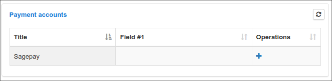
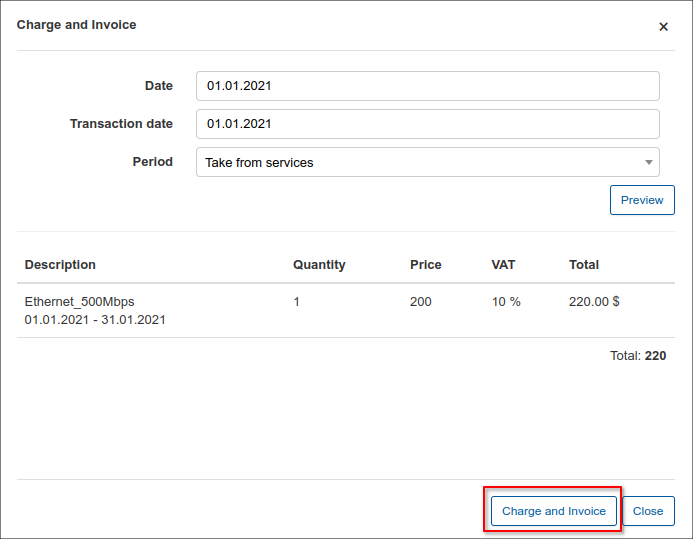
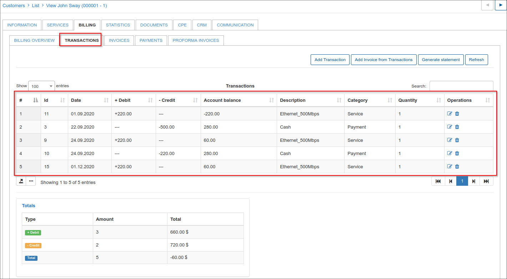
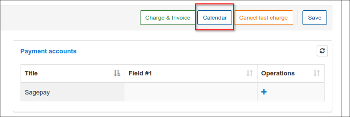
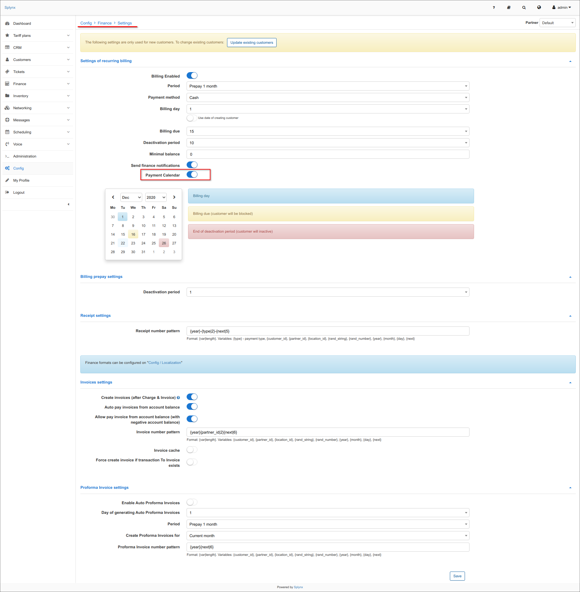
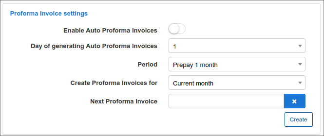
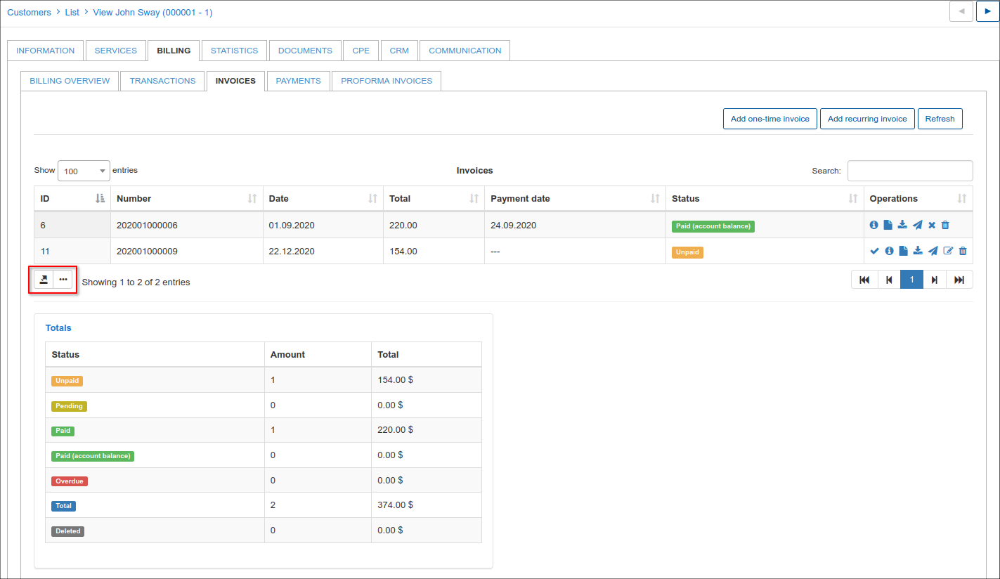

Customer billing
==========
This is your centralized finance department for each customer. Here you can customize your customer's billing to suit agreements and unique terms made with the respective customer, with regards to how they will be billed and interactions thereof.

The Customer Billing tab is divided into 6 sub-tabs:

* **Billing config** - the main information configuration page of your customer billing
* **Transactions** - all transactions pertaining to the customer can be found here
* **Invoices** - all invoices generated for the customer can be found here
* **Credit Notes** - all credit notes created for the customer is located here
* **Payments** - all payments made by or on behalf of the customer
* **Proforma Invoices** - a list of all proforma invoices is kept for future reference

## Billing config

Billing config displays 6 main sections:

* Billing Settings
* Billing actions
* Proforma Invoice Settings
* Payment Accounts
* Billing Address
* Reminders Settings

## Billing Settings:

In this section you can set up the billing of the **selected customer**.

(The global settings for **all customers** are located in `Config → Finance → Settings`).

**Billing settings description:**

* **Billing Enabled** - enables or disables billing for customer (whether the system should take customer into account or not);
* **Payment period** - period the customer will be billed for;
* **Payment method** - means in which way client will make payments; credit card, cash, etc.;
* **Billing day** - when the customer will be charged and invoices will be generated;
* **Payment due (days after billing day)** - when the customer needs to make payments before being blocked. Even though the customer will have a blocked status, their services will still be accounted;
* **Blocking period (days after payment due)** - allows to extend the period when customer will be blocked (by default the value is `0`);
* **Deactivation period (days after blocking) (Grace period)** - when the customer's services will be marked as inactive, client no longer uses services and the system no longer accounts for it;
* **Minimal balance** - minimal balance required in the customer account to avoid being blocked;
* **Partner percent** - shows the individual partner percent value the customer belongs to. The global `Partner's commission (%)` setting is located in `Config → System → Company Information`;
* **Auto create invoices** (after Charge & Invoice) - creates an invoice automatically after using the charge & invoice button <icon class="image-icon"></icon>
* **Send billing notifications** - toggle allows individually to enable/disable finance notifications for customer, the global configuration is located in `Config → Finance → Notifications`.

## Payment Accounts

 Accounts of the customer which can use to make payments on the system.

 

 You can edit the available accounts to add customers accounts details with the "**+**" icon.

 

## Billing address

Billing address can be configured here if it is different to the address on the **Main information** tab of the customer. By default, it is left empty and the address is taken from the **Main information** tab of the customer.

Specific billing address can be set here if the customer uses a different address for billing from the listed one in the *Main Information* page.

## Billing actions

 The actions section provide a quick access toolbox when dealing with customer billing.

**Charge & Invoice**

<icon class="image-icon"></icon>

Customers can be charged **manually** with the `Charge & Invoice` button. 
Simply click on the button, a *Charge and Invoice* window will appear where you can select the date and period of charging, then click on `Preview` to view service (-s) description and click on `Charge & Invoice` button to manually charge the customer.

The system will automatically charge the customer and the new transaction and invoice items will be created, they can be viewed in the Transactions/Invoices tab.

**NOTE:** if you are charging a customer **manually**, the new invoice will be created only if the `Auto create invoices` setting is enabled in customer's `Billing → Billing config → Billing settings`. The global `Auto create invoices` setting is located in `Config → Finance → Settings` (*Invoices settings* section).

If the transaction with `Add to Invoice` option is created, it will be added to the subsequent invoice. For example, you create manual transaction with `Add to Invoice` option, after that apply `Charge & Invoice`, the service and manual related transactions are visible in the preview:

When we apply `Cancel last charge` option, only service transaction will be removed with the invoice. The manual transaction can be deleted manually in `Billing → Transactions` tab.

During the process of adding a service to a customer, the discount can be adjusted. Navigate to customer services tab and select the desired service to apply the discount to, click on `Edit` icon <icon class="image-icon"></icon>. The edit service window will appear where you can apply the discount according to the parameters highlighted and you may add a note for reference in discount message. Once the discount has been set, it will appear in the new window when the button <icon class="image-icon"></icon> is pressed and the final price will be calculated automatically.

In case the previous invoice was canceled and the administrator doesn't want to change e.g. the invoice number, the option `Use the last canceled invoice` can be applied during the next manual charge.

**Payment Calendar**

<icon class="image-icon"></icon>

 You can generate a payment calendar for the customer with the use of templates.

By default payment calendar generating is disabled. To enable it you need to activate it in `Config -> Finance -> Settings`.

**Cancel last recurring invoice**

<icon class="image-icon"></icon>

This button can be used to cancel the previous bill of a customer. This feature ensures that charges are cleared appropriately in the system by deleting the invoice and transaction pertaining to the charge.

**Save** (the button at the bottom of the page)

<icon class="image-icon"></icon>

Save any change made in the customer billing tab.

In **Proforma Invoice settings** it is possible to enable the option `Enable Auto Proforma Invoice` creation for the current or next month as well as being able to choose a prepay payment period (up to 12 months).

In **Reminders settings** you can enable automatic sending of reminders to customers to remind them to pay for their services.

## Transactions

Transactions are divided into 2 sections, namely, **Debit transactions** and **Credit transactions**

**Debit transactions** - transaction added to customers account with amounts to be paid. (decreases customers account balance) 
**Credit transactions** - transaction added to customers account after making payments. (increases customers account balance) 

All transactions can be edited or deleted.

The option <icon class="image-icon"></icon> icon to print, copy or save customer's transactions list in CSV file can be found at the top right corner of the table.

We can also customize the transactions table by enabling/disabling fields or drag&drop fields in a preferred method of displaying.

More information about the transaction properties can be found in the [Transactions](finance/transactions/transactions.md) guide.

## Invoices

All invoices generated for the selected customer are shown in the invoices table. It displays the invoice number, date of issuing, payment date and status of payment.
Just as with transactions the option to print out, copy or save customer's invoices in CSV file and sort columns by drag & drop fields.

The invoices list comes well equipped with tools found in the operations column. With these tools invoices can be paid and marked as unpaid, edited (if not paid), viewed as PDF's, sent to the customer or deleted. Payments of paid invoices can be deleted here as well.

Functions of each button in operations can be found by simply hovering over the icons.

Detailed description and an explanation of invoicing can be found in the [Invoices](finance/invoices/invoices.md) guide.

## Credit notes

The *Credit Notes* entity is a new feature in Splynx v3.2 to simplify the invoicing processes, it is useful for adjusting errors in created invoices. It allows you to lawfully amend an invoice, without having to delete or alter it.
For example, you sent to customer the invoice which contains an error and the invoice has been paid, as a result you need to re-bill the customer for the billing period. Since you can’t change an invoice’s total amount, you need to apply credit note to correct the balance.
The experience with creating a new invoice with the negative price in order to refund a money to customer is now a thing of the past.
The *Credit notes* provide accurate and complete records keeping of the transactions that occur after an invoice has been created.

The detailed description and the explanation of the credit notes management can be found in the [Credit Notes](finance/credit_notes/credit_notes.md) guide.

## Payments

The Payments table contains all payments related to the selected customer, providing a table that displays the date of payments, payment types, amounts, invoice numbers and comments on the payments. Just as with transactions and invoices the option to print, copy or save customer's payments in CSV file and sort columns by drag & drop fields.

More information about Payments can be found here -  [Payments](finance/payments/payments.md)

## Proforma invoices

The table of all Proforma invoices related to the customer can be viewed here, displaying proforma invoice numbers, date of invoices, total amounts, payment dates and statuses (if it's paid or unpaid).
The option to print out, copy or save customer's proforma invoices in CSV file and sort columns by drag & drop fields.

Detailed information about Proforma invoices and the creation thereof  can be found here - [Proforma invoices](finance/proforma_invoices/proforma_invoices.md)

**Totals** for the transactions, invoices, proforma invoices and payments tabs can be found at the bottom of each section. Providing totals for relevant fields of the table within the tab.

Transactions tab total table:

