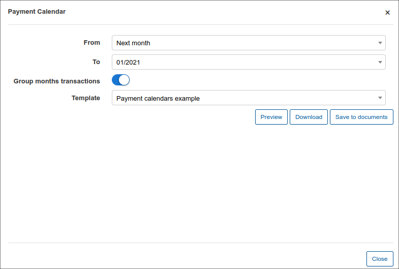
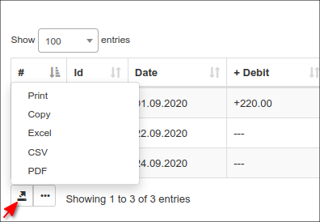
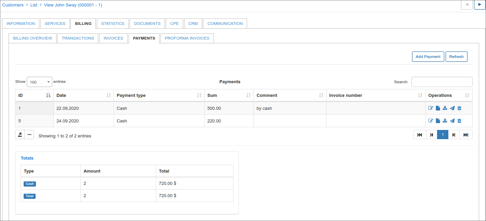

Customer billing
==========

The Customer Billing is divided into:
* Billing Overview
* Transactions
* Invoices
* Payments
* Proforma Invoices

## Billing Overview

Billing Overview displays 4 main sections:
* Billing Settings
* Actions
* Proforma Invoice settings
* Reminders settings

It is possible to see the **Billing settings** for the selected customer (The global settings for all customers are in `Config → Finance → Settings`).

Billing Settings:.
* **Billing Enabled** - enable billing for customer
* **Period** - it can be prepaid or postpaid
* **Payment Method** - it is possible to select how the customer will pay
* **Billing day** - when the customer will be charged
* **Billing due** - when the customer will be blocked
* **Grace Period** - when the customer's services will be disabled
* **Minimal balance** - minimal balance for the customer
* **Make Invoices** (after to charge) - create an invoice automatically after the charge

In **Actions section** you can see the type of customer's payment account with his billing address set by default taken from the Main information of the customer.

It is possible **to charge the customer manually** with the action `To charge`.
Select date and period of charging, click on `Preview` to see services description and click on `To charge`.

The system will automatically charge the customer, and it will be shown as a new transaction in the transaction's table.

Please note, that if you are charging customer **manually**, the new invoice will be created only if Invoicing option is enabled in `Customer's Billing →Billing Overview→Billing settings`.

It is possible **to set a discount for the customer** before you charge him. You can choose that option in Customer's services: select the service where you'd like to make a discount, and click on Edit icon <icon class="image-icon"></icon>. The window will appear where  it will be possible to enable Discount and set up Discount percent, Discount start and end date, and Discount message. After discount is set up it will appear in <icon class="image-icon"></icon> window and final price will be automatically counted.

In *Actions section* you can also generate a *Payment calendar* for the customer by using templates.

In **Proforma Invoice settings** is possible to enable Auto proforma invoices creation for the current or next month with choosing a prepay type (up to 12 months).

In **Reminders settings** you can enable sending automatic reminders to the customer to avoid him to get blocked or inactive. It is also possible to enable payment option for the last reminder and set an amount of reminder payment with comment on it.

## Transactions

In the Transaction's table all shown transactions related to the customer. They are divided into **Debit transactions**, when we make an invoice to be paid by a customer, and **Credit transactions**, when payment from customer has been received.

There is an option to print out, copy or save customer's transactions  in CSV or PDF files.

There is also an option to choose columns, which will be displayed in the transaction's table by sorting show/hide columns.

To know more about transactions, please, visit transactions manual page - [Transactions](finance/transactions/transactions.md).

## Invoices

Every customer's invoice is shown in this table. It contains invoice number, date of issuing the invoice,  payment date and status of payment. The same as with transactions there is an option to print out, copy or save customer's invoices in CSV or PDF files and sort columns by drag&drop fields.

Detailed explanation of Invoicing you can find here -  [Invoices](finance/invoices/invoices.md)

## Payments

Payment table contains all payments, related to the customer with the date of payment, payment type, amount, invoice number and comment on the payment. The same as with transactions and invoices there is an option to print out, copy or save customer's payments in CSV or PDF files and sort columns by drag&droping fields.

More information about Payments you can find here -  [Payments](finance/payments/payments.md)

## Proforma invoices

All Proforma invoices related to the customer will be shown in this table containing invoice number, date of invoice, total amount, payment date and status (if it's paid, unpaid or overdue).
There is the same option to print out, copy or save customer's pro forma invoices in CSV or PDF files and sort columns by drag&drop fields.

Detailed information about Proforma invoices and its creation you can find here - [Proforma invoices](finance/proforma_invoices/proforma_invoices.md)
