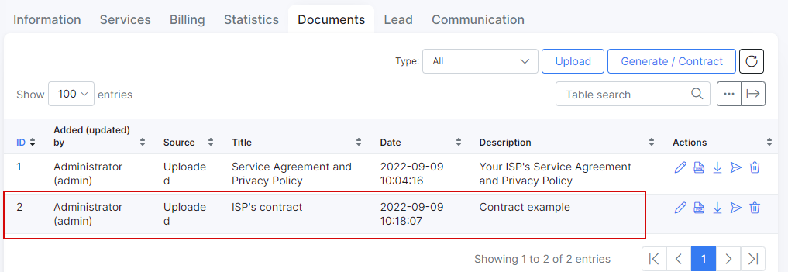
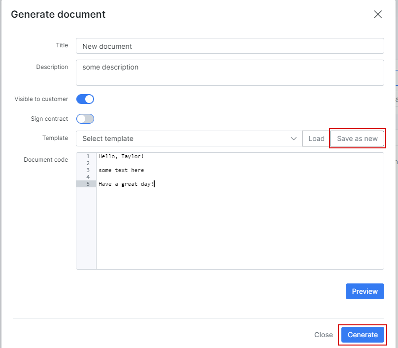
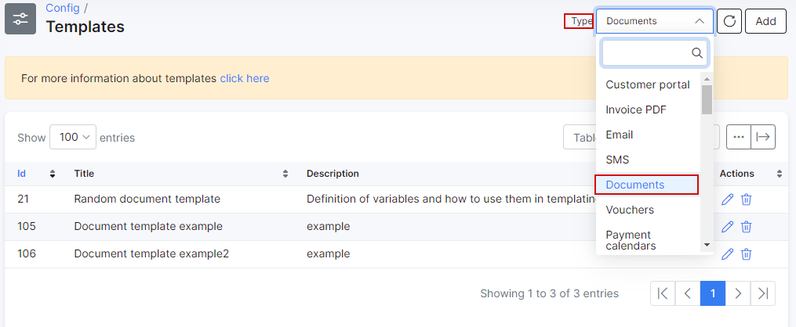

Customer documents
==========

As a company with many customers, you've probably found that keeping physical copies of all the contracts and agreements for each customer in files and folders, in boxes and closets is an inefficient, impractical and, frankly, messy way to conduct business. You don't have to worry about it anymore, we've digitized this much-needed form of record keeping.

Our **Documents** section allows you to upload documents in any format, providing a secure, neat, easy to manage and literally the best way to store customer documents. Need more? In *Documents* section it's possible to generate document or contract according to the templates created for it.


### How to upload a document to Splynx

**To upload a document to Splynx** click on the <icon class="image-icon"></icon> button at the top right corner of the table and a pop-up window **Upload file** will appear. In this window you can specify a **Title** of the document, a short **Description** (optional) and choose whether this document will be **Visible to customer** on their [Portal](customer_portal/customer_portal.md) or only available for administrator. Then, click on **File** upload icon <icon class="image-icon"></icon> and choose the document to upload.

You then have the option to click on the File upload icon <icon class="image-icon"></icon> and choose the document to be uploaded.


As soon as the file is uploaded, it will immediately appear in the *Documents* list.



In the **Operations** column of the table you'll find possible actions related to the file, such as `Edit` , `View` , `Download` , `Send` (to a customer) and `Delete` <icon class="image-icon"></icon>.

If you upload the file with the `Visible to customer` option enabled, the file will be available to download for the customer on their Portal under the *Documents* section.


The customer can download the file from *Portal* by clicking on the `Download` icon <icon class="image-icon"></icon> on the right side of the table.


### Generating a document in Splynx

Let's take a look at the process of generating a document for customer in Splynx .

To generate a document in customer profile click on the <icon class="image-icon"></icon> button at the top right corner of the table, in a new **Generate document** pop-up window, specify the **Title** of document, a short **Description** (optional) and choose whether this document will be **Visible to customer** on *Portal*.

The **Sign contract** option will be described in next section of the current article.


There are two options to generate the **Document code** (the message body) of the document:

* **Option 1** - simply type the desired content in the text window manually and then click on `Generate`, use `Save as new` button to save the typed text as a new document template in Splynx.



* **Option 2** - you can use one of the saved [Templates](configuration/system/templates/templates.md) to create/generate a document. Click on the **Template** drop-down list, select a necessary template and press <icon class="image-icon"></icon> button.
This will fill the text area with pre-configured content from the template.
Then, you should specify a **Title** of the document, a short **Description** (optional) and choose whether this document will be **Visible to customer** on *Portal*.


Press `Preview` to check the overall view of the document.


To create the document click on `Generate` button.


------------

**IMPORTANT**

Before using the own **templates** it is necessary to **configure** them first in `Config → System → Templates`. In Splynx, the templates are grouped according to the document type. You can add your own templates, edit/customize the existing ones, make a preview or remove the templates.


------------

When `Config → Templates` page is opened, take a look at the top right corner and select `Documents`type in drop-down list.



**To create a new template** click on the <icon class="image-icon"></icon> button. In new window, specify the `Title`, `Description` (optional) and insert or type the HTML code for your template.

Use `Check Code` and `Preview` buttons to check or to preview the validity of the code / output result. The `Placeholders` button can be used to quickly insert the necessary variable into the code.


More information about templates, *placehorders* and *variables* you can find in these articles:

- [Templates](configuration/system/templates/templates.md)
- [Variables for templates](configuration/system/templates/templates_variables/templates_variables.md)


### Contract and its signing by customer

If you work with customers, chances are, you’re at least somewhat familiar with contracts.
A customer contract is a legally binding agreement between you and the customer concerning the sale of goods or digital content or the supply of services (with or without goods).
You use the traditional post service or email (attachment) to send a contract to the customer and feverishly wait for it to return signed.
As a result, you are not sure whether the customer has received the contract, read it, or perhaps have already sent it back. Such situation is very common for people in sales and may feel annoying. But there is a solution.

You can create your own contract using the functionality of template and customer can add their 'electronic' signature withing Splynx. Such approach eliminates the costs and hassle of printing, scanning and delivery.


**Create a contract template:**

1. Navigate to `Config → System → Templates`, at the top right corner, select `Documents`type in drop-down list;

2. Click `Add` button in order to add a new template;

3. Fill out the fields `Title`, `Description` (optional) and `Code`. Pay attention that in the contract template code should be included the next variables:

**To show customer's signature image in contract (required):**

```

```

**To show the signature date (optional):**

```
{{sign_date}}
```

**To show the end of term (optional):**

```
{{end_of_term}}
```

**To show the document id (optional):**

```
{{id}}
```

**To show who added the document (optional):**

```
{{added_by}}
```
or

```
{{added_by_id}}
```


Use `Placeholders` button to quickly insert the necessary variable into the code and customize your template.


The **code example of the Contract** you can find [here](configuration/system/templates/templates_variables/templates_variables.md).

After the template code is ready press **Save** button.

4. In `Customers → List`, find the customer to whom the contract should be sent to, open customer profile, navigate to `Documents` tab and press <icon class="image-icon"></icon> button at the top right corner of the table.


5. In new window, click on **Template** drop-down list to choose the template created on previous step and press  <icon class="image-icon"></icon> button, the content will be loaded to **Document code** text area.

Enable the next toggles:

- **Visible to customer** - the document will be available on *Portal* to download by customer;

- **Sign contract** - it enables the option to sign contract by customer on *Portal*;

- **This contract has a term** - use this toggle if you contract has any term;

- **Term (month)** - in this field you can specify the contract term in month (depends on the service you provide).


Press **Generate** button to create a contract for the selected customer.


6. The generated contract will be available for customer on their *Portal*:


Let's simulate the signing of the contract by customer.

In customer profile, navigate to **Information** tab and click on **Actions** drop-down menu, choose `Login as customer` option to open customer *Portal* in a new tab of your web browser.
Click on `Documents` items on the sidebar and click on `Contract` tab. Then, press <icon class="image-icon"></icon> (Sign contract) button.

In new window, use your mouse or touch screen to put your signature and press **Submit contract** button.

If you make a mistake, press **Clear** button and start from the beginning.


After the contract is signed, the `(Signed)` label will be added to contract title and the date / time values will be set automatically in **Signature date** and **End of term** fields:


The customer can download the signed contract to their local storage:


You may also like: [Contract template example](configuration/system/templates/templates_variables/templates_variables.md)

<iframe width="350" height="270" src="https://www.youtube.com/embed/mfDjhX4Ux-c" title="YouTube video player" frameborder="0" allow="accelerometer; autoplay; clipboard-write; encrypted-media; gyroscope; picture-in-picture" allowfullscreen></iframe>
