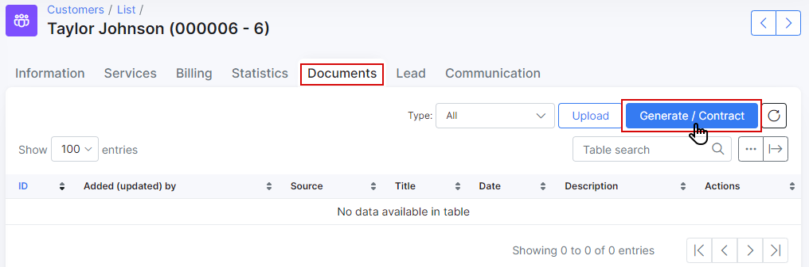

Customer documents
==========

As a company with multiple customers we've found keeping physical copies of all of the contracts and agreements for each client in files and folder, in boxes and storage rooms quite a inefficient, ineffective and honestly, messy way of doing things. Worry no more, we have digitalized this very necessary form of keeping records for you.

Our documents section allows you to upload any format of a document, giving you a secure, neat, easily manageable and quite literally better method of storing your documents. Need more? Our document section can also generate documents according to templates you create for it! Digitalizing the entire process and achieving hassle free bookkeeping.

## How to upload a document to Splynx.

To upload a document in Splynx click on the <icon class="image-icon"></icon> icon on the top right corner of the tab and a pop-up window *Upload file* will appear. Here you can specify the Title of the document, a short description (optional) and choose if you'd like this document to be visible to a customer in the portal. You then have the option to click on the File upload icon <icon class="image-icon"></icon> and choose the document to be uploaded.

A soon as the file is uploaded, it will immediately appear in the list of Documents.

In the Operations column of the table you'll find possible actions relating to the file, such as `Edit` , `View` , `Download` , `Send to a customer` and `Delete` <icon class="image-icon"></icon>.

If you have uploaded the file and enabled the `Visible to customer` option in the upload process, the file will be visible to the customer in their portal under the documents section.

The customer can download and view the file from here by clicking on the Download icon <icon class="image-icon"></icon> on the right side of the table.

## Generating a document in Splynx.

Let's take a look at generating a document within Splynx.

To generate a document in Splynx click on the <icon class="image-icon"></icon> icon on the top right corner of the tab, this will bring up a *Generate document* pop-up window. Where you can specify the Title of document, a short description (optional) and choose if you'd like the document to be visible to the customer.

There are two options to generate the body of the document:

* Option 1 - simply type the desired content in the text window and then click on `Generate` or `Save as new` template (option to save the manually generated content as a template can be found above the text area).

  Just as uploading documents, as soon as a document has been generated, it will immediately appear in the list of documents.

  

* Option 2 - we can use a Template to create/generate a document by clicking on the Template drop-down list, selecting a Template and then clicking on the <icon class="image-icon"></icon> icon. This will populate the text area with preconfigured content from the template. You then have to enter a *Title* for the document, give a short description (optional), choose whether or not to make it visible to the customer and complete the process by clicking on Generate.

  
  
  

As mentioned before, it will appear in the list of documents once completed and based on the selection for the "visible_to_customer" field, it may or may not be available for downloading in the customer portal.

Below is an example of the documents list in the Customer portal.

Before using Templates it is necessary to **configure** them first  in `Config → System → Templates`:

Select the `Type` of document in the top right corner - in this case: Documents. Please note that all templates relating to the document type you chose from the list will appear on the list for to either edit or add another to the list. Templates are grouped and found in the system according to the type of document.

**To create a new template** click on the <icon class="image-icon"></icon> option. A new window titled *Create template* will appear where you can specify the `Title`, `Description` (optional) and input code for the template. (HTML code - please see [Templates configuration](configuration/system/templates/templates.md))

You can use the `Check Code`, `Preview` and `Placeholders` buttons to check the validity of the code, preview the live code in a new window and select placeholders from a list respectively.

You can also edit existing templates or delete them by clicking on options  and  in the "Actions" column of the table.

