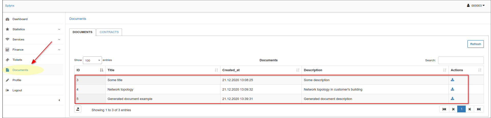

Customer documents
==========

The purpose of the Documents section in Customer profile is to store all important documents relating to every customer (agreements, contracts, certificates, identification etc.) These documents will be available for customers to use in the Customer Portal.

Documents can be uploaded in any format or generated with the help of templates.

## How to upload a document to Splynx.

To upload a document in Splynx click on the <icon class="image-icon"></icon> icon on the top right corner and a pop-up window *Upload file* will appear. Here you can specify the Title of the document, its Description (optional) and choose if you'd like this document to be visible to a customer in the portal by turning this option on/off. You then have the option to click on the File upload icon <icon class="image-icon"></icon> and choose the document to be uploaded.

A soon as the file will be uploaded it will also appear in a list of Documents.

In the Operations column of the table you'll find actions relating to the file, such as `Edit` , `View` , `Download` , `Send to a customer` and `Delete` <icon class="image-icon"></icon>.

Once the file has been uploaded it will also appear in the Customer Portal if the option `Visible by customer` is turned on. The customer can locate it in the Documents section.

The customer can download and view the file from here by clicking on the Download icon <icon class="image-icon"></icon> on the right side of the table.

## Generating a document in Splynx.

Another way to have files in the documents section is by generating them. To generate a document in Splynx click on the <icon class="image-icon"></icon> icon on the top right corner after which a *Generate document* pop-up window will appear. Here you can specify the Title of document, its description (optional) and choose if you'd like the document to be visible to the customer.

There are two options to generate the body of the document:

* Firstly, simply type it in the text area window and then click on `Generate` or `Save as new` template (option above the text area).

  As soon as the document has been generated it will appear in the list of documents in the table.

  

* Secondly, we can use a Template to create a document by clicking on the Template drop-down, choosing a Template and then clicking on the <icon class="image-icon"></icon> icon. Enter a *Title* for the document, make it visible to the customer (optional) and then click on Generate.

  

  

It will appear in the list of documents in a table and in a Customer portal as well, where customer will be able to download it.
Below is an example of the documents list on a Customer portal for a particular customer.

Before using Templates it is necessary to **configure** them first  in `Config → System → Templates`:

Select the `Type` of document in the top right corner - in this case Documents. All templates relating to the type of document you chose will be visible.

**To create a new template** click on the <icon class="image-icon"></icon> option. A new window titled *Create template* will appear where you will specify the `Title`, `Description` (optional) and  code for the template (HTML code - please see [Templates configuration](configuration/system/templates/templates.md))

You can use the `Check Code`, `Preview` and `Placeholders` buttons to check the validity, preview the live code in a new window and select placeholders from a list respectively.

You can also edit existing templates or delete them by clicking on options  and  in Actions column of the table.

