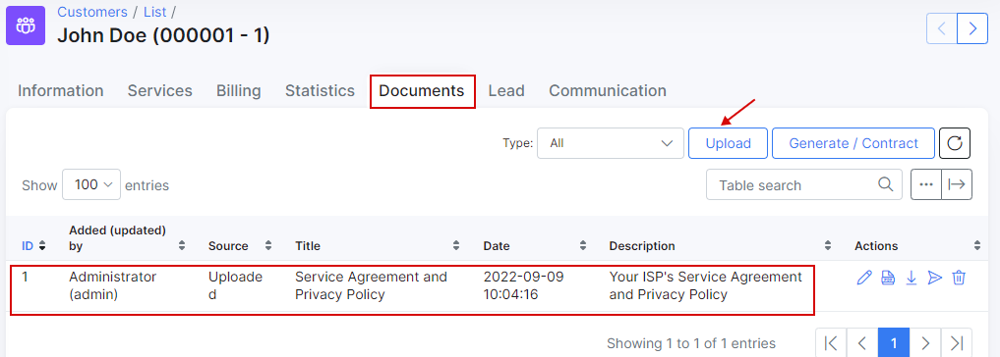

Customer documents
==========

The purpose of Documents section in Customer profile is to store all important documents for every customer (agreements, additional agreements, certificates or manually made invoices etc).
This documents will be available for customers use in Customer portal.

Documents can be uploaded in any format you will choose or generated with the help of templates.

## How to upload a document to Splynx.

To upload a document in Spynx click on <icon class="image-icon"></icon>  on the top right corner and window *"Upload file"* will appear. Here you can write the Title of the document, its Description (optionally) and choose if you'd like this document to be visible to a customer by turning this option on/off. Then click on File <icon class="image-icon"></icon>  and choose the document to be uploaded.

A soon as file will be uploaded it will also appear in a list of Documents.

In Operations column of the table will be additional options of using this file, such as `Edit` <icon class="image-icon"></icon> , `View` <icon class="image-icon"></icon> , `Download` <icon class="image-icon"></icon> , `Send to a customer` <icon class="image-icon"></icon>  and `Delete` <icon class="image-icon"></icon>.

Once file had been uploaded it will also appear in Customer portal if option `Visible by customer` was turned on. Customer will find it in Documents section.

Customer can download and view the file from here by clicking on Download icon <icon class="image-icon"></icon> on the right side of the table.

## How to generate document in Splynx.

Another way to have files in Documents section is by generating them. To generate a document in Splynx click on <icon class="image-icon"></icon> on the top right corner and the window *"Generate document"* will appear. Here you will write a Title of document, its description (optionally) and choose if you'd like the document to be visible to a customer.

There are to options to generate the body of the document:

* It is possible to simply type it in the text area window and then click on `Generate` or `Save as a new` template (option above the text area).

  

  There are here text formatting and editing tools, where you can not only choose a size of the letters, font or colour of the text but also insert the image or URL link, or print the document. You can also see the Preview of the document before generating by clicking on a `Preview option` on the left side of the text area.

  

  As soon as document will be generated it will appear in the list of documents in a table.

  

* It is possible to use a Template to create a document by clicking on a Template window, choosing a Template and then clicking on <icon class="image-icon"></icon> option. Write a *Title* of the document, make it visible to a customer (optional) and then click on Generate.

  

  

It will appear in the list of documents in a table and in a Customer portal as well, where customer will be able to download it and read.
Below is an example of the documents list on a Customer portal for a particular customer.

Before using Templates it is necessary **to configure** them first  in `Config →System →Templates`:

By clicking on a `Type` option on the top right corner and you can check all templates you've already have in each category such as `Customer portal`, `Invoice PDF`, `Mail`, `SMS`, `Documents`, `Cards`, `Payment calendars`.

**To create a new template** choose a type of template first `Document` and then click on <icon class="image-icon"></icon> option. A window *"Create template"* will appear where you will write the `Title`, `Description` (optionally) and a code for the template.

You can also edit existing template or delete it by clicking on options  and  in Operations column of the table.

