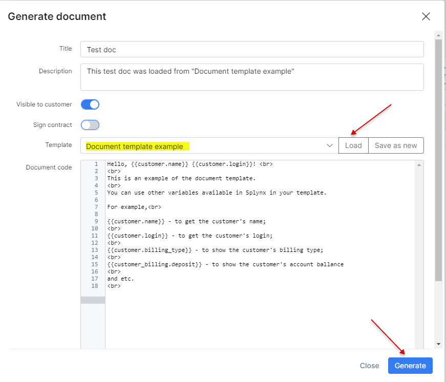

Customer documents
==========

In Splynx, it is possible to keep all contracts and agreements for each customer in a digitalized form.


In the **Documents** section, you can upload documents in any format, offering a secure, organized, and easily manageable way to store customer documents. Additionally, you can generate documents based on predefined templates.


## How to upload a document

To upload a document to Splynx, follow these steps:

1. Click the `Upload` button located at the top right corner of the table. A pop-up window titled **Upload file** will appear.

2. In this window, you can specify a **Title** for the document and provide a short **Description** (optional).

3. Choose whether this document will be **Visible to customer** on their [Portal](customer_portal/customer_portal.md) or if it should be available only for the administrator.

4. Click on ``Browse`` to select the document you wish to upload.


As soon as the file is uploaded, it will immediately appear in the *Documents* list.


## File management

In the **Actions** column of the table, you will find various actions related to the file, including `Edit` , `View` , `Download` , `Send` (to a customer), and `Delete` <icon class="image-icon"></icon>.

If you upload the file with the `Visible to customer` option enabled, it will be available for the customer to download on their Portal under the *Documents* section.


The customer can download the file from *Portal* by clicking on the `Download` icon <icon class="image-icon"></icon> on the right side of the table.

<icon class="image-icon"></icon> When you use the ``Send`` button to send a message via the Customer Portal, the message will appear in the **Messages** section, which should be enabled under *Config → Main → Portal → (Menu)*:


## How to generate a document

To generate a document in the customer's profile, click on the ``Generate/Contract`` button at the top right corner of the table:


In a new **Generate Document** pop-up window, please specify the document's **Title**, provide a brief **Description** (optional), and select whether this document should be made **Visible to customer** on the *Portal*.

The **Sign contract** option will be described in the next section of this article.


There are two options to generate the **Document code** (the message body) of the document:

* **Option 1**: Simply type the desired content in the text window manually, then use the ``Save as new`` button to save the typed text as a new document template in Splynx, and finally, click on ``Generate``:


* **Option 2** - you can use one of the saved [Templates](configuration/system/templates/templates.md) to create/generate a document. Click on the **Template** drop-down list, select the necessary template, and then press the ``Load`` button. 
This action will populate the text area with pre-configured content from the selected template. Next, you should provide a **Title** for the document, a brief **Description** (optional), and decide whether to make this document **Visible to customer** on the *Portal*.




Click on ``Preview`` to view the document overall.


## Templates

<icon class="image-icon"></icon> Before utilizing your own **templates**, it is essential to **configure** them first in *Config → System → Templates*. In Splynx, templates are organized by document type. You can add your own templates, customize existing ones, preview them, or remove templates.


When the *Config → Templates* page is opened, select the `Documents` type from the drop-down list at the top right corner of the page.


To **create a new template**, click the`Add` button. In the new window, specify the ``Title`` and, optionally, the ``Description``, then insert or type the HTML code for your template.

Use the ``Check Code`` and ``Preview`` buttons to verify the code's validity and preview the output result. The ``Placeholders`` button can be used to quickly insert the necessary variables into the code.


More information about *templates*, *placeholders*, and *variables* can be found in these articles:

- [Templates](configuration/system/templates/templates.md)
- [Variables for templates](configuration/system/templates/templates_variables/templates_variables.md)


## Contract and its signing by the customer

A customer contract is a legally binding agreement between you and the customer concerning the sale of goods or digital content or the supply of services (with or without goods).
You use the traditional post service or email (attachment) to send a contract to the customer and wait for it to return signed.
As a result, you are not sure whether the customer has received the contract, read it, or perhaps have already sent it back. Such situation is very common for people in sales and may feel annoying. But there is a solution.

You can create your own contract using the functionality of template and customer can add their 'electronic' signature withing Splynx. Such approach eliminates the costs and hassle of printing, scanning and delivery.


**Create a contract template:**

1. Navigate to `Config → System → Templates`, at the top right corner, select `Documents`type in drop-down list;

2. Click `Add` button in order to add a new template;

3. Fill out the fields `Title`, `Description` (optional) and `Code`. Pay attention that in the contract template code should be included the next variables:

**To show customer's signature image in contract (required):**

```

```

**To show the signature date (optional):**

```
{{sign_date}}
```

**To show the end of term (optional):**

```
{{end_of_term}}
```

**To show the document id (optional):**

```
{{id}}
```

**To show who added the document (optional):**

```
{{added_by}}
```
or

```
{{added_by_id}}
```


Use `Placeholders` button to quickly insert the necessary variable into the code and customize your template.


The **code example of the Contract** you can find [here](configuration/system/templates/templates_variables/templates_variables.md).

After the template code is ready press **Save** button.

4. In `Customers → List`, find the customer to whom the contract should be sent to, open customer's profile, navigate to `Documents` tab and press `Generate/Contract` button at the top right corner of the table.


5. In the new window, click on **Template** drop-down list to choose the template created on previous step and press `Load`, the content will be loaded to **Document code** text area.

Enable the next toggles:

- **Visible to customer** - the document will be available on *Portal* to download by customer;

- **Sign contract** - it enables the option to sign contract by customer on *Portal*;

- **This contract has a term** - use this toggle if you contract has any term;

- **Term (month)** - in this field you can specify the contract term in month (depends on the service you provide).


Press **Generate** button to create a contract for the selected customer.


6. The generated contract will be available for customer on their *Portal*:


Let's simulate the signing of the contract by customer.

In customer profile, navigate to **Information** tab and click on **Actions** drop-down menu, choose `Login as customer` option to open customer *Portal* in a new tab of your web browser.
Click on `Documents` items on the sidebar and click on `Contract` tab. Then, press <icon class="image-icon"></icon> (Sign contract) button.

In new window, use your mouse or touch screen to put your signature and press **Submit contract** button.

If you make a mistake, press **Clear** button and start from the beginning.


After the contract is signed, the `(Signed)` label will be added to contract title and the date / time values will be set automatically in **Signature date** and **End of term** fields:


The customer can download the signed contract to their local storage:


You may also like: [Contract template example](configuration/system/templates/templates_variables/templates_variables.md)

<iframe width="350" height="270" src="https://www.youtube.com/embed/mfDjhX4Ux-c" title="YouTube video player" frameborder="0" allow="accelerometer; autoplay; clipboard-write; encrypted-media; gyroscope; picture-in-picture" allowfullscreen></iframe>
