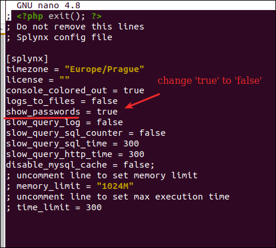
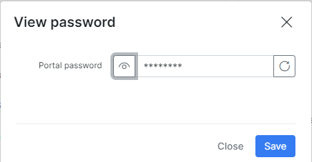
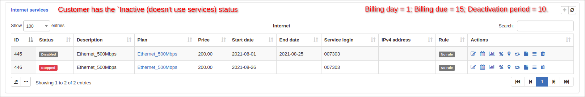
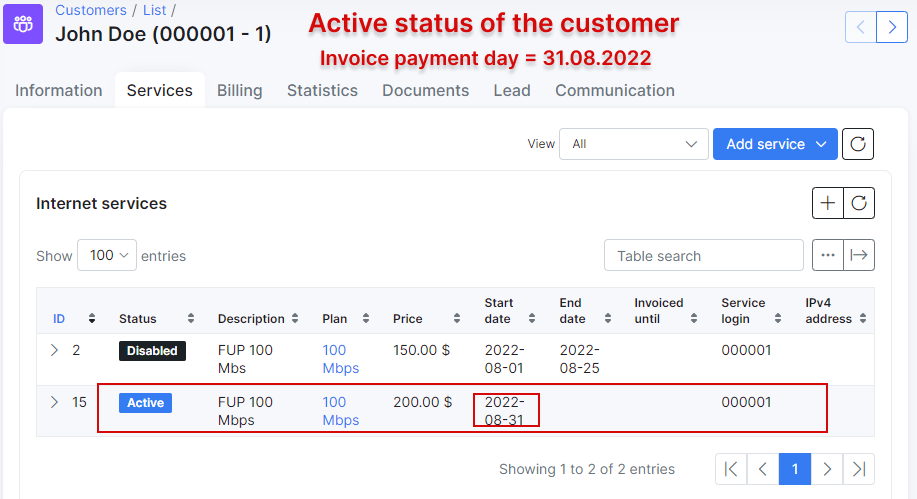
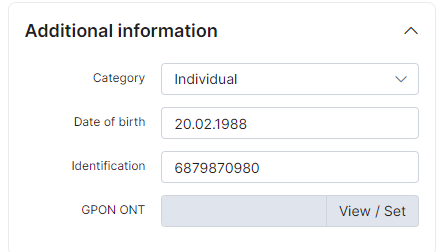
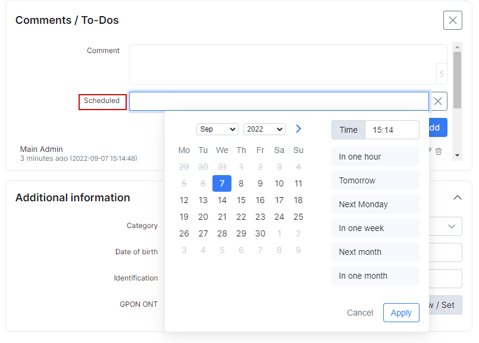
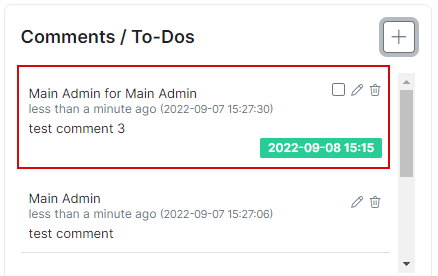
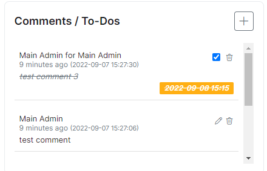

Customer information
====================

The customer information tab is divided into 4 sections, namely, _Main information_, _Additional information_, _Maps_ and _Comments_. Also, at the bottom of the information page you can find _Activity_ and _Comments_ tabs related to the user account.

To edit the customer's information, navigate to `Customers → List`, select the customer (click on *Full name*, *ID* or *Portal login* value of the required customer).


**Main information**

* **ID** - the customer's id within the system, allocated by the system in a sequential order;

* **Portal login** - username used to log into _Customer Portal_;

* **Portal password** -  password used to log into _Customer Portal_ (passwords are masked by default but it is possible to view the password in plain text by simply clicking ``Show`` button);

**Note:**

In order to prevent the display of customer's password for admin accounts, please change `show_passwords` parameter value from `true` to `false` in config file:

```bash
nano /var/www/splynx/config/config.php  
```



* **Status** - options to set are: New, Active, Inactive, Blocked (some functions are available to Active customers only, e.g. for the client to make use of services. Also, it is necessary to customer to be inactive in order to delete them `Inactive → Save → Actions → Delete`).

- **New (Not yet connected)** - status given to the customer recently created or added to the system;<br>
- **Active** - status given to customers to allow the system to take their profile into account and make features available;<br>
- **Blocked** - status given to customers who failed to make payments for services or to simply deny access to the client while taking their profile into account;
- **Inactive (Doesn't use services)** - this status stops customers services and the system from accounting. It is the status given to customers' automatically when they've reached the _deactivation (grace) period_. This status is given to customers who do not use your services for a long period. In case the customer's account has _Inactive_ status it can be deleted.;<br>

<icon class="image-icon"></icon> **The clarification of statuses relation (customer, service and invoice):**

<details style="font-size: 15px; margin-bottom: 5px;">
<summary><b>Click here for more information</b></summary>
<div markdown="1">

1. If the customer has an `unpaid` invoice (e.g. an invoice was created in `Billing day` date) and the customer doesn't pay the invoice before the date of `Billing due`, the customer status will be changed to `Blocked`, but the service (e.g. Internet service) is still be active;

2. The invoice status in period from `Billing day` to `Billing due` date is `unpaid`, from `Billing due` to `Deactivation period` and after `Deactivation period` the invoice will be considered  as `overdue`;

3. If the customer with `Blocked` status pays the `overdue` invoice, the customer's status will be changed to `Active`;

4. If the customer with `Blocked` status doesn't pay the invoice before the date of `Deactivation period` date, his status will be changed to `Inactive (doesn't use service)`. And after he decided to pay the invoice, the status would become `Active`;

5. If the customer has `Inactive (doesn't use service)` status, his service (e.g. Internet service) will be `disabled` (with `Start date` = `Billing day` date and `End date` = `Deactivation period` date) and the duplicate of the previous service will be created with `Stopped` status, its `Start date` = the date of `Deactivation period`.
And after customer decided to pay the `overdue` invoice, the status of duplicate service would become `Active`, its `Start date` would be changed to invoice payment date.





------------

</div>
</details>
<br/>

* **Billing type** - the options are Recurring payments and Prepaid (custom);

1. **Recurring** - type of billing following a full period in a fixed cycle and paid for either by prepay or post-pay;<br>
2. **Prepaid(custom)** - type of billing set to a custom period and paid for in advanced;<br>

* **Full name** - full name of the customer;

* **Email** - email address(es) of the customer, multiple emails separated by comma ",";

* **Billing email** - email address of the customer only for the billing correspondence (the multiple ones are separated by comma ","). The current field has the next logic:
**1)** *if the billing email field is empty - all emails are sending to email(-s) from main "Email" field;*
**2)** *if there is the email in the "Billing email" field - all billing notifications will be sent to this billing email and all other emails will be sent to email from main "Email" field. As a result, Splynx does not duplicate the billing notifications to email(-s) from the main "Email" field;*
**3)** *in case only the billing email was added, ("Email" field is empty), customer receives only the billing related letters, all others letters will not be sent by Splynx.*

* **Phone Number** - phone number(s) of the customer, multiple numbers separated by comma ",";

* **Partner** - partner that the customer belongs to;

* **Location** - location that the customer belongs to in the listed locations;

* **Street, ZIP Code, City** - Physical address fields of the customer;

* **Geo data** - physical coordinates of the customer address;

* **Date Added** - when the customer was added to Splynx.

<br/>

**Additional information**

It is possible to create additional fields for any additional information required/preferred in your system with the [Additional fields](customer_management/custom_additional_fields/custom_additional_fields.md) function.

Additional fields created will be displayed in the *Additional information* section.



<br/>

**Maps**

This is a physical representation of the customer's address. If the customers address is set and maps is configured within the system, you will be able to view the customer`s physical location on the map:


Maps can be configured in _`Config → Main → Maps`_.

<br/>

**Comments/To-Dos**

In this section it is possible to add, edit or remove _quick comments_ and set to-do tasks. They will be visible for other administrator accounts as well.


To create a task, set the date in _Scheduled_ field:



The *Comments* tab provides more functionality when we add comments - the relative type and category of message can be specified:


If you set date in _Scheduled_ field, such comment will be automatically transferred to _Comments/To-Dos_ as a task:



After checking the box for this task, it will be shown as completed:



**Activity**

It is represented as a tab at the bottom of a customer information page. In this tab you can find all the applied actions related to the settings of a customer account.

The information is displayed in a chronological order and can be sorted using *Period* and *Source* filters.


