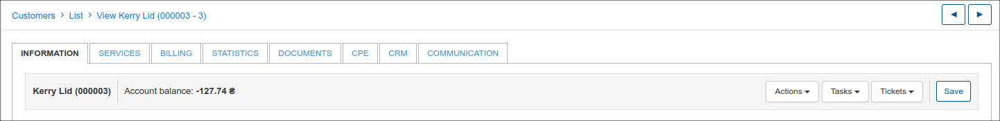
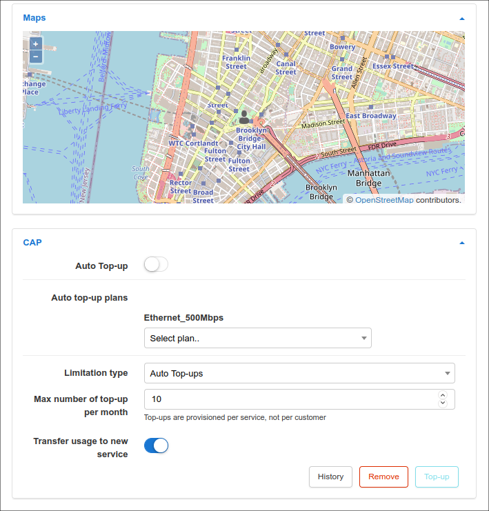
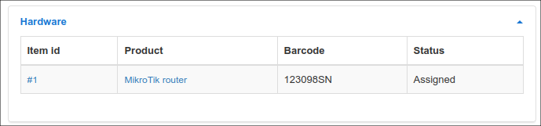
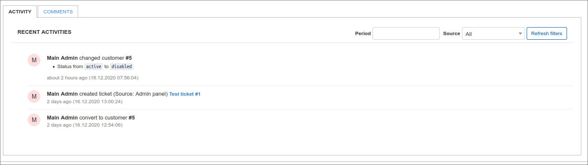

Customer information
====================

The customer information tab is divided into 6 main sections, namely, _Main information_, _Comments_, _Additional information_, _Maps_. _CAP_, _Activity_.
On the top sidebar of information page of the selected customer, the following functions are available:

**Full name of customer** - Names and surname of the customer
**Customer id** - the customer's ID in Splynx system
**Account balance** - the current customer's account balance

**Actions**
* *Create message* - Send Email, Message to *Customer portal*, Message to *Customer portal* & Email, SMS. In case of sending of email to customer the field *CC - Carbon Copy* is present in the form.
The predefined templates can be used as well.

Email / SMS configurations are required, check the articles:

[Email sending configuration](configuration/main_configuration/email_config/email_config.md)
[SMS sending configuration](configuration/main_configuration/sms_config/sms_config.md)

* *Send welcome message* - Send welcome message as *Email* / *SMS* / *Email + SMS*  to customer using the predefined template. Templates can be changed in Config → Templates. Email / SMS configurations are required
* *Login as customer* - Open the current customer account on [Customer Portal](customer_portal/customer_portal.md)

In case customer has *New (Not yet connected)* status, the function *Convert to lead* is available in *Actions* drop-down menu. *Convert to lead* helps to convert current customer back to lead one.
In case customer has *Inactive (Doesn't use services)* status, the function *Delete* is available in *Actions* drop-down menu. *Delete* - remove the current customer from Splynx. To remove multiple customer at the same time, go to Customers → List, select the customers, click on *Actions* and choose *Delete* option in drop down menu.
This option is available only when customers with *Inactive* status were selected.

**Task**
* *Create task* - Create [Task](scheduling/tasks/tasks.md) for current customer
* *List of tasks* - Open task/-s related to the current customer

**Tickets**
* *Create* - create [Ticket](tickets/tickets.md) linked to the current customer (directs to [tickets](/tickets/tickets.md))
* *All tickets* - show all related ticket/-s to current customer
* *Opened* - show only the opened ticket /-s to current customer
* *Closed* - show only the closed ticket /-s to current customer

**Save**
The button to save all the changes on the current customer page.

To edit a customers information, navigate to *Customers* -> *List* -> select the customer (click on the directly on the name or id or put a check mark to highlight the customer then click on *View*

**Main Information**

* *ID* - ID of the customer within the system, allocated by the system in a sequential order

* *Login* - username used to log into the Customer Portal

* *Password* -  password used to log into the Customer Portal. (Passwords are masked by default but it is possible to view the password in plain text by simply clicking the *Show* button.)

* *Status* - options to set are: New, Active, Inactive, Blocked. (Some functions are limited Active customers only, i.e, for the client of make use of services. Also, it is necessary for a customer to be inactive in order to delete them *Inactive -> Save -> Actions -> Delete*)

**New (Not yet connected)** - status given to customer recently created or added to the system. 
**Active** - status given to customers to allow the system to take their profile into account and make feature available. 
**Inactive (Doesn't use services)** - status given to customers for the system to disregard/ignore their profile, client no longer uses services. 
**Blocked** - status given to customers who failed to make payments for services or to simply deny access to the client while taking their profile into account.

* *Type of billing* - the options are Recurring payments, Prepaid (custom).

**Recurring** - type of billing following a full period in a fixed cycle and paid for either by prepay or post-pay. 
**Prepaid(custom)** - type of billing set to a custom period and paid for in advanced. 

* *Full name* - full name of the customer

* *Email* - email address(es) of the customer, multiple emails supported and separated by comma ","

* *Billing email* - email address(es) of the customer only for billing correspondence, multiple emails supported and separated by comma ","

* *Phone Number* - phone number(s) of the customer, multiple numbers supported and separated by comma ","

* *Partner* - partner that the customer belongs to

* *Location* - location that the customer belongs to in the listed locations

* *Street, ZIP Code, City* - Physical address fields of the customer

* *Geo data* - physical coordinates of the customer address

* *Date Added* - when the customer was added

**Comments**

The panel with comment/-s for current customer. At the bottom of customer's page, *Comments* are also available in the separate tab.

**Additional information**

It is possible to create additional fields for any additional information required/preferred in your system with the [Additional fields](customer_management/custom_additional_fields/custom_additional_fields.md) function.

Additional fields created will be displayed in the *Additional information* section.

**Hardware**

The section _Hardware_ is visible only when the created device is related to customer from [Inventory](inventory/inventory.md) items list. Except *item id* and *product name*, it shows *barcode* and *status* of device.

 

**Maps**

This is a physical representation of the customer's address. If the customers address is set and maps is configured within the system, you will be able to view the customers physical location on the map.
Maps can be configured in *Config / Main / Maps*

**CAP**

The manual CAP and bonus data permissions settings for current customer.
More info in the following articles:
[#1 Capped plans and Top-Ups](customer_management/custom_additional_fields/custom_additional_fields.md)
[#2 Capped plans and top up](networking/bandwidth_management/capped_plans/capped_plans.md)

**Activity**

The timeline shows us live information about all changes of customer profile in system.

