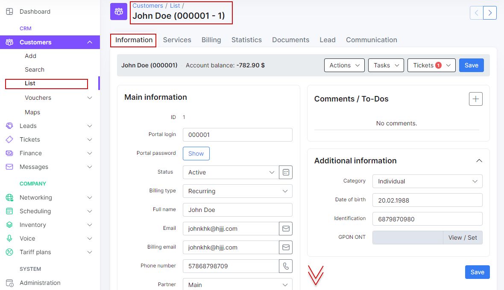

Customer information
====================

The customer information tab is divided into 3 sections, namely, _Main information_, _Additional information_ and _Maps_.

To edit a customers information, navigate to *Customers* -> *List* -> select the customer (click on the directly on the name or id or click to highlight the customer then click on *View*

* ID - ID of the customer within the system, allocated by the system in a sequential order

* Login - username used to log into the Customer Portal

* Password -  password used to log into the Customer Portal. (Passwords are masked by default but it is possible to view the password in plain text by simply clicking the *Show* button.)

* Status - options to set are: New, Active, Inactive, Blocked. (Some functions are limited Active customers only, i.e, for the client of make use of services. Also, it is necessary for a customer to be inactive in order to delete them *Inactive -> Save -> Actions -> Delete*)

**New** - status given to customer recently created or added to the system. 
**Active** - status given to customers to allow the system to take their profile into account and make feature available. 
**Inactive** - status given to customers for the system to disregard/ignore their profile, client no longer uses services. 
**Blocked** - status given to customers who failed to make payments for services or to simply deny access to the client while taking their profile into account.

* Type of billing - the options are Recurring payments, Prepaid (daily) or Prepaid (custom)

**Recurring** - type of billing following a full period in a fixed cycle and paid for either by prepay or post-pay. 
**Prepaid(daily)** - type of billing charged everyday and paid for in advanced. 
**Prepaid(custom)** - type of billing set to a custom period and paid for in advanced. 

* Full name - full name of the customer

* Email - email address(es) of the customer, multiple emails supported and separated by comma ","

* Phone Number - phone number(s) of the customer, multiple numbers supported and separated by comma ","

* Partner - partner that the customer belongs to

* Location - location that the customer belongs to in the listed locations

* Street, ZIP Code, City - Physical address fields of the customer

* Geo data - physical coordinates of the customer address

* Date Added - when the customer was added

It is possible to create additional fields for any additional information required/preferred in your system with the [Additional fields](customer_management/custom_additional_fields/custom_additional_fields.md) function.

Additional fields created will be displayed in the *Additional information* section.

**Maps**

This is a physical representation of the customer's address. If the customers address is set and maps is configured within the system, you will be able to view the customers physical location on the map

Maps can be configured in *Config / Main / Customer*
